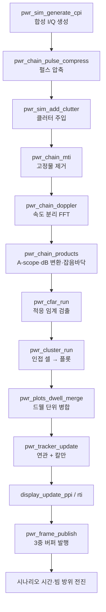
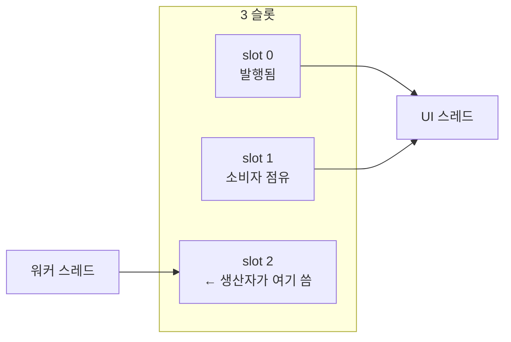
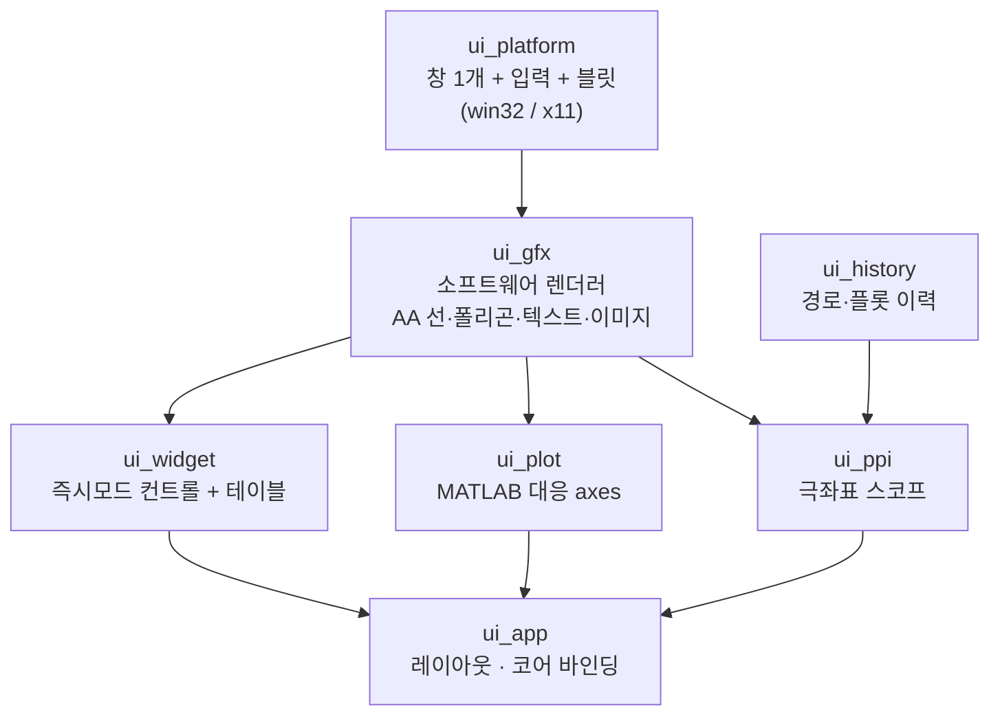

# PWRadarSystem 동작 원리와 코드 흐름

이 문서는 PWRadarSystem 소스 코드가 무엇을 어떤 순서로 하는지 설명함.
**레이다 지식은 전제하지 않음.** 필요한 개념은 등장하는 자리에서 정의함.

읽는 순서는 1장 → 2장 → 3장 권장. 1장은 레이다 배경, 2장은 전체 골격,
3장부터가 실제 코드. 코드만 빠르게 보려면 2.2절의 흐름도부터 시작해도 됨.

문서에 나오는 수치는 전부 기본 설정(`pwr_config_default`)을 실제로
라이브러리에 통과시켜 얻은 값이며, 근사값이 아님.

### 목차

| 장 | 내용 | 레이다 지식 필요 |
|---|---|---|
| [1. 레이다 기초](#1-레이다-기초) | 거리·펄스압축·도플러·모호성·CFAR·트랙 | 없음 (여기서 설명) |
| [2. 전체 구조](#2-전체-구조) | 두 실행 단위, CPI 한 번의 생애, dB 규약 | 1장이면 충분 |
| [3. 신호처리 단계별](#3-신호처리-단계별-상세) | 시뮬레이터 → 압축 → MTI → 도플러 → CFAR → 추적 | 1장이면 충분 |
| [4. 엔진](#4-엔진--실행과-동시성) | 워커 루프, 3중 버퍼, 락, 재구성 | 불필요 (순수 동시성) |
| [5. UI 계층](#5-ui-계층--화면은-전부-직접-그림) | 렌더러, 즉시모드 위젯, 플롯, PPI | 불필요 |
| [6. 검증](#6-이-시스템이-스스로를-검증하는-방법) | 자체검증, 시나리오, 빌드 게이트 | 1장이면 충분 |
| [부록 A](#부록-a-숫자로-따라가는-표적-하나) | 표적 하나가 화면에 뜨기까지, 실제 수치로 | — |
| [부록 B](#부록-b-용어집) | 용어집 | — |

4장과 5장은 레이다와 무관하므로, 동시성이나 렌더링만 보려면 바로 건너뛰어도 됨.

---

## 1. 레이다 기초

### 1.1 거리를 재는 원리

레이다는 전파를 쏘고 반사파가 돌아오는 시간을 잼. 전파 속도 `c`는 초당
약 3×10⁸ m이므로, 왕복 시간 `t`에서 거리가 나옴.

```
R = c · t / 2        (왕복이므로 2로 나눔)
```

이 시스템은 **펄스형(Pulsed Waveform, PW)** 레이다. 연속으로 쏘지 않고
짧은 펄스를 일정 간격으로 반복 송신함.

- **PRF (Pulse Repetition Frequency)** — 초당 펄스 수. 기본값 3000 Hz.
- **PRI (Pulse Repetition Interval)** — 펄스 간격, PRF의 역수. 여기서는 333 µs.

수신기는 펄스를 쏜 직후부터 다음 펄스 전까지 반사파를 기다림. 이 대기 구간을
샘플링한 것이 원시 데이터이고, 샘플 인덱스가 곧 거리에 대응함.

> **거리 빈(range bin)** — 샘플 한 칸. 이 시스템은 6.25 MHz로 샘플링하므로
> 한 칸이 `c/(2·6.25MHz)` = **23.98 m**에 해당.

### 1.2 거리 분해능과 펄스 길이의 상충

두 물체를 구분하려면 두 반사파가 시간축에서 겹치지 않아야 함. 따라서 단순한
펄스에서 **거리 분해능**은 펄스 길이가 결정함.

```
ΔR = c · Tp / 2       (Tp = 펄스 길이)
```

여기서 문제가 생김.

- 펄스를 짧게 → 분해능은 좋아지지만 **에너지가 부족**해 멀리 못 봄
- 펄스를 길게 → 에너지는 충분하지만 **분해능이 나빠짐**

탐지 거리는 펄스에 실린 총 에너지(첨두전력 × 펄스길이)가 결정하므로, 둘 다
얻으려면 다른 방법이 필요함.

### 1.3 펄스 압축 — 상충의 해결

해법은 **긴 펄스를 쏘되, 그 안에서 주파수를 변화시키는 것**. 이 시스템은
**LFM(Linear Frequency Modulation) 처프**를 씀. 펄스 20 µs 동안 주파수를
5 MHz 폭으로 선형으로 쓸어 올림.

수신 측에서 이 처프를 정합필터에 통과시키면, 20 µs에 걸쳐 퍼져 있던 에너지가
**1/B = 0.2 µs 폭의 뾰족한 봉우리로 압축**됨.

```
압축 후 분해능  ΔR = c/(2B) = 29.98 m       (펄스 길이와 무관, 대역폭만 관여)
압축 이득       = Tp · B = 100배 = 20 dB
```

- **시간대역폭적(TB)** — `Tp × B`. 여기서는 100. 압축비이자 SNR 이득.
- 즉 **3 km 길이의 펄스로 30 m 분해능을 얻음.** 이것이 펄스 압축.

대가도 있음. 압축된 봉우리 양옆에 **거리 부엽(range sidelobe)**이 생겨, 큰
표적 주변에 가짜 봉우리가 뜸. 이를 억제하는 것이 테이퍼(창 함수)이며,
이 시스템이 그것을 어떻게 처리하는지가 3.2절의 핵심.

### 1.4 도플러 — 속도를 재는 원리

표적이 움직이면 반사파 주파수가 변함(도플러 효과). 레이다에서는

```
fd = -2 · ṙ / λ      (ṙ = 시선속도, λ = 파장)
```

부호 규약: 이 코드에서 **시선속도는 멀어지는 방향이 양수**(`pwr_config.c` 주석).

한 펄스만으로는 이 미세한 주파수 변화를 못 잼. 대신 **여러 펄스에 걸친 위상
변화**를 봄. 표적이 움직이면 펄스마다 왕복 거리가 조금씩 달라지고, 그것이
위상의 규칙적 회전으로 나타남. 이 위상 열에 FFT를 걸면 속도별로 분리됨.

- **CPI (Coherent Processing Interval)** — 함께 FFT할 펄스 묶음. 기본 **32 펄스**,
  시간으로는 **10.67 ms**.
- **느린 시간(slow time)** — 펄스 번호 축. **빠른 시간(fast time)** — 펄스 내
  샘플 축. 도플러 FFT는 느린 시간 축으로 수행.

한 CPI를 처리하면 **거리 × 속도 2차원 지도**가 나옴. 이것이 Range-Doppler 맵이고
콘솔 우상단에 표시됨. 기본 형상은 **1000 거리 빈 × 64 속도 빈**.

### 1.5 모호성 — 반복 송신의 부작용

펄스를 반복하기 때문에 두 가지 되풀이가 생김.

**거리 모호** — 다음 펄스를 쏜 뒤에 도착한 먼 표적의 에코는 가까운 표적처럼
보임. 한계는

```
R_ua = c/(2·PRF) = 49.97 km
```

**속도 모호** — 펄스 간 위상 회전이 ±180°를 넘으면 방향을 구분할 수 없음.

```
V_ua = ±λ·PRF/4 = ±73.72 m/s
```

시속으로 약 ±265 km/h. 그보다 빠른 표적은 **접혀서(fold)** 엉뚱한 속도로 나타남.
시나리오 6이 이 현상을 재현하며, 추적기가 이를 어떻게 견디는지가 3.9절에 있음.

또 하나, 송신 중에는 수신을 못 하므로 아주 가까운 거리는 보이지 않음.

```
blind range = c·Tp/2 = 3.0 km
```

### 1.6 왜 고정 임계값이 안 되는가 — CFAR

"일정 세기 이상이면 표적"이라는 고정 임계값은 실패함. 배경 잡음 자체가
장소마다 다르기 때문.

- 가까운 바다는 해면 반사(클러터)가 강함
- 먼 거리는 잡음만 있음
- 재머가 있는 방위는 통째로 잡음이 올라감

고정 임계값을 낮게 잡으면 클러터 구역이 오경보로 뒤덮이고, 높게 잡으면 먼
표적을 놓침.

**CFAR(Constant False Alarm Rate)** 는 셀마다 **주변을 보고 임계값을 새로 계산**함.
검사 대상 셀(CUT) 둘레의 훈련 셀들로 그 자리의 배경 세기를 추정하고, 목표
오경보 확률 `Pfa`를 만족하는 배수를 곱해 임계값을 만듦. 배경이 올라가면
임계값도 같이 올라가므로 오경보율이 일정하게 유지됨.

바로 옆 셀은 표적 에너지가 새어 들어와 추정을 망치므로, CUT 주변 몇 칸은
**가드 셀**로 비워 둠.

### 1.7 플롯과 트랙

- **플롯(plot)** — 한 번의 관측에서 나온 "여기 뭔가 있다"는 점. 위치 정보만 있고
  정체성은 없음.
- **트랙(track)** — 여러 스캔에 걸쳐 이어 붙인 하나의 물체. 고유 번호, 속도,
  침로, 이력을 가짐.

플롯을 트랙으로 바꾸는 일이 **추적(tracking)** 이고 두 문제로 나뉨.

1. **데이터 연관** — 이번 플롯이 어느 트랙의 것인가
2. **필터링** — 잡음 섞인 관측에서 참 위치·속도를 추정 (칼만 필터)

레이다가 회전하면 한 표적은 **한 바퀴에 한 번** 관측됨. 기본값 24 rpm이므로
**2.5초에 한 번**. 추적기의 시간 규약이 여기서 나옴.

### 1.8 기본 제원 (실측)

기본 설정을 라이브러리에 통과시켜 얻은 값.

| 항목 | 값 | 유도 |
|---|---|---|
| 파장 λ | 0.09829 m | c / 3.05 GHz |
| 거리 분해능 | 29.98 m | c / (2 × 5 MHz) |
| 거리 빈 간격 | 23.98 m | c / (2 × 6.25 MHz) |
| 압축 이득 | 20.00 dB (TB 100) | 20 µs × 5 MHz |
| 코히런트 적분 이득 | 15.05 dB | 10 log₁₀ 32 |
| PRI 샘플 수 | 2083 | 6.25 MHz / 3000 Hz |
| 고속시간 FFT 크기 | 2048 | 게이트 창 기준 축소 (3.2절) |
| 처리 격자 | 1000 × 64 | 거리 × 도플러 |
| 비모호 거리 | 49.97 km | c / (2 × PRF) |
| 비모호 속도 | ±73.72 m/s | λ × PRF / 4 |
| 속도 분해능 | 4.607 m/s | λ×PRF/(2×32 펄스) |
| 속도축 간격 | 2.304 m/s | λ×PRF/(2×64 빈), 2배 오버샘플 |
| 블라인드 거리 | 3.00 km | c × 20 µs / 2 |
| CPI | 10.667 ms | 32 / 3000 Hz |
| 스캔 주기 | 2.5 s | 60 / 24 rpm |
| CPI/스캔 | 234.4 | 2.5 s / 10.667 ms |
| CPI당 방위 진행 | 1.536° | 360° × 10.667ms / 2.5s |
| 빔폭당 펄스 수 | 33.3 | 1.6° 통과 시간 × PRF |
| 듀티비 / 평균전력 | 6.00 % / 1200 W | 20 µs × 3000 Hz |
| 잡음 전력 | −103.02 dBm | kT₀BF |

**속도 분해능(4.607)과 속도축 간격(2.304)이 다른 이유** — 32개 펄스를 64점
FFT로 처리(제로 패딩)하기 때문. 실제 분리 능력은 4.607 m/s이고 축은 그 절반
간격으로 촘촘히 찍힘. 오버샘플은 분해능을 높이지 않고 봉우리 위치 추정만
매끄럽게 함.

**링크 예산** (RCS 1 m², 보어사이트 기준, `pwr_snr_single_pulse_db`)

| 거리 | 단일 펄스 SNR | CPI 적분 후 |
|---|---|---|
| 5 km | 45.91 dB | 60.96 dB |
| 10 km | 33.87 dB | 48.92 dB |
| 20 km | 21.83 dB | 36.88 dB |
| 30 km | 14.79 dB | 29.84 dB |
| 40 km | 9.79 dB | 24.84 dB |

거리가 2배면 SNR이 12 dB 떨어짐(R⁻⁴ 법칙). 단일 펄스 13 dB 기준 최대 탐지거리는
0.1 m² 18.70 km / 1 m² 33.25 km / 100 m² 105.14 km.

### 1.9 Pfa를 정하는 법

`Pfa`는 **셀 하나당** 오경보 확률이므로, 실제 오경보 개수는 검사하는 셀 수에
비례함.

```
CPI당 셀      1000 × 64 = 64,000
스캔당 CPI    234.4
스캔당 셀     약 1.5 × 10⁷
```

따라서 기본값 `Pfa = 1e-7`에서

```
1e-7 × 1.5e7 = 스캔당 오경보 약 1.50개
```

관습적으로 쓰이는 `1e-6`이면 스캔당 15개가 되어 트랙 파일이 가짜 트랙으로
채워짐. 이 프로젝트가 `1e-7`을 기본값으로 쓰는 근거.
---

## 2. 전체 구조

### 2.1 두 개의 실행 단위

| 프로젝트 | 산출물 | 역할 |
|---|---|---|
| `PWRadarCore` | `.dll` / `.so` | 신호처리 엔진. 창도 화면도 모름 |
| `PWRadarUI` | `.exe` / 실행파일 | 검증 콘솔. 레이다 물리를 모름 |

둘 사이는 순수 C ABI 하나로만 연결됨(`PWRadarCore/include/pwradar/`). UI는 축
정보·단위·눈금까지 전부 프레임 구조체에서 받으므로 레이다 지식이 필요 없고,
코어는 표시 방법을 모른 채 데이터만 발행함.

경계를 넘는 구조체 배치는 `PWR_ABI_VERSION`(현재 4)에 종속되며, UI가 시작 시
`pwr_abi_version()`을 자기 컴파일 값과 대조해 불일치면 실행을 거부함
(`main.c:105`).

### 2.2 한 CPI의 생애

엔진의 심장은 `pwr_engine_process_cpi()` (`pwr_engine.c:623`). 이 함수 한 번이
곧 "펄스 32발을 쏘고 받아 처리해 화면 한 장을 만드는" 전 과정임.



각 단계는 EWMA로 시간이 계측되어 상태바와 DSP 탭에 표시됨. `load_factor`는
`t_total / CPI 예산`이며, 1을 넘으면 실시간을 못 따라간다는 뜻.

**클러터 주입이 압축 '뒤'에 있는 점**이 순서상 가장 눈에 띄는 부분이며,
이유는 3.3절에 있음.

### 2.3 데이터가 거치는 모양 변화

같은 데이터가 단계마다 배열 모양을 바꿈. `pwr_core.h` 상단에 규약이 정의됨.

| 버퍼 | 모양 | 의미 |
|---|---|---|
| `rx` | `[펄스][고속시간 샘플]` 32 × 2083 | 수신기 원시 I/Q |
| `pc` | `[펄스][거리 빈]` 32 × 1000 | 압축 후 |
| `slow` | `[거리 빈][도플러 빈]` 1000 × 64 | 느린시간 전치 (FFT 입력) |
| `rd_pow` | `[도플러 빈][거리 빈]` 64 × 1000 | 표시·검출용 전력 맵 |

**전치가 두 번 일어나는 것은 의도적**임.

- `pc → slow` 전치로 도플러 FFT가 **연속된 행**에서 수행됨 (캐시 효율)
- `slow → rd_pow` 전치로 최종 배치가 **화면 표시 순서**이자 **CFAR 거리축
  슬라이딩 순서**와 일치함

각 원소는 `PWR_Complex`(float 2개). 단정밀도를 쓰는 이유는 FFT 단계의 지배적
비용이 메모리 대역폭이고, float으로도 120 dB 이상의 유효 동적범위가 확보되어
실제 수신기 ENOB을 훨씬 상회하기 때문(`pwr_types.h:60`).

### 2.4 모든 dB가 SNR인 이유 (이 코드베이스의 핵심 불변식)

이 프로젝트를 이해하는 데 가장 중요한 규약.

> **시뮬레이터가 복소 샘플당 열잡음 분산을 정확히 1.0으로 주입하고,
> 신호처리 체인이 그 기준을 끝까지 보존함. 따라서 화면의 dB 값은 곧 SNR이고
> 잡음 바닥이 0 dB에 놓임.**

이것이 성립하려면 각 단계가 잡음에 가하는 이득을 정확히 상쇄해야 하며,
두 상수가 그 일을 함.

| 상수 | 위치 | 역할 |
|---|---|---|
| `sigma_pc` | `pwr_engine.c:283` | 압축 필터가 단위분산 백색잡음에 가하는 진폭 이득 |
| `doppler_norm` | `pwr_engine.c:290` | 도플러 FFT + 테이퍼의 이득 상쇄 |

`sigma_pc`는 **가정이 아니라 측정값**. `pwr_waveform_build()`가 필터를 단위
압축 피크로 정규화한 뒤, 파스발 관계로 실제 잡음 이득을 계산함
(`pwr_waveform.c:177-182`).

```
sigma_pc     = sqrt( Σ|H[k]|² / N )
doppler_norm = 1 / ( sigma_pc · sqrt(Σ w_d²) )
```

이 규약 덕분에 하류가 단순해짐. 임계값·탐지·트랙 품질 어디에도 추가 스케일링이
없고, 운용자는 화면을 SNR 계측기로 그대로 읽을 수 있음. MTI 계수를
`1/sqrt(Σc²)`로 정규화하는 것도(3.4절) 같은 불변식을 지키기 위한 것.

### 2.5 스캔과 드웰 — 시간 규약

회전 레이다이므로 시간 단위가 셋 있고, 코드 곳곳의 판단 기준이 이 중 하나임.

| 단위 | 길이 | 무엇 |
|---|---|---|
| PRI | 333 µs | 펄스 하나 |
| CPI | 10.67 ms | 도플러 처리 묶음, 방위 1.536° 진행 |
| 스캔 | 2.5 s | 안테나 한 바퀴, CPI 234개 |

**드웰(dwell)** — 빔이 한 표적을 지나가는 동안. 빔폭 1.6°이므로 CPI 약 1~2개에
걸치지만, 강한 표적은 빔 부엽까지 포함해 훨씬 여러 CPI에서 검출됨.

이 구분이 중요한 이유: **검출은 CPI마다 일어나지만, 표적 하나는 스캔당 한 번만
보고되어야 함.** 그 변환이 3.8절의 드웰 병합이고, 추적기의 M-of-N도 스캔을
단위로 셈(3.9절).
---

## 3. 신호처리 단계별 상세

### 3.1 시뮬레이터 — 가짜 수신기 만들기

**파일** `pwr_sim.c` · **출력** `rx[32][2083]` 복소 I/Q

실제 안테나 대신 수신기 출력을 합성함. 순서는 잡음 → 표적 → 이클립싱.

**(1) 잡음 바닥**

```c
if (enable_thermal_noise) noise_var += 1.0;      // 정확히 1.0
if (enable_jammer)        noise_var += 재머전력 × 패턴이득 × 대역비율;
```

분산 1.0은 임의의 값이 아니라 **전 시스템 dB 기준의 정의**임(2.4절).
재머는 안테나 패턴을 통해 들어오므로 특정 방위에서만 잡음이 솟구침.

**(2) 표적**

각 표적에 대해 순서대로 계산.

| 단계 | 내용 |
|---|---|
| 기하 | ENU 좌표 → 경사거리, 방위, 고각, 시선속도 (`pwr_geom_compute`) |
| 안테나 | 2-way 가우시안 패턴. 부엽 바닥 −45 dB |
| 요동 | Swerling 모델별 진폭 배율 |
| 다중경로 | 저고각에서 해면 반사와의 간섭 (로빙) |
| 링크예산 | 레이다 방정식으로 SNR 산출 |

안테나 패턴은 가우시안 근사.

```
G(θ)/G₀ = exp(−2.7726 · (θ/θ₃dB)²)        // θ = θ₃dB/2 에서 정확히 −3 dB
2-way   = (G_az · G_el)²
```

주입 진폭은 dB 규약과 직결됨.

```
amp = sqrt(SNR_linear) · sigma_pc · 요동배율 · 다중경로이득
```

`sigma_pc`를 곱하는 이유: 압축 필터가 단위 피크 이득으로 정규화되어 있으므로,
압축 출력에서 신호 피크는 `sqrt(SNR)`, 잡음은 `sigma_pc`가 됨. 즉 **설계한
SNR이 압축 후에 정확히 그대로 나타남**.

**Swerling 모델** — 표적 반사 세기는 자세가 조금만 바뀌어도 요동침. 이를
통계 모델로 표현한 것.

| 모델 | 분포 | 갱신 주기 |
|---|---|---|
| 0 | 요동 없음 | — |
| 1 / 2 | 지수(레일리 진폭) | 스캔마다 / 펄스마다 |
| 3 / 4 | 자유도 4 카이제곱 | 스캔마다 / 펄스마다 |

**(3) 분수 지연 처프 삽입** — 정확도의 핵심

표적 지연 `tau`는 정수 샘플이 아님. 흔한 방법은 보간이지만, 이 코드는 **해석적
위상을 직접 평가**함.

```c
u = n − tau;                                   // 샘플 n에서의 처프 내 위치
t = (u − tx_centre)/fs;
sig = carrier × exp(jπ·K·t²);                  // 보간 없음
```

보간 오차가 없으므로 압축 봉우리 위치가 부표본 정밀도로 정확함. 자체검증 T6가
12000 m 표적을 11992 m로 찾아내는 근거(오차 8 m, 빈 간격 24 m의 1/3).

펄스 간에는 두 가지가 동시에 진행됨.

```
tau_rate = 2·ṙ/c · fs · PRI     // CPI 내 거리 워크 (지연이 조금씩 변함)
fd       = −2·ṙ/λ               // 도플러 위상 진행
```

**(4) 이클립싱** — 송신 중 수신 불가. 각 펄스 앞부분 `n_tx` 샘플을 0으로 만듦.
1.5절의 블라인드 거리가 여기서 생김.

**최적화** — 잡음과 에코를 `fast_copy` 샘플까지만 생성함. 그 뒤 샘플은 어차피
표시 거리 빈에 도달할 수 없어 압축기가 읽지도 않음.

---

### 3.2 펄스 압축 — 긴 펄스를 뾰족하게

**파일** `pwr_waveform.c`(필터 설계, 시작 시 1회) + `pwr_chain.c:35`(매 CPI 적용)

**압축 필터 만들기**

```
1. 처프 생성      s(t) = exp(jπKt²),  K = B/Tp
2. TX 스펙트럼    FFT(s)
3. 등화 필터      H(f) = conj(TX)·W(f) / (|TX|² + ε)
4. 정규화         압축 피크가 정확히 1이 되도록 스케일
5. 측정           noise_gain, 정합손실, 부엽, 주엽폭
```

**3단계가 이 프로젝트에서 가장 특징적인 결정.**

교과서적 구현은 시간영역 레플리카에 창을 곱함. 그 방식은 시간축과 주파수축이
대응한다는 **정상위상 근사**에 의존하고, 오차는 `1/sqrt(Tp·B)`로만 줄어듦.
TB = 100이면 오차가 10 % 수준으로 남고, LFM 스펙트럼의 Fresnel 리플이
**±Tp 전 구간에 −40 dBc 평탄한 페어드 에코 대(pedestal)** 를 만듦.

거리로 환산하면 대형 선박 양쪽 **±3 km에 유령 표적**이 뜬다는 뜻. 설계상
−35 dB 부엽을 약속한 테이퍼를 썼는데도 실제로는 −40 dBc 바닥이 깔림.

`|TX(f)|`를 나눠 스펙트럼을 평탄화하면 리플이 사라지고 **선택한 테이퍼의 설계
부엽이 실제로 구현됨**. `ε = 0.02 × max|TX|²`는 등화 동적범위 상한이며,
잡음 증폭(정합손실)을 0.05 dB 이하로 묶음.

측정된 결과 — 코드가 시작 시 실제로 계산해 로그로 출력함:

| 테이퍼 | 달성 부엽 | 주엽폭 | 정합손실 |
|---|---|---|---|
| Rectangular | −25.4 dB | 2.0 bin | 0.42 dB |
| **Taylor −35 dB** (기본) | **−37.4 dB** | 2.0 bin | 0.05 dB |
| Hamming | −43.7 dB | 2.0 bin | 0.02 dB |
| Blackman | −64.5 dB | 4.0 bin | 0.01 dB |

부엽을 낮추면 주엽이 넓어지는 상충이 표에 그대로 보임.

**매 CPI 적용** — 주파수영역 상관.

```c
FFT(수신) → × mf_spectrum → IFFT → 데시메이션
dst[i] = w[range_offset + i·range_decim];
```

상관으로 구현했기 때문에 **출력 인덱스가 곧 에코 지연 샘플**이고, 따라서

```
range(i) = range_first_m + i · range_step_m
```

에 어떤 군지연 보정항도 필요 없음. 체인 전체가 이 성질에 기대고 있음.

**FFT 크기 축소** — 전체 PRI(2083 샘플)를 변환할 필요가 없음. 표시 거리 빈에
도달 가능한 창 + 펄스 1개 + 순환 겹침 흡수용 패딩 2개면 충분하므로
`pow2_ceil(1125 + 250) = 2048`. 전체를 쓰면 4096이므로 **변환 비용 절반**.

**FFT 구현** (`pwr_fft.c`) — radix-4 위주에 log₂n이 홀수일 때만 radix-2 한 단.
순수 radix-2 대비 실수 곱셈 약 25 % 절감. 비트반전 후 radix-4 버터플라이는
입력 두 개를 교환해서 읽어야 하는데(`t1 ← +2q`, `t2 ← +1q`), 그 근거가 파일
상단에 증명으로 적혀 있음. 플랜은 생성 후 불변이라 여러 스레드가 공유 가능.

---

### 3.3 클러터 주입 — 왜 여기인가

**파일** `pwr_sim_add_clutter` (`pwr_sim.c:467`) · **위치** 압축 직후, MTI 직전

파이프라인에서 유일하게 순서가 직관에 어긋나는 지점.

**클러터** — 표적이 아닌 반사. 해면, 지면, 비. 무수한 산란체의 반사가 겹친 것.

원시 I/Q에 난수를 더하는 순진한 방법은 **두 가지가 동시에 틀림**.

1. 정합필터가 그 난수를 압축하지 못해 **펄스 길이 전체(3 km)로 번짐**
2. 압축 이득을 못 받아 레벨이 **20 dB 낮게** 나옴

정확한 방법은 반사율 필드를 처프와 컨볼루션하는 것이지만 펄스당 FFT 2회가
추가됨(압축 자체와 맞먹는 비용).

압축이 **선형**이고 표면 반사율이 **백색**이므로, 압축 후 클러터의 통계는
압축 데이터에 직접 더한 백색 필드와 (압축 펄스폭 상관거리 이내에서) 동일함.
따라서 압축 뒤에 넣으면 레벨도 도플러 거동도 정확하면서 비용이 없음.

**거리 법칙**

```
해면: 셀 면적 ∝ R, 2-way 확산 ∝ R⁻⁴  →  R⁻³
강우: 셀 부피 ∝ R², 확산 ∝ R⁻⁴       →  R⁻²
```

해면 클러터는 4/3 지구 수평선(`R_h = 4.12·sqrt(h)` km) 너머에서 지수적으로
꺾임.

**펄스 간 상관** — 파도는 움직이므로 클러터도 도플러 폭을 가짐. AR(1) 재귀로
구현.

```
ρ = exp(−2·(π·σ_f·PRI)²)          // 가우시안 스펙트럼에 대응
state = ρ·state + sqrt(1−ρ²)·새난수
```

`σ_f`(기본 12 Hz)가 클수록 상관이 빨리 풀려 MTI로 제거하기 어려워짐.

---

### 3.4 MTI — 안 움직이는 것 지우기

**파일** `pwr_chain.c:116`

**MTI(Moving Target Indication)** — 고정 반사체를 지우는 필터. 펄스 축(느린
시간)에서 이웃 펄스를 빼면 변하지 않는 성분이 상쇄됨.

```
2펄스 [1, −1]        1차 상쇄기
3펄스 [1, −2, 1]     2차, 노치가 더 넓고 깊음
4펄스 [1, −3, 3, −1] 3차
```

**대가** — 차수 K는 펄스 K개를 소모함. 32펄스에 3펄스 상쇄기를 걸면 30펄스만
남아 도플러 분해능이 나빠짐. `n_pulses_valid`가 이를 추적하며, 결과는 인덱스
0부터 다시 채워져 도플러 단계가 **연속된 유효 구간**만 보게 됨(제로 패딩 불연속
없음).

**정규화** — 계수를 `1/sqrt(Σc²)`로 나눔. MTI를 켜도 잡음 바닥이 그대로
0 dB에 머물러야 2.4절 불변식이 유지되기 때문.

**DC 제거 모드**는 펄스를 소모하지 않는 대안. 느린시간 평균을 빼는 것이라
잡음 이득이 `(1−1/N)`(32펄스에서 −0.14 dB)로 1에 가까워 캘리브레이션을 건드리지
않음.

기본 설정은 **MTI OFF**. 도플러 필터뱅크 자체가 이미 속도 분리를 하므로 굳이
펄스를 버릴 이유가 없고, 필요하면 운용자가 켬.

---

### 3.5 도플러 필터뱅크 — 속도로 분리

**파일** `pwr_chain.c:208`

```
1. 전치       pc[펄스][거리] → slow[거리][도플러]
2. 테이퍼     느린시간 창 (기본 Hamming)
3. 제로패딩   32 유효 펄스 → 64점
4. FFT        거리 게이트마다 1회 (1000회)
5. 전치 기록  slow → rd_pow[도플러][거리], 전력으로 변환
```

**축 순서** — 5단계에서 단순 복사가 아니라 재배열이 일어남.

```c
k = (nd/2 − 1 − j + nd) % nd;      // 출력 행 j ← FFT 빈 k
```

목적은 **표시 축을 시선속도 증가 순으로 만드는 것**. 그 결과 j = 0이 가장 빨리
접근하는 표적이고, 대응 속도는

```
rdot(j) = λ·PRF/(2n) · (j − n/2 + 1)
```

**정규화** — `γ = doppler_norm`을 곱해 잡음 바닥을 0 dB에 고정.

**폴백** — 도플러 처리를 끄거나 유효 펄스가 2개 미만이면 비코히런트 평균을 모든
도플러 행에 복제. 맵과 A-scope가 계속 의미를 갖게 하기 위함.

---

### 3.6 표시물 생성

**파일** `pwr_chain_products` (`pwr_chain.c:307`)

**A-scope 프로파일** — 거리마다 도플러 축 최댓값(max-hold). 어떤 속도든 가장
강한 것을 보여줌. 이때 **argmax 행 번호를 `profile_peak_j`에 기록**해 두는데,
나중에 CFAR가 임계 트레이스를 만들 때 맵을 다시 훑지 않아도 되게 하기 위함.

**잡음 바닥 추정** — 표적과 클러터에 흔들리지 않아야 하므로 평균이 아니라
**중앙값**을 씀. 스트라이드 부분표본 약 2048개의 중앙값을 취한 뒤

```
평균 추정 = 중앙값 / ln(2)
```

로 나눔. 셀 전력이 지수분포이고 그 중앙값이 평균의 `ln2`배이기 때문. 이 보정이
있어야 깨끗한 맵이 정확히 0.0 dB로 읽힘.

**PPI 잔광** — 실제 레이다 스코프의 인광 잔상을 흉내 냄. 구현상 주의점이 하나
있는데, 누산을 **8비트가 아니라 Q8 고정소수(16비트, 하위 8비트가 소수부)로** 함.

감쇠는 누산기에 1보다 작은 계수를 곱하고 **버리는(절삭)** 연산이라, 곱할 때마다
저장 정밀도의 1단위씩 손실이 생김. 8비트로 저장하면 그 1단위가 곧 **화면 1레벨**임.

감쇠 패스는 전체 격자를 훑으므로 비용이 커서, 잔광 시간상수가 32 CPI 이상일
때만 **4 CPI에 한 번으로 묶어** 실행함. 기본값(6.0 s ≥ 32 × 10.67 ms = 0.341 s)은
이 조건을 만족하므로 배치가 적용됨.

| 저장 방식 | 회전당 절삭 횟수 | 회전당 손실 |
|---|---|---|
| 8비트 (배치 적용, 기본값) | 58.6 | 약 58 레벨 |
| 8비트 (배치 없음, 짧은 시간상수) | 234 | 255레벨 전소 |
| **Q8 (실제 구현)** | 58.6 | **0.23 레벨** |

즉 8비트로는 기본 설정에서도 한 바퀴에 잔광의 1/4가 양자화만으로 사라지고,
시간상수를 0.341초 미만으로 낮추면 한 스캔 만에 화면이 지워짐. 소수부 8비트가
그 손실을 256분의 1로 줄임.

> **주의** — `pwr_core.h:288`의 주석은 "CPI당 1레벨, 회전당 약 230레벨, 어떤
> 시간상수를 골라도 한 스캔에 전소"라고 적고 있으나, 이는 `pwr_chain.c:378`의
> 4 CPI 배치가 들어오기 전 기준임. 같은 주석의 Q8 수치(회전당 1/4레벨 미만)는
> 배치를 전제하므로 주석 내부가 서로 맞지 않음. 코드 동작은 위 표가 정확함.

---

### 3.7 CFAR — 적응 임계 검출

**파일** `pwr_cfar.c`

1.6절에서 설명한 적응 임계값을 2차원 맵에 적용함.

**참조창 기하**

```
        ← 훈련 →  ← 가드 →  [CUT]  ← 가드 →  ← 훈련 →
```

- 거리축은 맵 가장자리에서 **잘림(클램프)**
- 도플러축은 **감김(wrap)** — 도플러 스펙트럼이 PRF 주기로 반복되므로 물리적으로 옳음

**추정기 5종**

| 종류 | 방식 | 강점 |
|---|---|---|
| CA | 훈련셀 평균 | 균질 잡음에서 최적 |
| GO | 앞뒤 반쪽 중 큰 쪽 | 클러터 경계에서 오경보 억제 |
| SO | 작은 쪽 | 표적이 여럿 붙어 있을 때 |
| OS | k번째 순서통계량 | 다표적에 강함, 이 시스템 기본 대안 |
| TM | 상하 절사 평균 | OS와 CA의 절충 |

임계 배수는 목표 `Pfa`에서 유도됨.

```
CA:  α = N · (Pfa^(−1/N) − 1)
OS:  Pfa = Π_{i=0}^{k−1} (N−i)/(N−i+α)   → 이분법으로 정확해
```

**성능 설계** — 셀마다 창을 다시 더하면 CPI당 6.4만 셀 × 수백 셀이 되어 실시간이
불가능함. 두 가지로 해결.

1. 행별 **prefix sum** — 거리축 구간합이 뺄셈 한 번
2. 도플러축 **증분 슬라이딩** — CUT 행이 내려갈 때 들어오는 행을 더하고 나가는
   행을 빼서 O(1) 유지
3. `α`는 참조셀 개수에만 의존하고 그 값이 맵 가장자리에서만 변하므로
   **메모이제이션**(`PWR_AlphaCache`)

단 3번은 **CA·SOCA·TM에만 적용됨**. OS는 캐시를 거치지 않고 셀마다
`pwr_alpha_os`를 새로 풂(`pwr_cfar.c:413`). 이분법 60회 반복에 각 회마다 k회
곱셈이 들어가므로, 기본 형상에서 CPI당 6.4만 번 반복됨. **OS-CFAR가 CA보다
눈에 띄게 비싼 주된 이유**이며, 순서통계량 자체(퀵셀렉트)보다 이쪽 비중이 큼.

**피크 선택** — 임계값을 넘은 셀 중 자기 가드 영역 안에서 최댓값인 것만 남김.
없으면 강한 표적 하나가 거리·도플러 부엽에 **십자 모양 플롯 무리**를 만듦.
실제 운용 처리기가 모두 하는 처리.

**제로 도플러 검열** — 고정물이 몰려 있는 DC 열 주변을 통째로 제외. 이때 검열된
셀은 **분모에서도 빠져야** 함. 안 그러면 `measured_pfa`가 검열 비율만큼 낮게
편향됨.

---

### 3.8 클러스터링과 드웰 병합 — 셀을 플롯으로

**클러스터링** (`pwr_cluster_run`)

표적 하나는 보통 인접한 여러 셀을 켬. 이를 하나로 묶어야 플롯 하나가 됨.

```
1. 플러드필로 연결 성분 라벨링 (연결 반경 tol_r, tol_d)
2. 전력 가중 중심
3. dB 표면에서 3점 포물선 보간 → 부빈(sub-bin) 정밀도
4. 셀 수 / 최소 SNR로 채택 판정
```

**여기서 코드를 읽을 때 헷갈리는 지점이 하나 있음.** 플러드필은 도플러 중심을
시드 행 기준 상대값으로 누산하고(`acc.wd_sum`), 616행에서 `cen_d`를 그 값으로
계산함. wrap을 가로지르는 클러스터를 위한 장치처럼 보이지만, 바로 아래 626–635행이
**조건 없이** `cen_d`를 봉우리 주변 포물선 보간값으로 덮어씀. 즉 **가중평균
도플러 중심은 플롯 출력에 도달하지 못함**(거리축 `cen_r`은 `peak_r`이 내부일
때만 덮어쓰는 것과 대조적).

실제 wrap 안전성은 다른 경로에서 나옴 — 포물선 보간이 이웃 행을 `jm`, `jp`로
`nd` 모듈로 잡기 때문. 출력되는 도플러 좌표는 언제나 `peak_j + (−0.5..+0.5)`임.

**드웰 병합** (`pwr_plots_dwell_merge`) — 이 프로젝트에서 가장 중요한 단계 중 하나

문제: CPI별 플롯의 방위각은 **그 CPI의 빔 조준선**임. 강한 표적은 빔이 지나가는
여러 연속 CPI에서 전부 임계값을 넘음(SNR 66 dB 표적은 2-way −50 dB 지점까지
검출). 그대로 흘리면 표적 하나가 스캔마다 **방위 수 도에 걸친 플롯 문자열**을
만들고, 두 가지가 망가짐.

1. 남는 가장자리 플롯이 개시 억제 반경을 벗어나 **중복 트랙** 생성
2. CPI당 1.536°씩 옮겨가는 방위 갱신이 칼만 필터에 **빔 회전 방향의 가짜 접선
   속도**를 주입. 추정 침로가 실제와 무관해지고 때로는 정반대가 됨

해결: 실장비 플롯 추출기와 같이 **드웰 단위로 중심추정**.

```
연속 CPI에서 거리·시선속도가 한 셀 이내로 일치하는 히트 → 하나의 드웰 플롯에
전력 가중 누적 → 빔이 지나가면(기여 없는 CPI 1회) 닫고 발행
```

방위는 2-way 빔 형상에 대한 **전력 가중 중심**이며, 이것이 고전적인 **빔
분할(beam splitting)** 추정기. 빔폭의 수분의 일 정확도가 나옴 — 즉 1.6° 빔으로
그보다 훨씬 정밀한 방위를 얻음.

게이트를 좁게(거리 1.25빈, 속도 1.5빈) 잡은 이유는 **분해능 페어를 병합하지
않기 위해서**. 시나리오 4가 1.2 분해능셀 간격의 표적 쌍으로 이를 검증함.
같은 CPI의 플롯끼리는 정의상 서로 다른 표적이므로 병합 대상이 아님.

정지응시(스캔 0 rpm)에서는 드웰이 끝나지 않으므로 이 단계를 통째로 우회함.

---

### 3.9 추적 — 플롯을 물체로

**파일** `pwr_track.c`

**칼만 필터** — 4상태 등속 모델.

```
X = [x, y, vx, vy]ᵀ          ENU 미터
F = [I  dt·I ; 0  I]         등속 전이
Q = 백색가속 이산 모델        σ_a로 구동
H = [I  0]                   위치만 관측
```

측정은 극좌표(거리, 방위)로 들어오므로 야코비안으로 공분산을 변환함.

```
J = [ sin Az   R·cos Az ;  cos Az  −R·sin Az ]
```

거리 오차는 작고 횡거리 오차는 `R·Δθ`로 커지므로, 불확실성 타원이 **먼 거리일수록
옆으로 길쭉한 바나나 모양**이 됨. 콘솔에서 `G` 키로 이 타원을 볼 수 있음.

공분산 갱신은 **Joseph 형식**을 씀. 단순한 `(I−KH)P`는 긴 코스팅 구간에서 대칭성과
양정부호성을 잃는 것이 알려져 있음.

**데이터 연관** — 어느 플롯이 어느 트랙인가

비용은 표준 전역 최근접 척도.

```
cost = 정규화 이노베이션 제곱(d²) + ln det(S)
```

`ln det(S)` 항이 있어야 불확실성이 큰 트랙이 부당하게 유리해지지 않음.

3단 게이트로 후보를 줄임.

1. 직사각 사전게이트 (`gate_max_range_m`) — 값싼 배제
2. 마할라노비스 게이트 (`gate_sigma²`)
3. 도플러 게이트 — **2·V_ua 모듈로 비교**

3번이 미묘함. 측정 시선속도는 ±V_ua로 접혀서 들어오므로, 접힘을 무시하고 비교하면
표적의 실제 시선속도가 모호 경계를 넘는 순간(예: 횡단 표적의 방위가 커질 때)
수렴한 트랙이 **모든 후속 플롯을 기각하고 굶어 죽음**. 시나리오 6의 검증 항목.

할당은 **Jonker-Volgenant 최단증강경로**로 정확해를 구함. 탐욕적 방법은 국소적으로
가장 싼 쌍을 먼저 집어 전체 비용을 망칠 수 있음 — 자체검증 T4가 탐욕법이 8을 고르는
3×4 문제에서 최적해 6을 확인함. 정확 해법은 `행 ≤ 열` 제약이 있어, 빔 안 트랙이
플롯보다 많으면 탐욕법으로 되돌아감.

**회전 안테나 부기** — 시간 규약이 여기서 결정적

드웰 병합된 플롯은 **빔이 표적을 지나간 뒤**에 도착함. 따라서 "이번 CPI에 봤나"로
히트/미스를 판정할 수 없음. 대신

> 조준선이 트랙 방위를 **LAG**(빔폭 1.6배 + 2 CPI 여유)만큼 지나치는 순간에
> **회전당 한 번** 판정

여기에 두 보정이 붙음.

- **소급 정정** — 예측이 뒤처져 교차가 플롯보다 먼저 와 미스로 기록됐으면, 이후
  연관이 장부를 되돌림
- **시간 기반 캐치업** — 역행 겉보기 운동으로 교차 창을 건너뛴 트랙은 1.25 스캔이
  지나면 강제 판정. 회전당 1회를 보장

**후보 선정이 방위 창이 아닌 이유** — 방위 창은 통계 게이트보다 좁음. 2 km에서
접선 150 m/s로 횡단하는 표적은 스캔당 10°를 움직이지만 예측에서는 375 m밖에
떨어지지 않음. 방위로 자르면 자기 트랙에서 끊김.

**M-of-N 확인** — 트랙 생애

```
history_bits: 슬라이딩 비트 윈도우, 최신이 bit 0, 1 = 히트
최근 N회 중 M회 히트면 CONFIRMED  (기본 3-of-5)
```

| 상태 | 의미 |
|---|---|
| TENTATIVE | 개시됨, 아직 미확인 |
| CONFIRMED | M-of-N 충족 |
| COASTING | 놓치는 중, 예측으로 유지 |
| FREE | 삭제 |

이 비트열은 콘솔 트랙 테이블 HIT 열(`#`/`.`)에 그대로 표시되어, 확인 논리가
세는 증거를 눈으로 확인 가능함.

**트랙 개시** — 미연관 플롯에서 새 트랙 생성. 단일 플롯은 속도 정보가 시선방향
하나뿐이므로 그것만 시드로 넣음. `init_inhibit_m`(기본 600 m) 안에 기존 트랙이
있으면 개시하지 않음 — 없으면 한 드웰에 플롯이 둘 나올 때마다 중복 트랙이 생김.

**발산 가드** — 속도가 한계의 2배를 넘거나 위치 공분산이 1e12를 넘은 트랙은 즉시
삭제. 조건을 `sp > limit`이 아니라 `!(sp <= limit)`로 쓴 것은 NaN을 잡기 위함
(NaN은 모든 비교가 false라 부정형으로만 걸림).

다만 가드가 없어도 NaN이 비용 행렬로 번지지는 않음. `cost`는 `PWR_ASSOC_INFEASIBLE`로
초기화된 뒤 직사각 사전게이트와 `d2 >= 0.0 && d2 <= gate2`를 **모두** 통과해야
덮어써지는데, NaN이면 두 비교 다 false이므로 실현불가 상태로 남음. 가드의 실질적
효과는 **죽은 슬롯 회수**와, 발산했지만 유한한 트랙이 거대한 `P`로 게이트 상자
안의 플롯을 놓고 경쟁하는 것을 끊는 것임.
---

## 4. 엔진 — 실행과 동시성

**파일** `pwr_engine.c`, 상태는 `pwr_core.h`의 `struct PWR_Engine`

DSP가 "무엇을 계산하는가"라면 엔진은 "언제, 누가, 어떤 순서로"를 담당함.
UI가 60 fps로 그리는 동안 워커는 93.75 Hz로 CPI를 돌리고, 운용자는 그 사이에
슬라이더를 움직임. 이 셋이 서로를 멈추지 않게 하는 것이 이 장의 주제.

### 4.1 워커 루프

```c
for (;;) {
    ctrl_lock 잡고 run_state가 RUNNING이 될 때까지 조건변수에서 대기
    if (quit) break;

    proc_lock 잡고 → 펜딩 설정 반영 → CPI 1회 처리 → proc_lock 해제

    while (mutator_waiting > 0) yield;      // 공정성 게이트 (4.4절)

    벽시계 페이싱
}
```

**페이싱** — 시나리오 시간은 벽시계와 분리되어 있음. 목표 주기는

```
period = cpi_duration_s / time_scale      // 슬라이더 0.05×–8×
```

`max_cpi_per_second`로 상한을 더 걸 수 있음. 0.25초 넘게 뒤처지면 밀린 만큼
따라잡으려 하지 않고 **재동기화**하며, 건너뛴 개수를 `frames_dropped`에 기록함.
무한정 밀린 작업이 쌓이는 것을 막기 위함.

### 4.2 프레임 발행 — 3중 버퍼

워커는 계속 쓰고 UI는 계속 읽음. 락으로 묶으면 서로를 멈추므로 버퍼를 3개 둠.

```
publish_index : 가장 최근 완성 슬롯
held_index    : 소비자가 잡고 있는 슬롯
write_index   : 생산자가 쓰는 슬롯
```

생산자는 **"발행 슬롯도 아니고 점유 슬롯도 아닌"** 슬롯을 고름. 슬롯이 3개면
그런 슬롯이 항상 하나 존재하므로

- 생산자는 **절대 블록되지 않음**
- 소비자는 **찢어진 프레임을 절대 보지 않음**



`pwr_engine_frame_acquire()`는 릴리스 없이 다시 부르면 `PWR_ERR_INVALID_STATE`를
반환하고, 발행된 프레임이 없으면 `PWR_STATUS_NO_DATA`(오류 아님)를 반환함.
`PWR_Frame` 안의 포인터는 acquire와 release 사이에서만 유효.

### 4.3 핫세터 메일박스 — UI를 멈추지 않는 설정 변경

운용자가 Pfa 슬라이더를 드래그하면 프레임마다 세터가 호출됨. 세터가 `proc_lock`을
기다리면 어떻게 되는가?

부하율이 1을 넘는 환경에서 워커는 `proc_lock`을 사실상 상시 점유함. 그러면
슬라이더 한 칸마다 UI 스레드가 **CPI 하나만큼(10 ms 이상) 멈춤**. 드래그가
끊겨 보임.

해결: 세터는 **절대 기다리지 않음**.

```
세터: 검증 → pending_* 에 적재 → pending_flags 비트 세움 → 즉시 반환
워커: 다음 CPI 시작 시 proc_lock 아래에서 병합
```

엔진이 유휴(정지·일시정지·수동 스텝)면 `trylock`이 성공하므로 그 자리에서 즉시
반영됨.

| 플래그 | 대상 |
|---|---|
| `PWR_PENDING_CFAR` / `CLUSTER` / `TRACKER` | 검출·추적 파라미터 |
| `PWR_PENDING_ENV` | 환경(클러터·재머·비) |
| `PWR_PENDING_TIME_SCALE` / `SCAN_RATE` / `STC` | 실행·기하 |

단 **CFAR 참조창 크기(`train_range`, `guard_range`)는 이 경로를 못 씀**.
`pwr_engine_set_cfar()`가 변경을 감지하면 전체 재구성 경로로 넘기고, 메일박스로
들어온 값은 되돌림.

이유는 안전성이 아니라 **일관성 규칙**임. 실제로는 스크래치가 넘칠 수 없는데,
용량이 `max(2·(train+guard)+4, 4096)`이고 클램프 상한(`train ≤ 64`,
`guard ≤ 32`)에서 창 유래 항이 최대 196이라 **바닥값 4096이 항상 이기기 때문**.
쓰기 지점도 `cnt < train_capacity`로 막혀 있음. 그럼에도 이 두 값을 전체 경로로
보내는 것은, 그것이 `pwr_cfar_alloc` 시점의 워크스페이스 계약에 속하므로
할당 경로 밖에서 바꾸지 않는다는 규칙을 지키기 위함.

### 4.4 공정성 게이트 — 기아 방지

`pwr_engine_reconfigure`와 표적 목록 변경자는 **블로킹**임(현재 CPI 종료를
기다림). 그런데 일반 뮤텍스는 **공정하지 않음**. 해제해도 대기자에게 소유권이
넘어가지 않고 단지 깨울 뿐이라, 포화된 워커는 대기자가 스케줄되기 전에 다음
CPI를 위해 락을 다시 잡음. 결과적으로 뮤테이터가 **수 초씩 굶을 수 있음**.

해결은 단순함.

```c
static void pwr_engine_lock_proc_fair(PWR_Engine* e) {
    atomic_add(&e->mutator_waiting, +1);     // "나 기다린다" 선언
    pwr_mutex_lock(&e->proc_lock);
    atomic_add(&e->mutator_waiting, -1);
}
```

워커는 CPI 사이에서 `mutator_waiting > 0`인 동안 양보함. 이로써 블로킹 뮤테이터의
대기 시간이 **최대 1 CPI**로 묶임.

### 4.5 락 세 개와 교착 불가능성

| 락 | 보호 대상 |
|---|---|
| `ctrl_lock` | 실행 상태, 조건변수 (워커가 여기서 잠듦) |
| `proc_lock` | CPI 처리 전 구간, 전체 재구성 |
| `pending_lock` | 메일박스 (구조체 복사 동안만, 리프 락) |

획득 순서가 두 가지뿐임.

```
워커   : ctrl → 해제 → proc → pending
뮤테이터: proc → 해제 → ctrl   또는  pending 단독
```

중첩되는 방향이 `proc → pending` **하나뿐**이므로 순환 대기가 성립할 수 없음.
즉 교착이 구조적으로 불가능함.

### 4.6 재구성 — 두 갈래 경로

설정이 바뀌면 버퍼를 다시 잡아야 할 때와 아닐 때가 있음. `pwr_dims_equal()`이
판정함.

```
전체 재할당 : 격자 크기가 바뀜 (거리 빈 수, 도플러 크기, 펄스 수, PPI/RTI 크기 …)
경량 경로   : 격자 동일 → 파형만 다시 만들고 캘리브레이션 갱신
```

경량 경로에서는 **PPI 잔광, RTI 워터폴, 트랙 파일이 전부 살아남음**. 운용자가
테이퍼 노브를 돌렸을 때 화면이 초기화되지 않는 것이 자연스럽기 때문.

두 가지 미묘한 점이 코드에 명시되어 있음.

1. **`sample_rate_hz`를 파생값이 아니라 직접 비교함** — 샘플율과 PRF를 같은
   비율로 함께 바꾸면 `samples_per_pri`, 빈 간격, FFT 크기가 전부 그대로인데도
   **샘플 영역 오프셋과 데시메이션은 바뀜**. 그 둘은 전체 경로에서만 다시
   계산되므로, 파생값만 보면 옛 격자로 데시메이션하면서 새 지표를 발행하게 됨.

2. **격자가 바뀌어도 트랙 파일은 보존됨** — 트래커 상태가 격자 인덱스가 아니라
   **ENU 미터 좌표**라 격자 변경으로 무효화되지 않음. 새 커버리지 밖에 남은
   트랙은 플롯을 못 받아 스캔 노후화 규칙으로 자연 소거됨.

### 4.7 설정에서 파생되는 값들

`pwr_config_derive()`는 순수 함수로 모든 파생 지표를 계산함. 두 곳이 특히 볼
만함.

**거리축 데시메이션 — 올림이 아니라 반올림**

```c
decim = (span_samples + bins/2) / bins;      // 반올림
```

24.0 km를 23.98 m 샘플로 덮으려면 1001 샘플이 필요함. 1000빈을 요청했을 때
올림을 쓰면 `decim = 2`가 되어 **거리 샘플링이 소리 없이 절반으로 떨어짐**.
반올림하면 요청한 빈 수가 그대로 유지되고 덮는 범위만 반 빈 이내로 달라짐.

**고속시간 FFT 게이팅**

```c
need  = offset + (bins−1)·decim + 1 + n_tx;
gated = pow2_ceil(need + 2·n_tx);
full  = pow2_ceil(spp + n_tx);
size  = min(gated, full);                    // 기본값에서 2048 (full은 4096)
```

표시 거리 빈에 도달 가능한 구간 + 펄스 1개 + 순환 겹침이 무음에 떨어지도록
펄스 2개분 패딩. 표시 범위를 좁히면 변환 비용이 비례해 줄어듦.

**링크 예산에 대역폭 항이 없는 이유**

```
SNR = Pt·Tp·Gt·Gr·λ²·σ / ( (4π)³·R⁴·k·T₀·F·L )
```

정합필터 이후의 SNR은 수신 대역폭이 아니라 **송신 에너지 `Pt·Tp`** 가 결정하기
때문. 그래서 에너지 형식에는 `B`가 등장하지 않음.

### 4.8 플랫폼 계층

`pwr_platform.[ch]`가 OS 의존성을 전부 흡수함. 다른 어떤 코어 파일도
`<windows.h>`나 `<pthread.h>`를 인클루드하지 않음.

- 스레드, 뮤텍스, 조건변수
- 원자연산 — `<stdatomic.h>` 대신 인트린식. MSVC의 C11 원자연산이 아직
  `/experimental:c11atomics` 뒤에 있기 때문
- 단조 시계 — Windows는 QPC, POSIX는 `CLOCK_MONOTONIC_RAW`
- 정렬 할당 — 64 B(AVX-512 친화)

`pwr_plat_sleep_s`는 두 플랫폼 모두 **마지막 1 ms를 스핀**함. Windows 기본
스케줄러 양자가 15.6 ms라 그냥 `Sleep`하면 CPI 페이싱이 뭉개지기 때문.

### 4.9 상태 코드 명명과 빌드 게이트

성공 코드가 `PWR_OK`가 아니라 `PWR_STATUS_OK`인 이유. `<winuser.h>`가 레거시
`WM_POWER` 상수를 **오브젝트형 매크로**로 정의함.

```c
#define PWR_OK  1        /* winuser.h */
```

매크로는 스코프와 무관하게 열거자를 이김. `<windows.h>`에 닿는 번역 단위에서
`PWR_OK = 0` 열거자가 `1`로 치환되면 `return PWR_OK;`가 `return 1;`이 되고
호출자의 성공 검사가 전부 실패함. 경고 없이 컴파일되고 Linux에서는 재현되지
않음.

방어가 세 겹으로 걸려 있음.

| 방어선 | 위치 |
|---|---|
| 이름을 아예 쓰지 않음 | `PWR_STATUS_OK` |
| 컴파일 타임 가드 | `pwr_guard.c` — `<windows.h>`를 **먼저** 인클루드하는 전용 TU |
| 빌드 게이트 | `tools/check_name_collisions.py` — SDK 전체 매크로 스윕 |

`pwr_guard.c`는 코드를 생성하지 않는 파일이며, 상태 코드 ABI 값과
`PWR_Complex` 레이아웃도 `_Static_assert`로 고정함. 헤더 안에 트립와이어를 두는
방식은 동작하지 않는데, 실제 번역 단위는 공개 헤더를 `<windows.h>`보다 먼저
인클루드하므로 평가 시점에 문제의 매크로가 아직 없기 때문.
---

## 5. UI 계층 — 화면은 전부 직접 그림

**파일** `PWRadarUI/src/*`

이 콘솔은 GUI 툴킷을 쓰지 않음. OS에서 받는 것은 **창 하나, 입력 이벤트,
그리고 픽셀 버퍼를 화면에 복사하는 함수** 뿐이고 나머지 픽셀은 전부 자체
렌더러가 만듦.



### 5.1 왜 픽셀 포맷이 딱 맞는가

프레임버퍼는 픽셀당 `uint32_t` 하나, `0xAARRGGBB`. 리틀엔디언 메모리에서는
바이트 순서가 B, G, R, A인데 이것이 **Win32 BI_RGB DIB**와 **X11 24/32비트
TrueColor 비주얼**이 둘 다 기대하는 배치임. 따라서 어느 플랫폼에서도 변환이
0회이고, 두 OS가 **픽셀 단위로 동일한 화면**을 냄.

- Windows: DIB 섹션을 메모리 DC에 선택 → `BitBlt` 한 번
- Linux: 클라이언트 버퍼를 `XImage`로 감싸 `XPutImage`

MIT-SHM을 쓰면 복사를 아낄 수 있지만 `libXext` 의존이 늘어나므로 일부러
쓰지 않음.

### 5.2 소프트웨어 렌더러

**알파 합성** — 소스오버 블렌딩을 픽셀당 곱셈 2회로 처리함. R/B 채널을 한
32비트 워드에 함께 담아 동시에 곱하는 방식.

```c
d_rb = dst & 0x00FF00FF;   s_rb = src & 0x00FF00FF;
o_rb = ((d_rb*ia + s_rb*a) >> 8) & 0x00FF00FF;   // R과 B를 한 번에
```

**안티에일리어싱 선** — 주축을 따라 걸으면서 수직 방향으로 짧은 구간만 칠함.
비용이 **경계상자가 아니라 O(길이 × 굵기)** 라, 긴 대각선이 수평선과 같은
비용임. 레이다 화면은 대각선 투성이라 이 성질이 중요함.

**폴리곤** — 스캔라인 채우기 + 수직 4배 슈퍼샘플 + 수평 방향은 정확한 구간
피복률. 할당이 전혀 없음.

**클립 스택** — 깊이 32. 위젯이 자기 클립을 밀어 넣고 복원할 수 있음.

**텍스트** — `ui_font_data.c`에 4개 페이스(11 px sans, 13 px sans, 13 px bold,
12 px mono)의 8비트 알파 아틀라스가 들어 있음. `tools/gen_font.py`가 오프라인에서
생성해 커밋한 산출물이며 빌드는 이를 건드리지 않음. 덕분에 **폰트 라이브러리
없이 제대로 안티에일리어싱된 텍스트**가 나옴.

글리프 조회는 ASCII(32–126)는 직접 인덱스, 그 외 공학 기호 22종(°, ±, µ, λ, σ,
Δ, ≤, ≥, ▲, ●, │ …)은 선형 탐색.

### 5.3 즉시모드 위젯

위젯 트리를 유지하지 않음. 위젯은 **그리기와 상호작용 결과 반환을 동시에 하는
함수 호출**임.

```c
if (ui_button(c, ui_id("tb.reset", 0), rect, "RESET")) { ...눌렸을 때... }
```

프레임 간에 남아야 하는 상태는 `UI_Context`에 해시 ID로만 보관함.

| 상태 | 의미 |
|---|---|
| `hot` | 포인터가 올라가 있는 위젯 |
| `active` | 눌린 채 붙잡고 있는 위젯 |
| `focus` | 키보드 초점 |

레이아웃이 매 프레임 라이브 설정에서 계산되는 콘솔에서는 유지형 트리보다
훨씬 단순하고, **표시 데이터와 어긋날 수가 없음**.

**드롭다운만 예외** — 팝업은 자기 뒤에 선언된 위젯 위에 그려져야 함. 그래서

```
프레임 시작 : 지난 프레임 기하로 팝업 입력 처리 (모달)
프레임 끝   : 팝업 그리기
```

선택값을 호출자 포인터가 아니라 컨텍스트(`popup_sel`)에 두는 이유도 있음.
콤보에 넘긴 `sel` 포인터는 대개 그 프레임에만 유효한 패널 스택을 가리키므로,
팝업이 값을 들고 있다가 **현재 프레임의 새 포인터로 커밋**함.

### 5.4 플롯 — MATLAB 어휘의 재현

`ui_plot.[ch]`가 `axes`, `plot`, `stairs`, `area`, `scatter`, `imagesc`,
`colorbar`, `legend`, `datacursormode`에 대응하는 것을 제공함.

**틱 알고리즘** — 고전적인 1-2-5 선택에 **2.5를 추가**함. dB 축에서 2.5 dB
간격이 2나 5보다 훨씬 읽기 좋기 때문.

**min/max 데시메이션** — 이 부분이 계측 장비다움을 결정함.

1000개 거리 빈을 400 픽셀 폭에 그릴 때 단순히 솎아내면 **부엽 스파이크가 사라짐**.
대신 목적지 컬럼마다 그 구간의 **최솟값과 최댓값 둘 다** 찍음. 오실로스코프가
쓰는 방식이며, 창이 좁아도 신호의 포락선이 보존됨.

**imagesc** — 축의 전체 범위를 목적지 사각형으로 매핑하되 클립으로 잘라내므로,
축을 확대하면 이미지도 같이 확대됨.

**상호작용** — 휠 줌(포인터 중심, Ctrl/Shift로 축 한정), 좌 드래그 박스 줌,
중간 드래그 팬, 더블클릭 전체 복귀, 우클릭 데이터 커서 고정. 네 디스플레이가
각자 독립적인 뷰를 가짐.

### 5.5 PPI 스코프

**극좌표 → 래스터 변환 캐시** — 목적지 픽셀마다 (방위 셀, 거리 게이트)를
구하려면 `atan2`와 `sqrt`가 필요함. 700 × 700이면 프레임당 **50만 번**.

그래서 매핑을 인덱스 LUT에 캐시하고 **기하나 거리 스케일이 바뀔 때만** 다시
만듦. 이후 픽셀 그리기는 인덱스 조회 두 번으로 끝남.

**빔 표시** — 이산적인 광선을 여러 개 그리면 부챗살처럼 보여 스코프답지 않음.
대신 **알파가 뒤로 갈수록 감쇠하는 채워진 쐐기** 14조각으로 잔광을 만들고,
현재 조준선에만 밝은 반경선을 하나 그림.

**심볼로지**

| 요소 | 표현 |
|---|---|
| 트랙 상태 | 황색 tentative / 초록 confirmed / 주황 coasting |
| 표적 분류 | 원(항공) · 사각(수상) · 삼각(회전익·UAV) · 다이아몬드(미사일) |
| 속도 | 화살촉 달린 방향 벡터. 길이 = leader 시간 동안 이동거리, 30초마다 눈금 |
| 불확실성 | 2σ 공분산 타원 (2×2 블록 고유분해, 24각형) |
| 드웰 증거 | 초록 실선 링 = 히트, 빨강 점선 호 = 미스 |

**tentative 트랙은 일부러 조용하게** 그림 — 라벨·리더·트레일 없이 점만. 대부분
한 스캔 안에 사라질 오경보인데 확정 트랙만큼 눈에 띄면 화면이 읽히지 않기 때문.
그렇다고 숨기지는 않음. 검출기 거동을 보여주는 것이 이 콘솔의 목적이므로.

### 5.6 히스토리와 Verify 탭

엔진은 **현재 그림 + 짧은 심볼 트레일**만 발행함. 장기 이력은 표시 계층의
관심사이므로 `ui_history.[ch]`가 콘솔이 이미 받은 프레임에서 누적함.

- 경로 점은 입력 시 최소 간격(25 m)으로 합쳐짐 — 정지 표적이 점 하나로 유지됨
- 보존 창을 넘긴 점은 나이로 제거됨. 수 시간 시나리오가 수백 KB에 들어감

**Verify 탭**은 실제값-트랙 자동 페어링으로 채점함(`app_verify_update`).

| 지표 | 의미 |
|---|---|
| ST | 표적별 추적 상태 (SEARCH / TRACK / LOST / OUT) |
| ERR / RMSE | 현재 오차 / 누적 제곱평균 |
| CMP% | 추적 완성도 = 추적된 시간 / 활성 시간 |
| TTT | 최초 트랙 소요 시간 |
| spurious | 어떤 실제값도 주장하지 않는 확정 트랙 = 가짜 트랙 |
| redundant | 같은 게이트 안의 추가 확정 트랙 = 중복 트랙 |

`spurious`와 `redundant`가 중요한 이유: 3.8절의 드웰 병합과 `init_inhibit_m`이
제대로 동작하는지를 **숫자로** 확인하는 창구임.

### 5.7 앱 프레임 루프

```
1. 입력 배수  (ui_plat_poll)
2. 대기 중인 단일 스텝 소진 (청크 단위)
3. 이전 프레임 릴리스 → 최신 프레임 획득 → 히스토리 갱신
4. 레이아웃 계산 → 툴바 · 제어패널 · 4개 디스플레이 · 테이블 · 상태바
5. 팝업 그리기 (ui_frame_end) → 커서 설정 → present
6. 지연된 재구성
7. 60 fps 페이싱
```

두 군데가 설계적으로 중요함.

**설정 변경을 프레임 끝으로 미룸** — 컨트롤은 로컬 `PWR_RadarConfig` 복사본을
편집하고 `cfg_dirty` 플래그만 세움. 실제 `pwr_engine_reconfigure`는 **아무 위젯도
잡고 있지 않고 편집 중인 필드도 없을 때**만 호출됨.

```c
if (a->cfg_dirty && a->ui.active == 0u && a->ui.edit_id == 0u) { ... }
```

이렇게 하지 않으면 슬라이더를 드래그하는 동안 **픽셀마다 엔진을 재구성**하게 됨.
거부된 설정은 롤백되고 사유가 상태바에 표시됨.

**단일 스텝을 청크로 나눔** — `+1 SCAN`은 CPI 234개를 요구함. 한 번에 처리하면
콘솔이 몇 초간 얼어붙음. 대신 요청을 `step_pending`에 쌓아 두고 UI 프레임마다
**약 20 ms 분량씩** 소진함. 그 결과 전체 스캔 스텝이 **애니메이션처럼** 진행됨.

**RTI 자동 색상 한계** — 워터폴은 도플러 축 최댓값을 보여주므로 잡음 바닥이
셀 단위 바닥보다 `ln(N_doppler)`만큼 위에 있음. 하한을 그만큼 들어 올리지 않으면
배경 전체가 중간 색으로 떠서 대비가 사라짐.
---

## 6. 이 시스템이 스스로를 검증하는 방법

레이다 신호처리는 **틀려도 그럴듯해 보이는** 분야임. 축이 반대로 뒤집혀도,
캘리브레이션이 3 dB 어긋나도 화면은 여전히 레이다처럼 보임. 그래서 이 프로젝트는
검증 장치를 여러 겹으로 두고 있음.

### 6.1 수치 자체검증 스위트

`PWRadarUI --selftest` (CTest에도 `core_selftest`로 등록). 각 케이스는 체인의
결함이 있으면 반드시 깨지는 성질을 하나씩 검사함.

| 케이스 | 검사 대상 | 결함이 있으면 |
|---|---|---|
| T1 | FFT vs 직접 DFT, 왕복 | 버터플라이·트위들 오류 |
| T2 | 창 함수 9종 | 음수 계수, 잘못된 ENBW |
| T3 | 정렬 / 퀵셀렉트 | OS-CFAR 임계 오류 |
| T4 | JV 할당 최적성 | 데이터 연관 열화 |
| T5 | 2×2 역행렬·게이트·대칭화 | 칼만 발산 |
| T6 | 압축 봉우리 거리 정확도 | 축 오프셋·군지연 오류 |
| T7 | 도플러 축 캘리브레이션 | 속도 부호·스케일 오류 |
| T8 | 잡음 전용 오경보율 | 임계 배수 공식 오류 |
| T9 | 종단 추적 정확도 | 통합 회귀 |

**T4가 특히 잘 설계됨** — 비용 행렬이 이렇게 생김.

```
row0: 1  2  9  9
row1: 2  4  9  9
row2: 9  9  9  2
```

탐욕법(전역 최소 짝을 반복 선택)은 `(0,0)=1`을 먼저 집고 `(2,3)=2`, `(1,1)=4`로
끝나 **합 7**을 냄. 최적해는 `(0,1)+(1,0)+(2,3) = 2+2+2 = **6**`. 즉 증강경로
탐색이 실제로 동작하지 않으면 통과할 수 없음. 단순히 "돌아간다"가 아니라
"**옳은 답을 낸다**"를 검사함.

> **주의** — `pwr_selftest.c:209`의 주석은 "탐욕법은 8에 도달한다"고 적고 있으나
> 틀림. 이 행렬로 만들 수 있는 1:1 할당의 총합은 {6, 7, 12, 13, 14, 15, 19, 20,
> 22, 27}뿐이라 **8은 애초에 나올 수 없는 값**임. 탐욕법이 `(0,0)`을 먼저 집는다는
> 서술은 맞고, 결과값만 오기임. 테스트 자체는 총합 6을 검사하므로 정상 동작함.

출력 예 (GCC 13.3 / Linux x86-64 Release):

```
T1 FFT vs direct DFT            fwd rel 1.10e-07, round trip 1.26e-07
T6 pulse compression range      truth 12000 m, peak 11992 m
T7 Doppler axis calibration     truth -35.0 m/s, peak -34.6 m/s
T8 CFAR false-alarm rate        design 1.0e-04, achieved 8.63e-05 over 614400 cells
T9 end-to-end tracking          1 confirmed, best |dy| = 293 m
9/9 cases passed
```

수치는 컴파일러·최적화에 따라 변동하며 판정은 항목별 허용범위로 함. T8은 설계
Pfa의 0.05배–20배 구간인데, 유한 표본 추정이고 클러스터링이 인접 경보를 병합하므로
한 자릿수 이내 일치가 유효 범위임.

### 6.2 시나리오 — 현상별 검증

각 시나리오는 특정 거동 하나를 고립시킴.

| # | 시나리오 | 무엇을 확인하는가 |
|---|---|---|
| 0 | 잡음만 | 설계 Pfa 대비 실측 오경보율 |
| 1 | 단일 접근 항공기 | 기본 탐지·트랙 개시 |
| 2 | 해면 클러터 속 해상 표적 | MTI, R⁻³ 법칙, 클러터 무릎 근방 |
| 3 | 공중·수상 혼합 | 정상 운용 |
| 4 | 분해능 페어 | 거리 분해능, 드웰 병합이 **안** 뭉치는지 |
| 5 | 교차 트랙 | 데이터 연관 (같은 셀 통과) |
| 6 | 고속 접근 | 도플러 폴딩, 모듈로 게이트 |
| 7 | 비 + 재머 | CFAR 클러터 경계, 재밍 스트로브 |
| 8 | 탐지거리 워크 | 레이다 방정식 대비 실측 |

4번과 6번은 **회귀 방지용**임. 드웰 병합 게이트를 넓히면 4번이 깨지고, 도플러
게이트의 모듈로를 빼면 6번이 깨짐.

### 6.3 화면 자체가 검증 도구

콘솔은 예쁘게 보여주는 물건이 아니라 **처리 사슬을 눈으로 검증**하려고 만든 것.

- **플롯 히스토리** — 청록(트랙에 연관됨) vs 황색(미연관). 오경보 산포가 그대로 보임
- **연관선** — 이번 드웰에 어느 플롯이 어느 트랙을 갱신했는지
- **드웰 히트/미스 링** — M-of-N이 세는 증거를 심볼 위에 직접 표시
- **HIT 열** — `history_bits`를 `#`/`.`로 그대로 노출
- **Verify 탭** — 실제값 대비 정량 채점

즉 "탐지가 되는 것 같다"가 아니라 **드웰 → 히트 → 플롯 → 트랙** 각 단계를 따로
확인할 수 있음.

### 6.4 빌드 게이트

| 게이트 | 무엇을 막는가 |
|---|---|
| 엄격 C17 + 확장 끔 | 컴파일러 종속 코드 |
| GCC/Clang `-Wall -Wextra -Wpedantic -Wshadow -Wconversion` 무경고 | 암묵 변환·섀도잉 |
| MSVC `/W4` 무경고 | 위와 동일, 다른 진단 집합 |
| `-DPWR_WERROR=ON` (옵트인) | 경고 유입 |
| `tools/check_name_collisions.py` | 공개 식별자 vs Windows SDK 매크로 충돌 (4.9절) |
| `tools/check_windows_build.sh` | mingw-w64 교차 컴파일 + **wine 실제 실행** |
| `--capture N FILE` | 헤드리스 렌더 회귀 (PPM 출력, 이미지 라이브러리 불필요) |
| CTest `core_selftest` | 수치 회귀 |

`check_windows_build.sh`가 **컴파일에서 멈추지 않고 wine으로 실행까지** 하는 것이
핵심임. 4.9절의 매크로 충돌 같은 결함은 `-Werror`를 무경고로 통과하고 런타임에만
드러나기 때문. "빌드된다"와 "동작한다"는 다른 주장임.

---

## 부록 A. 숫자로 따라가는 표적 하나

기본 설정에서 **RCS 1 m², 거리 20 km, 시선속도 −60 m/s(접근)** 인 표적이 어떻게
화면에 나타나는지 실제 값으로 추적함.

**1. 링크 예산** — `pwr_snr_single_pulse_db`

```
단일 펄스 SNR = 21.83 dB
```

**2. 시뮬레이터 주입** — 진폭 `sqrt(10^2.183) · sigma_pc`로 처프를 삽입.
왕복 지연은

```
tau = 2 × 20000 / c × 6.25 MHz = 833.9 샘플     (정수가 아님 → 해석적 위상 평가)
```

**3. 펄스 압축** — 20 µs에 퍼진 에너지가 0.2 µs 봉우리로 모임. 출력 인덱스가 곧
지연이므로 봉우리는

```
거리 빈 833.9 → 834번 빈 (= 20,002 m)
```

**4. 도플러 FFT** — 32펄스, Hamming 테이퍼, 64점.

```
처리 이득 = (Σw)²/Σw² = 22.95 = 13.61 dB      (이상적 15.05 dB 대비 1.44 dB 테이퍼 손실)
```

속도축은 `first = −71.416 m/s`, `step = 2.304 m/s` 이므로

```
−60 m/s → 빈 4.96 ≈ 5번 빈
```

**5. 화면 표시** — 잡음 바닥이 0 dB로 캘리브레이션되어 있으므로

```
21.83 + 13.61 = 35.44 dB
```

Range-Doppler 맵의 `(도플러 5, 거리 834)` 위치가 **35.4 dB**로 뜸. 이 값이 곧
적분 후 SNR이며 별도 환산이 필요 없음(2.4절).

**6. CFAR** — 그 자리의 배경(잡음만이면 0 dB 부근)에 임계 배수를 곱한 값과 비교.
35 dB는 압도적으로 넘으므로 검출.

**7. 클러스터링** — 인접 셀 몇 개가 함께 켜졌을 것이므로 하나로 묶고, dB 표면
포물선 보간으로 부빈 중심을 구함.

**8. 드웰 병합** — 빔이 이 표적을 지나가는 CPI 여러 개에서 같은 히트가 나옴.
그것들을 전력 가중으로 합쳐 **방위 중심**을 구함(빔 분할). 빔이 지나가면 플롯
하나가 발행됨.

**9. 추적** — 극→직교 변환 후 게이팅·연관·칼만 갱신. 스캔당 1회 M-of-N 적립.
3-of-5를 채우면 CONFIRMED로 승격되어 PPI에 초록 원으로 표시됨.

---

## 부록 B. 용어집

| 용어 | 뜻 |
|---|---|
| **PW** | Pulsed Waveform. 펄스를 반복 송신하는 방식 |
| **PRF / PRI** | 초당 펄스 수 / 그 역수인 펄스 간격 |
| **CPI** | 함께 도플러 처리하는 펄스 묶음 (여기서는 32펄스, 10.67 ms) |
| **드웰** | 빔이 한 표적을 지나가는 동안 |
| **스캔** | 안테나 한 바퀴 (여기서는 2.5 s) |
| **빠른 시간 / 느린 시간** | 펄스 내 샘플 축 / 펄스 번호 축 |
| **거리 빈(range bin)** | 거리축 한 칸 (여기서는 23.98 m) |
| **LFM 처프** | 펄스 안에서 주파수를 선형으로 쓸어가는 파형 |
| **TB (시간대역폭적)** | `Tp × B`. 압축비이자 SNR 이득 (여기서는 100 = 20 dB) |
| **펄스 압축** | 긴 처프를 정합필터로 짧은 봉우리로 모으는 처리 |
| **거리 부엽** | 압축 봉우리 양옆의 잔여 응답. 큰 표적 주변 가짜 봉우리의 원인 |
| **테이퍼(창)** | 부엽을 낮추려고 곱하는 가중 함수. 대가로 주엽이 넓어짐 |
| **정합손실** | 이상적 정합필터 대비 SNR 손해 |
| **도플러** | 표적 운동에 의한 주파수 변이. 속도 측정의 근거 |
| **시선속도** | 레이다 방향 성분 속도. 이 코드는 **멀어지는 쪽이 양수** |
| **비모호 거리/속도** | 되풀이 없이 측정 가능한 상한 (50 km / ±73.7 m/s) |
| **블라인드 거리** | 송신 중이라 못 보는 근거리 (3.0 km) |
| **이클립싱** | 송신 중 수신 차단 |
| **MTI** | 고정 반사체를 지우는 펄스축 필터 |
| **클러터** | 표적이 아닌 반사 (해면, 지면, 비) |
| **CNR / JNR** | 클러터 / 재머 대 잡음비 |
| **CFAR** | 주변 배경으로 임계값을 매 셀 다시 계산해 오경보율을 일정하게 유지 |
| **CUT / 가드셀 / 훈련셀** | 검사 대상 셀 / 누설 차단용 여백 / 배경 추정용 셀 |
| **Pfa** | 셀 하나당 오경보 확률 |
| **Swerling 모델** | 표적 반사 세기 요동의 통계 모델 (0/1/2/3/4) |
| **RCS** | 레이다 반사 단면적 [m²]. 표적이 얼마나 잘 보이는지 |
| **플롯 / 트랙** | 한 번의 관측 점 / 여러 스캔을 이은 물체 |
| **빔 분할** | 빔 통과 중 전력 가중 중심으로 빔폭보다 정밀한 방위를 얻는 기법 |
| **M-of-N** | 최근 N회 기회 중 M회 검출되면 트랙을 확정하는 규칙 |
| **게이팅** | 트랙 예측 주변에 후보 영역을 잡아 연관 대상을 제한 |
| **마할라노비스 거리** | 불확실성으로 정규화한 거리. 게이트 판정 기준 |
| **JV 할당** | Jonker-Volgenant. 전역 최소 비용 매칭 정확 해법 |
| **코스팅** | 관측이 없어 예측만으로 트랙을 유지하는 상태 |
| **PPI** | Plan Position Indicator. 극좌표 레이다 화면 |
| **A-scope** | 거리 대 세기 1차원 표시 |
| **RTI** | Range-Time Intensity. 거리축 이력 워터폴 |
| **STC** | 근거리 포화를 막는 감도 시간 제어 램프 |
| **ENBW** | 등가 잡음 대역폭. 창 함수의 SNR 손실 척도 |
