# PWRadarSystem 동작 원리와 코드 흐름

이 문서는 PWRadarSystem 소스 코드가 무엇을 어떤 순서로 하는지 설명함.
**레이다 지식은 전제하지 않음.** 필요한 개념은 등장하는 자리에서 정의함.

읽는 순서는 1장 → 2장 → 3장 권장. 1장은 레이다 배경, 2장은 전체 골격,
3장부터가 실제 코드. 코드만 빠르게 보려면 2.2절의 흐름도부터 시작해도 됨.

문서에 나오는 수치는 전부 기본 설정(`pwr_config_default`)을 실제로
라이브러리에 통과시켜 얻은 값이며, 근사값이 아님. 부록 G의 값들은 한 걸음 더
나아가 **빌드해서 돌린 뒤 출력을 읽은 실측치**임.

코드 위치는 `파일 · 함수명`으로 적음. 행 번호는 코드가 조금만 움직여도
틀리므로 쓰지 않음.

문서의 화면 그림은 전부 저장소를 빌드해 `--capture`로 뽑은 **실제 출력**에 주석을
얹은 것임(0장, 3.5절, 3.7절, 5.0절, 5.5절, 7장). 목업이 아니므로 코드와 어긋날 수 없음.

### 목차

| 장 | 내용 | 레이다 지식 필요 |
|---|---|---|
| [0. 30초 요약](#0-30초-요약) | 이 프로그램이 무엇인지 한 페이지로 | 없음 |
| [1. 레이다 기초](#1-레이다-기초) | 거리·펄스압축·도플러·모호성·CFAR·트랙·좌표계 | 없음 (여기서 설명) |
| [2. 전체 구조](#2-전체-구조) | 두 실행 단위, CPI 한 번의 생애, dB 규약, 프레임 | 1장이면 충분 |
| [3. 신호처리 단계별](#3-신호처리-단계별-상세) | 시뮬레이터 → 압축 → MTI → 도플러 → CFAR → 추적 | 1장이면 충분 |
| [4. 엔진](#4-엔진--실행과-동시성) | 워커 루프, 3중 버퍼, 락, 재구성 | 불필요 (순수 동시성) |
| [5. UI 계층](#5-ui-계층--화면은-전부-직접-그림) | 렌더러, 즉시모드 위젯, 플롯, PPI | 불필요 |
| [6. 검증](#6-이-시스템이-스스로를-검증하는-방법) | 자체검증, 시나리오, 빌드 게이트 | 1장이면 충분 |
| [7. 파라미터 관계](#7-파라미터는-서로-어떻게-얽혀-있는가) | 노브 하나를 돌리면 무엇이 같이 움직이는가 | 1장이면 충분 |
| [부록 A](#부록-a-숫자로-따라가는-표적-하나) | 표적 하나가 화면에 뜨기까지, 실제 수치로 | — |
| [부록 B](#부록-b-용어집) | 용어집 | — |
| [부록 C](#부록-c-설정-파라미터-전체-레퍼런스) | 설정 파라미터 전체 레퍼런스 | — |
| [부록 D](#부록-d-공개-api-지도) | 공개 API 지도와 프레임 내용물 | — |
| [부록 E](#부록-e-코드-지도--질문에서-파일로) | 코드 지도 — "이걸 알고 싶으면 여기" | — |
| [부록 F](#부록-f-흔히-걸리는-함정-10가지) | 흔히 걸리는 함정 10가지 | — |
| [부록 G](#부록-g-실측으로-확인한-동작) | 실측으로 확인한 동작 | — |

4장과 5장은 레이다와 무관하므로, 동시성이나 렌더링만 보려면 바로 건너뛰어도 됨.

---

## 0. 30초 요약

**이 프로그램은 레이다가 아니라 레이다 신호처리기임.** 안테나도 송신기도 없음.
대신 "이런 표적이 있다면 수신기 출력이 이렇게 생겼을 것"이라는 신호를 만들어
놓고, 실제 처리기와 똑같은 계산을 돌려서 결과를 화면에 그림.

```
매 10.67 ms마다 (= 1 CPI = 펄스 32발)

  ① 합성   표적·잡음·클러터·재밍을 섞어 복소 I/Q 32×2083 을 만듦
  ② 압축   20 µs 짜리 긴 펄스를 0.2 µs 봉우리로 모음  →  거리 분해능 30 m
  ③ 도플러 펄스 32발의 위상 변화를 FFT  →  거리×속도 지도 1000×64
  ④ 검출   셀마다 주변을 보고 임계값을 새로 계산(CFAR)  →  히트 마스크
  ⑤ 플롯   붙어 있는 히트를 하나로 묶고, 빔이 지나갈 때까지 모아서 점 하나로
  ⑥ 추적   점을 기존 트랙에 배정하고 칼만 필터로 위치·속도를 갱신
  ⑦ 발행   3중 버퍼에 프레임을 놓고 UI가 가져감
```

그 결과가 이 화면임. 이 문서의 모든 그림은 저장소를 빌드해 `--capture`로 뽑은
실제 출력이며, 손으로 그린 목업이 아님.

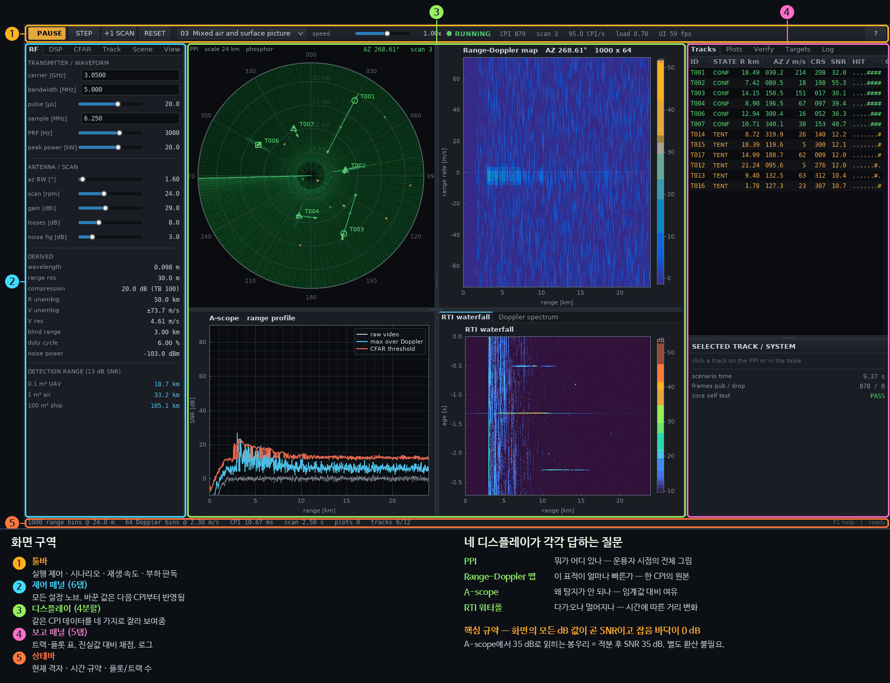

**한 가지만 기억하면 나머지가 쉬워짐.** 시뮬레이터가 잡음 분산을 정확히 1.0으로
넣고 체인이 그 기준을 끝까지 보존하므로, **화면의 모든 dB 값이 곧 SNR이고 잡음
바닥이 0 dB**임(2.4절). 임계값도, 트랙 품질도, 링크 예산도 전부 같은 자 위에 있음.

**두 번째로 중요한 것은 시간 단위가 셋이라는 점**(2.5절).

| 단위 | 길이 | 무엇 | 여기서 결정되는 것 |
|---|---|---|---|
| PRI | 333 µs | 펄스 하나 | 비모호 거리 50 km |
| CPI | 10.67 ms | 펄스 32발, 도플러 처리 한 묶음 | 속도 분해능 4.6 m/s |
| 스캔 | 2.5 s | 안테나 한 바퀴 (CPI 234개) | 트랙 갱신률, M-of-N |

검출은 CPI마다 일어나지만 **표적 하나는 스캔당 한 번만 보고되어야 함.** 그
변환이 3.8절의 드웰 병합이고, 이 프로젝트에서 가장 실무적인 부분임.

---

## 1. 레이다 기초

### 1.1 거리를 재는 원리

레이다는 전파를 쏘고 반사파가 돌아오는 시간을 잼. 전파 속도 `c`는 초당
약 3×10⁸ m이므로, 왕복 시간 `t`에서 거리가 나옴.

```
R = c · t / 2        (왕복이므로 2로 나눔)
```

이 시스템은 **펄스형(Pulsed Waveform, PW)** 레이다. 연속으로 쏘지 않고
짧은 펄스를 일정 간격으로 반복 송신함.

- **PRF (Pulse Repetition Frequency)** — 초당 펄스 수. 기본값 3000 Hz.
- **PRI (Pulse Repetition Interval)** — 펄스 간격, PRF의 역수. 여기서는 333 µs.

수신기는 펄스를 쏜 직후부터 다음 펄스 전까지 반사파를 기다림. 이 대기 구간을
샘플링한 것이 원시 데이터이고, 샘플 인덱스가 곧 거리에 대응함.

> **거리 빈(range bin)** — 샘플 한 칸. 이 시스템은 6.25 MHz로 샘플링하므로
> 한 칸이 `c/(2·6.25MHz)` = **23.98 m**에 해당.

### 1.2 거리 분해능과 펄스 길이의 상충

두 물체를 구분하려면 두 반사파가 시간축에서 겹치지 않아야 함. 따라서 단순한
펄스에서 **거리 분해능**은 펄스 길이가 결정함.

```
ΔR = c · Tp / 2       (Tp = 펄스 길이)
```

여기서 문제가 생김.

- 펄스를 짧게 → 분해능은 좋아지지만 **에너지가 부족**해 멀리 못 봄
- 펄스를 길게 → 에너지는 충분하지만 **분해능이 나빠짐**

탐지 거리는 펄스에 실린 총 에너지(첨두전력 × 펄스길이)가 결정하므로, 둘 다
얻으려면 다른 방법이 필요함.

### 1.3 펄스 압축 — 상충의 해결

해법은 **긴 펄스를 쏘되, 그 안에서 주파수를 변화시키는 것**. 이 시스템은
**LFM(Linear Frequency Modulation) 처프**를 씀. 펄스 20 µs 동안 주파수를
5 MHz 폭으로 선형으로 쓸어 올림.

수신 측에서 이 처프를 정합필터에 통과시키면, 20 µs에 걸쳐 퍼져 있던 에너지가
**1/B = 0.2 µs 폭의 뾰족한 봉우리로 압축**됨.

```
압축 후 분해능  ΔR = c/(2B) = 29.98 m       (펄스 길이와 무관, 대역폭만 관여)
압축 이득       = Tp · B = 100배 = 20 dB
```

- **시간대역폭적(TB)** — `Tp × B`. 여기서는 100. 압축비이자 SNR 이득.
- 즉 **3 km 길이의 펄스로 30 m 분해능을 얻음.** 이것이 펄스 압축.

대가도 있음. 압축된 봉우리 양옆에 **거리 부엽(range sidelobe)**이 생겨, 큰
표적 주변에 가짜 봉우리가 뜸. 이를 억제하는 것이 테이퍼(창 함수)이며,
이 시스템이 그것을 어떻게 처리하는지가 3.2절의 핵심.

### 1.4 도플러 — 속도를 재는 원리

표적이 움직이면 반사파 주파수가 변함(도플러 효과). 레이다에서는

```
fd = -2 · ṙ / λ      (ṙ = 시선속도, λ = 파장)
```

부호 규약: 이 코드에서 **시선속도는 멀어지는 방향이 양수**(`pwr_config.c` 주석).

한 펄스만으로는 이 미세한 주파수 변화를 못 잼. 대신 **여러 펄스에 걸친 위상
변화**를 봄. 표적이 움직이면 펄스마다 왕복 거리가 조금씩 달라지고, 그것이
위상의 규칙적 회전으로 나타남. 이 위상 열에 FFT를 걸면 속도별로 분리됨.

- **CPI (Coherent Processing Interval)** — 함께 FFT할 펄스 묶음. 기본 **32 펄스**,
  시간으로는 **10.67 ms**.
- **느린 시간(slow time)** — 펄스 번호 축. **빠른 시간(fast time)** — 펄스 내
  샘플 축. 도플러 FFT는 느린 시간 축으로 수행.

한 CPI를 처리하면 **거리 × 속도 2차원 지도**가 나옴. 이것이 Range-Doppler 맵이고
콘솔 우상단에 표시됨. 기본 형상은 **1000 거리 빈 × 64 속도 빈**.

### 1.5 모호성 — 반복 송신의 부작용

펄스를 반복하기 때문에 두 가지 되풀이가 생김.

**거리 모호** — 다음 펄스를 쏜 뒤에 도착한 먼 표적의 에코는 가까운 표적처럼
보임. 한계는

```
R_ua = c/(2·PRF) = 49.97 km
```

**속도 모호** — 펄스 간 위상 회전이 ±180°를 넘으면 방향을 구분할 수 없음.

```
V_ua = ±λ·PRF/4 = ±73.72 m/s
```

시속으로 약 ±265 km/h. 그보다 빠른 표적은 **접혀서(fold)** 엉뚱한 속도로 나타남.
시나리오 6이 이 현상을 재현하며, 추적기가 이를 어떻게 견디는지가 3.9절에 있음.

또 하나, 송신 중에는 수신을 못 하므로 아주 가까운 거리는 보이지 않음.

```
blind range = c·Tp/2 = 3.0 km
```

### 1.6 왜 고정 임계값이 안 되는가 — CFAR

"일정 세기 이상이면 표적"이라는 고정 임계값은 실패함. 배경 잡음 자체가
장소마다 다르기 때문.

- 가까운 바다는 해면 반사(클러터)가 강함
- 먼 거리는 잡음만 있음
- 재머가 있는 방위는 통째로 잡음이 올라감

고정 임계값을 낮게 잡으면 클러터 구역이 오경보로 뒤덮이고, 높게 잡으면 먼
표적을 놓침.

**CFAR(Constant False Alarm Rate)** 는 셀마다 **주변을 보고 임계값을 새로 계산**함.
검사 대상 셀(CUT) 둘레의 훈련 셀들로 그 자리의 배경 세기를 추정하고, 목표
오경보 확률 `Pfa`를 만족하는 배수를 곱해 임계값을 만듦. 배경이 올라가면
임계값도 같이 올라가므로 오경보율이 일정하게 유지됨.

바로 옆 셀은 표적 에너지가 새어 들어와 추정을 망치므로, CUT 주변 몇 칸은
**가드 셀**로 비워 둠.

### 1.7 플롯과 트랙

- **플롯(plot)** — 한 번의 관측에서 나온 "여기 뭔가 있다"는 점. 위치 정보만 있고
  정체성은 없음.
- **트랙(track)** — 여러 스캔에 걸쳐 이어 붙인 하나의 물체. 고유 번호, 속도,
  침로, 이력을 가짐.

플롯을 트랙으로 바꾸는 일이 **추적(tracking)** 이고 두 문제로 나뉨.

1. **데이터 연관** — 이번 플롯이 어느 트랙의 것인가
2. **필터링** — 잡음 섞인 관측에서 참 위치·속도를 추정 (칼만 필터)

레이다가 회전하면 한 표적은 **한 바퀴에 한 번** 관측됨. 기본값 24 rpm이므로
**2.5초에 한 번**. 추적기의 시간 규약이 여기서 나옴.

### 1.8 기본 제원 (실측)

기본 설정을 라이브러리에 통과시켜 얻은 값.

| 항목 | 값 | 유도 |
|---|---|---|
| 파장 λ | 0.09829 m | c / 3.05 GHz |
| 거리 분해능 | 29.98 m | c / (2 × 5 MHz) |
| 거리 빈 간격 | 23.98 m | c / (2 × 6.25 MHz) |
| 압축 이득 | 20.00 dB (TB 100) | 20 µs × 5 MHz |
| 코히런트 적분 이득 | 15.05 dB | 10 log₁₀ 32 |
| PRI 샘플 수 | 2083 | 6.25 MHz / 3000 Hz |
| 고속시간 FFT 크기 | 2048 | 게이트 창 기준 축소 (3.2절) |
| 처리 격자 | 1000 × 64 | 거리 × 도플러 |
| 비모호 거리 | 49.97 km | c / (2 × PRF) |
| 비모호 속도 | ±73.72 m/s | λ × PRF / 4 |
| 속도 분해능 | 4.607 m/s | λ×PRF/(2×32 펄스) |
| 속도축 간격 | 2.304 m/s | λ×PRF/(2×64 빈), 2배 오버샘플 |
| 블라인드 거리 | 3.00 km | c × 20 µs / 2 |
| CPI | 10.667 ms | 32 / 3000 Hz |
| 스캔 주기 | 2.5 s | 60 / 24 rpm |
| CPI/스캔 | 234.4 | 2.5 s / 10.667 ms |
| CPI당 방위 진행 | 1.536° | 360° × 10.667ms / 2.5s |
| 빔폭당 펄스 수 | 33.3 | 1.6° 통과 시간 × PRF |
| 듀티비 / 평균전력 | 6.00 % / 1200 W | 20 µs × 3000 Hz |
| 잡음 전력 | −103.02 dBm | kT₀BF |

**속도 분해능(4.607)과 속도축 간격(2.304)이 다른 이유** — 32개 펄스를 64점
FFT로 처리(제로 패딩)하기 때문. 실제 분리 능력은 4.607 m/s이고 축은 그 절반
간격으로 촘촘히 찍힘. 오버샘플은 분해능을 높이지 않고 봉우리 위치 추정만
매끄럽게 함.

**링크 예산** (RCS 1 m², 보어사이트 기준, `pwr_snr_single_pulse_db`)

| 거리 | 단일 펄스 SNR | CPI 적분 후 |
|---|---|---|
| 5 km | 45.91 dB | 60.96 dB |
| 10 km | 33.87 dB | 48.92 dB |
| 20 km | 21.83 dB | 36.88 dB |
| 30 km | 14.79 dB | 29.84 dB |
| 40 km | 9.79 dB | 24.84 dB |

거리가 2배면 SNR이 12 dB 떨어짐(R⁻⁴ 법칙). 단일 펄스 13 dB 기준 최대 탐지거리는
0.1 m² 18.70 km / 1 m² 33.25 km / 100 m² 105.14 km.

### 1.9 Pfa를 정하는 법

`Pfa`는 **셀 하나당** 오경보 확률이므로, 실제 오경보 개수는 검사하는 셀 수에
비례함.

```
CPI당 셀      1000 × 64 = 64,000
스캔당 CPI    234.4
스캔당 셀     약 1.5 × 10⁷
```

따라서 기본값 `Pfa = 1e-7`에서

```
1e-7 × 1.5e7 = 스캔당 오경보 약 1.50개
```

관습적으로 쓰이는 `1e-6`이면 스캔당 15개가 되어 트랙 파일이 가짜 트랙으로
채워짐. 이 프로젝트가 `1e-7`을 기본값으로 쓰는 근거.

실측은 설계값보다 높게 나오며, 그 이유와 분해된 원인은 부록 G.1에 있음.

### 1.10 좌표계·각도·부호 규약

코드 전체가 다음 네 규약을 지킴. 하나라도 잘못 읽으면 화면이 통째로 뒤집혀
보이므로 여기서 못 박아 둠 (`pwr_config.c` 파일 상단 주석에 원문이 있음).

**① 좌표계는 ENU, 레이다가 원점**

```
x = East (동)      y = North (북)      z = Up (고도)
```

`PWR_SimTarget`의 `x_m, y_m, z_m`과 `PWR_Track`의 `x_m, y_m`이 모두 이 계.
트래커 내부 상태도 격자 인덱스가 아니라 **ENU 미터**임 — 그래서 처리 격자를
바꿔도 트랙 파일이 살아남음(4.6절).

**② 방위는 나침반 방위(compass bearing)**

```
0° = 북(+y),  90° = 동(+x),  시계 방향으로 증가
```

수학 관례(동쪽 0°, 반시계)와 **반대**임. 그래서 코드에 `atan2(x, y)`가
나옴 — 흔한 `atan2(y, x)`가 아님. 방위→직교 변환도 짝을 맞춤.

```c
x = R * sin(az);      /* not cos */
y = R * cos(az);      /* not sin */
```

**③ 시선속도는 멀어지는 쪽이 양수**

```
rdot > 0  →  개방(opening, 멀어짐)
rdot < 0  →  접근(closing, 다가옴)
fd = -2 * rdot / lambda        (접근하면 도플러 주파수가 +)
```

**④ 표시 도플러 축은 시선속도 증가 순**

따라서 **행 0이 가장 빨리 접근하는 표적**, 마지막 행이 가장 빨리 멀어지는 표적.
FFT 출력 순서와 다르므로 `pwr_chain_doppler`가 재배열함(3.5절).

```
행 j  ←  FFT 빈 k = (n/2 - 1 - j + n) mod n
rdot(j) = lambda*PRF/(2n) * (j - n/2 + 1)
```

기본 형상(n = 64)에서 **행 31이 시선속도 0**이고, 이 행이 제로 도플러 검열
대상임(3.7절, 부록 F).

---

## 2. 전체 구조

### 2.1 두 개의 실행 단위

| 프로젝트 | 산출물 | 역할 |
|---|---|---|
| `PWRadarCore` | `.dll` / `.so` | 신호처리 엔진. 창도 화면도 모름 |
| `PWRadarUI` | `.exe` / 실행파일 | 검증 콘솔. 레이다 물리를 모름 |

둘 사이는 순수 C ABI 하나로만 연결됨(`PWRadarCore/include/pwradar/`). UI는 축
정보·단위·눈금까지 전부 프레임 구조체에서 받으므로 레이다 지식이 필요 없고,
코어는 표시 방법을 모른 채 데이터만 발행함.

경계를 넘는 구조체 배치는 `PWR_ABI_VERSION`(현재 5)에 종속되며, UI가 시작 시
`pwr_abi_version()`을 자기 컴파일 값과 대조해 불일치면 실행을 거부함
(`ui_app.c · app_create`).

### 2.2 한 CPI의 생애

엔진의 심장은 `pwr_engine.c · pwr_engine_process_cpi()`. 이 함수 한 번이
곧 "펄스 32발을 쏘고 받아 처리해 화면 한 장을 만드는" 전 과정임.

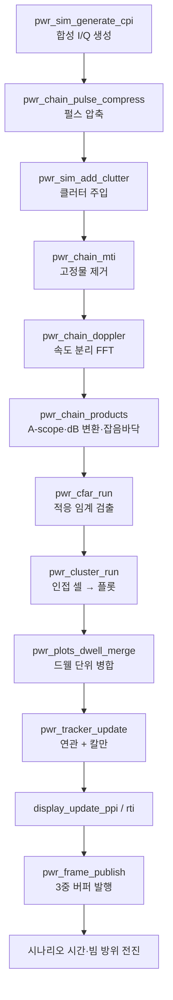

각 단계는 EWMA로 시간이 계측되어 상태바와 DSP 탭에 표시됨. `load_factor`는
`t_total / CPI 예산`이며, 1을 넘으면 실시간을 못 따라간다는 뜻.

**클러터 주입이 압축 '뒤'에 있는 점**이 순서상 가장 눈에 띄는 부분이며,
이유는 3.3절에 있음.

### 2.3 데이터가 거치는 모양 변화

같은 데이터가 단계마다 배열 모양을 바꿈. `pwr_core.h` 상단에 규약이 정의됨.

| 버퍼 | 모양 | 의미 |
|---|---|---|
| `rx` | `[펄스][고속시간 샘플]` 32 × 2083 | 수신기 원시 I/Q |
| `pc` | `[펄스][거리 빈]` 32 × 1000 | 압축 후 |
| `slow` | `[거리 빈][도플러 빈]` 1000 × 64 | 느린시간 전치 (FFT 입력) |
| `rd_pow` | `[도플러 빈][거리 빈]` 64 × 1000 | 표시·검출용 전력 맵 |

**전치가 두 번 일어나는 것은 의도적**임.

- `pc → slow` 전치로 도플러 FFT가 **연속된 행**에서 수행됨 (캐시 효율)
- `slow → rd_pow` 전치로 최종 배치가 **화면 표시 순서**이자 **CFAR 거리축
  슬라이딩 순서**와 일치함

각 원소는 `PWR_Complex`(float 2개). 단정밀도를 쓰는 이유는 FFT 단계의 지배적
비용이 메모리 대역폭이고, float으로도 120 dB 이상의 유효 동적범위가 확보되어
실제 수신기 ENOB을 훨씬 상회하기 때문(`pwr_types.h` · `pwr_real` 정의 주석).

### 2.4 모든 dB가 SNR인 이유 (이 코드베이스의 핵심 불변식)

이 프로젝트를 이해하는 데 가장 중요한 규약.

> **시뮬레이터가 복소 샘플당 열잡음 분산을 정확히 1.0으로 주입하고,
> 신호처리 체인이 그 기준을 끝까지 보존함. 따라서 화면의 dB 값은 곧 SNR이고
> 잡음 바닥이 0 dB에 놓임.**

이것이 성립하려면 각 단계가 잡음에 가하는 이득을 정확히 상쇄해야 하며,
두 상수가 그 일을 함.

| 상수 | 위치 | 역할 |
|---|---|---|
| `sigma_pc` | `pwr_engine.c · pwr_engine_refresh_calibration` | 압축 필터가 단위분산 백색잡음에 가하는 진폭 이득 |
| `doppler_norm` | 같은 함수 | 도플러 FFT + 테이퍼의 이득 상쇄 |

`sigma_pc`는 **가정이 아니라 측정값**. `pwr_waveform.c · pwr_waveform_build()`가
필터를 단위 압축 피크로 정규화한 뒤(5단계), 파스발 관계로 실제 잡음 이득을
계산함(6단계).

```
sigma_pc     = sqrt( Σ|H[k]|² / N )
doppler_norm = 1 / ( sigma_pc · sqrt(Σ w_d²) )
```

기본 형상(Taylor −35 dB)에서 `sigma_pc = 0.0999`. 테이퍼를 바꾸면 이 값도 같이
바뀌므로(0.0939 ~ 0.1268, 부록 G.2) 캘리브레이션은 테이퍼 변경 때마다 다시
계산됨.

이 규약 덕분에 하류가 단순해짐. 임계값·탐지·트랙 품질 어디에도 추가 스케일링이
없고, 운용자는 화면을 SNR 계측기로 그대로 읽을 수 있음. MTI 계수에
`1/sqrt(Σc²)`를 **곱하는** 것도(3.4절) 같은 불변식을 지키기 위한 것.

**이 불변식이 깨지는 두 경우**가 있고, 둘 다 의도된 것임.

| 경우 | 무슨 일이 벌어지나 |
|---|---|
| **STC를 켰을 때** | 램프가 표적 에코와 클러터에만 걸리고 열잡음에는 걸리지 않으므로, `stc_range_m` 안쪽에서는 표적이 램프만큼 내려가고 잡음 바닥은 0 dB에 그대로 있음. 화면 dB는 여전히 SNR이지만, 그 SNR 자체가 근거리에서 감쇠분만큼 낮아진 값임 (3.2절) |
| **A-scope·RTI를 볼 때** | 이 둘은 도플러축 **최댓값**(max-hold)이므로 잡음 바닥이 셀 단위 바닥보다 `ln(N_doppler)`만큼 위에 있음. 64빈이면 약 +6 dB. R-D 맵만이 셀 단위로 0 dB임 |

### 2.5 스캔과 드웰 — 시간 규약

회전 레이다이므로 시간 단위가 셋 있고, 코드 곳곳의 판단 기준이 이 중 하나임.

| 단위 | 길이 | 무엇 |
|---|---|---|
| PRI | 333 µs | 펄스 하나 |
| CPI | 10.67 ms | 도플러 처리 묶음, 방위 1.536° 진행 |
| 스캔 | 2.5 s | 안테나 한 바퀴, CPI 234개 |

**드웰(dwell)** — 빔이 한 표적을 지나가는 동안. 빔폭 1.6°이므로 CPI 약 1~2개에
걸치지만, 강한 표적은 빔 부엽까지 포함해 훨씬 여러 CPI에서 검출됨.

이 구분이 중요한 이유: **검출은 CPI마다 일어나지만, 표적 하나는 스캔당 한 번만
보고되어야 함.** 그 변환이 3.8절의 드웰 병합이고, 추적기의 M-of-N도 스캔을
단위로 셈(3.9절).

### 2.6 프레임 — 코어가 UI에게 넘기는 것 전부

`PWR_Frame` 하나가 "화면 한 장에 필요한 모든 것"임. UI는 이것 말고는 코어의
내부를 전혀 보지 않으며, **축 정보·단위·눈금까지 전부 여기 들어 있으므로 UI에
레이다 지식이 필요 없음**.

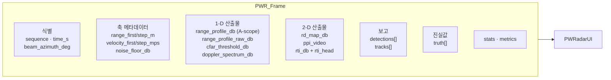

| 필드 | 크기 | 무엇 | 어느 화면 |
|---|---|---|---|
| `range_profile_db` | `[range_bins]` | 거리별 도플러축 최댓값 | A-scope 실선 |
| `range_profile_raw_db` | `[range_bins]` | **MTI 이전** 비코히런트 평균 | A-scope "raw video" |
| `cfar_threshold_db` | `[range_bins]` | A-scope가 보여주는 셀의 임계값 | A-scope 점선 |
| `doppler_spectrum_db` | `[doppler_bins]` | 커서 거리빈의 도플러 단면 | 스펙트럼 창 |
| `rd_map_db` | `[doppler_bins × range_bins]` | 전체 거리-도플러 지도 | R-D 맵 |
| `ppi_video` | `[ppi_az_cells × range_bins]` | 잔광 누산 결과 (8비트) | PPI 배경 |
| `rti_db` | `[rti_rows × range_bins]` 링 | 거리 프로파일 이력 | RTI 워터폴 |
| `detections` | ≤ 512 | 이번에 발행된 플롯 | PPI 점, Plots 탭 |
| `tracks` | ≤ 128 | 전체 트랙 파일 | PPI 심볼, Tracks 탭 |
| `truth` | ≤ 64 | 시나리오 표적 원본 | `T` 오버레이, Verify 탭 |

**수명 계약** — 이 포인터들은 `pwr_engine_frame_acquire()` 성공과 짝이 되는
`pwr_engine_frame_release()` **사이에서만** 유효함. 그 밖에서 접근하면 워커가
같은 슬롯에 덮어쓰는 중일 수 있음. 3중 버퍼가 이를 성립시킴(4.2절).

**`range_profile_raw_db`에 클러터가 없는 이유** — 이 배열은
`pwr_chain_pulse_compress` 안에서 누산되는데, 클러터 주입은 그 **뒤에** 실행됨
(3.3절). 따라서 "raw video" 트레이스는 MTI 이전이면서 동시에 **클러터 이전**임.
클러터가 A-scope 실선에는 보이는데 raw 트레이스에는 안 보이는 이유가 이것.

---

## 3. 신호처리 단계별 상세

### 3.1 시뮬레이터 — 가짜 수신기 만들기

**파일** `pwr_sim.c` · **출력** `rx[32][2083]` 복소 I/Q

실제 안테나 대신 수신기 출력을 합성함. 순서는 잡음 → 표적 → 이클립싱.

**(1) 잡음 바닥**

```c
if (enable_thermal_noise) noise_var += 1.0;      // 정확히 1.0
if (enable_jammer)        noise_var += 재머전력 × 패턴이득 × 대역비율;
```

분산 1.0은 임의의 값이 아니라 **전 시스템 dB 기준의 정의**임(2.4절).
재머는 안테나 패턴을 통해 들어오므로 특정 방위에서만 잡음이 솟구침.

**(2) 표적**

각 표적에 대해 순서대로 계산.

| 단계 | 내용 |
|---|---|
| 기하 | ENU 좌표 → 경사거리, 방위, 고각, 시선속도 (`pwr_geom_compute`) |
| 안테나 | 2-way 가우시안 주엽. −45 dB에서 `1/θ²` 부엽 포락선으로 인계 |
| 요동 | Swerling 모델별 진폭 배율 |
| 다중경로 | 저고각에서 해면 반사와의 간섭 (로빙). 왕복 경로이므로 진폭에 `F²` |
| 링크예산 | 레이다 방정식으로 SNR 산출 |

안테나 패턴은 주엽만 가우시안 근사이고, 그 바깥은 실제 개구가 따르는 감소
포락선으로 넘어감.

```
u = |θ| / θ₃dB
G(θ)/G₀ = exp(−2.7726 · u²)                 // u ≤ 1.9331, θ₃dB/2 에서 −3 dB
        = 3.16e−5 · (1.9331/u)²             // 그 바깥, −45 dB에서 이어받는 1/θ²
2-way   = (G_az · G_el)²
```

두 상수는 한 쌍임 — 가우시안이 −45 dB를 지나는 지점이 인계점이라 패턴이 연속임
(불연속 0.001 dB 미만). **평탄한** 바닥이 아니라 감소 포락선인 이유: 평탄하면
재머가 5°에서나 180°에서나 같은 응답을 받고, 근거리 대형 표적이 360° 전 방위에
균일한 부엽 고리를 그림. 다만 개별 부엽 로브·널·후엽은 없는 매끄러운 포락선이므로
부엽 **레벨**은 논할 수 있어도 부엽 블랭킹·상쇄는 논할 수 없음.

주입 진폭은 dB 규약과 직결됨.

```
amp = sqrt(SNR_linear) · sigma_pc · 요동배율 · F² · g_stc(R)
```

`F`는 편도 전압 전파인자(다중경로). 단상태 왕복 경로는 간섭 패턴을 두 번
지나므로 전력이 `F⁴`, 즉 진폭이 `F²`임 — 바로 위에서 편도 전력 패턴을 제곱해
`pat2`를 만드는 것과 같은 이유. `F`를 한 번만 곱하면 로빙의 널과 피크가 dB로
정확히 절반이 됨.

`sigma_pc`를 곱하는 이유: 압축 필터가 단위 피크 이득으로 정규화되어 있으므로,
압축 출력에서 신호 피크는 `sqrt(SNR)`, 잡음은 `sigma_pc`가 됨. 즉 **설계한
SNR이 압축 후에 정확히 그대로 나타남**.

**Swerling 모델** — 표적 반사 세기는 자세가 조금만 바뀌어도 요동침. 이를
통계 모델로 표현한 것.

| 모델 | 분포 | 갱신 주기 |
|---|---|---|
| 0 | 요동 없음 | — |
| 1 / 2 | 지수(레일리 진폭) | 스캔마다 / 펄스마다 |
| 3 / 4 | 자유도 4 카이제곱 | 스캔마다 / 펄스마다 |

**(3) 분수 지연 처프 삽입** — 정확도의 핵심

표적 지연 `tau`는 정수 샘플이 아님. 흔한 방법은 보간이지만, 이 코드는 **해석적
위상을 직접 평가**함.

```c
u = n − tau;                                   // 샘플 n에서의 처프 내 위치
t = (u − tx_centre)/fs;
sig = carrier × exp(jπ·K·t²);                  // 보간 없음
```

보간 오차가 없으므로 압축 봉우리 위치가 부표본 정밀도로 정확함. 자체검증 T6가
12000 m 표적을 11992 m로 찾아내는 근거(오차 8 m, 빈 간격 24 m의 1/3).

펄스 간에는 두 가지가 동시에 진행됨.

```
tau_rate = 2·ṙ/c · fs · PRI     // CPI 내 거리 워크 (지연이 조금씩 변함)
fd       = −2·ṙ/λ               // 도플러 위상 진행
```

**(4) 이클립싱** — 송신 중 수신 불가. 각 펄스 앞부분 `n_tx` 샘플(기본 125)을
0으로 만듦. 1.5절의 블라인드 거리 3.0 km가 여기서 생김.

주의할 점: **잡음도 같이 지워짐.** 이클립싱 구간은 신호도 잡음도 0이므로 그
안쪽 A-scope 바닥이 0 dB가 아니라 훨씬 아래로 떨어짐. 압축 필터가 이 구간을
걸치면서 부드러운 램프가 생기므로, 근거리 몇 백 m의 잡음 바닥이 비스듬히
올라오는 모양이 됨. 캘리브레이션이 깨진 것이 아님.

**최적화** — 잡음과 에코를 `fast_copy` 샘플까지만 생성함. 그 뒤 샘플은 어차피
표시 거리 빈에 도달할 수 없어 압축기가 읽지도 않음. 기본 형상에서는 표시 범위
24 km + 펄스 1개분이므로 **약 27 km 밖의 표적은 시뮬레이터 단계에서 아예
존재하지 않음** — 표적을 멀리 놓았는데 아무것도 안 뜨면 이것을 의심할 것.

**(5) 다중경로(로빙)** — `enable_multipath`

저고각 표적은 직접파 말고 **해면에 반사된 경로**로도 신호가 돌아옴. 두 경로의
행로차가 파장의 정수배면 보강, 반파장 어긋나면 상쇄되어 **고도에 따라 밝기가
줄무늬처럼 진동**함(로빙, lobing).

```c
dphi   = 4π · h_ant · h_tgt / (λ · R)          /* 두 경로의 위상차 */
gain   = | 1 + Γ · exp(j·dphi) |,  Γ = -0.9    /* 해면 반사계수 */
```

`Γ = −0.9`는 저입사각 해면의 프레넬 반사계수 근사이고, 부호가 음수인 것은
반사 시 위상이 180° 뒤집히기 때문. 그래서 `dphi = 0`(표적이 아주 낮거나 아주
멀 때)이면 **이득이 0.1로 거의 상쇄**됨 — 수평선 근처 저고각 표적이 잘 안 보이는
실제 현상이 그대로 재현됨. 최대 이득은 1.9(약 +5.6 dB).

적용 조건은 고각 10° 미만 + 안테나 높이 > 0.1 m + 표적 고도 > 0.1 m.
시나리오 7이 이것을 켬.

**(6) 재머** — `enable_jammer`

재머는 **표적과 근본적으로 다르게** 들어옴.

| | 표적 | 재머 |
|---|---|---|
| 안테나 패턴 | **2-way** (송신×수신) | **1-way** (수신만) |
| 거리 의존 | R⁻⁴ | 없음 (직접 복사) |
| 나타나는 곳 | 특정 (거리, 도플러) 셀 | **모든 거리·모든 도플러** |

재머는 스스로 전파를 쏘므로 왕복이 아니라 편도이고, 그래서 패턴 가중이
`pwr_pattern_oneway` 한 번만 적용됨. 코드에서는 잡음 분산 자체를 올리는 방식으로
구현됨.

```c
noise_var += 10^(jammer_power_db/10) · G_1way(방위차) · 대역비율;
```

결과적으로 PPI에서 **재머 방위에만 반경 방향으로 뻗은 밝은 띠**(재밍 스트로브)가
생김. 그 방위에서는 잡음 바닥 자체가 올라가 있으므로 CFAR가 임계를 같이 올리고,
따라서 오경보는 늘지 않되 **그 방위의 탐지 거리가 짧아짐**. 이것이 잡음 재밍의
목적이며, 시나리오 7에서 관찰 가능.

**(7) 거리 모호 폴딩** — `enable_range_ambiguity` (기본 꺼짐)

켜면 표적 지연을 PRI로 나눈 나머지로 접음.

```c
tau0 = fmod(tau0, samples_per_pri);
```

즉 60 km 표적이 10 km에 나타남(비모호 거리 50 km). 끄면 그런 표적은 그냥
윈도우 밖으로 나가 사라짐. **기본값이 꺼짐**이므로 1.5절에서 설명한 거리 모호는
기본 설정에서는 관찰되지 않음 — 보려면 이 스위치를 켜야 함.

**(8) 난수와 재현성**

시뮬레이터는 PCG32 스트림을 **두 개** 씀(`pwr_math.c`, `pwr_sim.c · pwr_sim_reset`).

| 스트림 | 쓰이는 곳 |
|---|---|
| `rng` | 열잡음, 재머, 표적 Swerling 요동 |
| `rng_clutter` | 해면·강우 클러터 (AR(1) 상태 포함) |

분리해 두는 이유는 **클러터를 껐다 켜도 표적과 잡음의 난수열이 흔들리지 않게**
하기 위함임. 그래야 "클러터만 바꿨을 때 무엇이 달라지는가"를 비교할 수 있음.

시드는 `PWR_SimEnvironment::rng_seed`(기본 `0x5150524152` = ASCII "PWRAR").

```c
seed = deterministic ? rng_seed : (rng_seed ^ 0x9E3779B97F4A7C15);
```

> **주의** — `deterministic = 0`은 **무작위가 아님.** 고정 상수를 XOR 한 *다른*
> 고정 시드를 쓸 뿐이라 여전히 완전히 재현 가능함. 이 라이브러리에 진짜
> 비결정적 경로는 없음. 매 실행 다른 결과를 원하면 `rng_seed`를 직접 바꿔야 함.

리셋할 때마다 같은 시드로 되돌아가므로 **같은 시나리오가 비트 단위로 재현됨.**
자체검증과 시나리오 회귀가 성립하는 근거이며, 부록 G의 실측치가 재현 가능한
이유이기도 함.

---

### 3.2 펄스 압축 — 긴 펄스를 뾰족하게

**파일** `pwr_waveform.c · pwr_waveform_build`(필터 설계, 시작 시 1회) +
`pwr_chain.c · pwr_chain_pulse_compress`(매 CPI 적용)

**압축 필터 만들기**

```
1. 처프 생성      s(t) = exp(jπKt²),  K = B/Tp
2. TX 스펙트럼    FFT(s)
3. 등화 필터      H(f) = conj(TX)·W(f) / (|TX|² + ε)
4. 정규화         압축 피크가 정확히 1이 되도록 스케일
5. 측정           noise_gain, 정합손실, 부엽, 주엽폭
```

**3단계가 이 프로젝트에서 가장 특징적인 결정.**

교과서적 구현은 시간영역 레플리카에 창을 곱함. 그 방식은 시간축과 주파수축이
대응한다는 **정상위상 근사**에 의존하고, 오차는 `1/sqrt(Tp·B)`로만 줄어듦.
TB = 100이면 오차가 10 % 수준으로 남고, LFM 스펙트럼의 Fresnel 리플이
**±Tp 전 구간에 −40 dBc 평탄한 페어드 에코 대(pedestal)** 를 만듦.

거리로 환산하면 대형 선박 양쪽 **±3 km에 유령 표적**이 뜬다는 뜻. 설계상
−35 dB 부엽을 약속한 테이퍼를 썼는데도 실제로는 −40 dBc 바닥이 깔림.

`|TX(f)|`를 나눠 스펙트럼을 평탄화하면 리플이 사라지고 **선택한 테이퍼의 설계
부엽이 (아래 한계 안에서) 실제로 구현됨**. `ε = 0.02 × max|TX|²`는 등화 동적범위
상한이며, 나눗셈이 발산해 잡음이 폭증하는 것을 막음.

측정된 결과 — 코드가 시작 시 실제로 계산해 로그로 출력하는 값 전체:

| 테이퍼 | 달성 부엽 | 주엽폭 | 정합손실 | `sigma_pc` |
|---|---|---|---|---|
| Rectangular | −25.4 dB | 2.0 bin | **0.42 dB** | 0.0939 |
| **Taylor −35 dB** (기본) | **−37.4 dB** | 2.0 bin | 0.05 dB | 0.0999 |
| Hamming | −43.8 dB | 2.0 bin | 0.02 dB | 0.1047 |
| Taylor −50 dB | −47.9 dB | 2.0 bin | 0.02 dB | 0.1064 |
| Hann | −55.2 dB | 2.0 bin | 0.01 dB | 0.1097 |
| Kaiser β=6 | −59.9 dB | 2.0 bin | 0.01 dB | 0.1085 |
| Blackman-Harris | −63.6 dB | 4.0 bin | 0.01 dB | 0.1268 |
| Chebyshev −60 dB | −64.4 dB | 4.0 bin | 0.01 dB | 0.1195 |
| Blackman | −64.5 dB | 4.0 bin | 0.01 dB | 0.1177 |

부엽을 낮추면 주엽이 넓어지는 상충이 표에 그대로 보임. 기본값이 Taylor −35 dB인
이유는 **주엽 2 bin을 유지하는 테이퍼 중 부엽이 가장 낮기** 때문.

**정합손실은 테이퍼마다 다름.** 테이퍼가 있는 쪽은 0.01~0.05 dB로 무시 가능하지만
**Rectangular만 0.42 dB**임. 등화 필터 `W/(|TX|²+ε)`에서 `W`가 평탄하면 대역
가장자리까지 그대로 밀어 올려야 하므로 등화가 가장 세게 걸리고, 그 대가가
잡음 증폭으로 나타남. "정합손실이 전부 0.05 dB 이하"는 테이퍼를 쓰는 경우에만
맞는 말임.

**ε은 부엽의 바닥도 정함 — 이것이 표를 읽는 열쇠.**

`ε`은 정합손실의 상한이자 동시에 **달성 가능한 부엽의 하한**임. 등화가 `ε`에서
멈추므로 스펙트럼 평탄화가 완벽하지 않고, 남은 리플이 약 −64 dB의 부엽 바닥을
만듦. 실측으로 확인됨(`PWR_EQ_EPSILON`을 바꿔 가며 측정).

| 테이퍼 | 설계 부엽 | ε = 0.02 (기본) | ε = 0.002 | ε = 0.0002 |
|---|---|---|---|---|
| Taylor −35 dB | −35 dB | −37.4 | −37.4 | −37.4 |
| Hamming | −42.7 dB | −43.8 | −43.8 | −43.8 |
| Blackman | −58 dB | −64.5 | −64.3 | −64.2 |
| Chebyshev −60 dB | −60 dB | −64.4 | −83.9 | −86.2 |
| **Blackman-Harris** | **−92 dB** | **−63.6** | −83.4 | **−93.6** |

읽는 법.

- 설계 부엽이 −64 dB보다 **얕은** 테이퍼(Taylor, Hamming)는 `ε`과 무관 — 자기
  설계값을 그대로 달성함.
- 설계 부엽이 −64 dB보다 **깊은** 테이퍼(Blackman-Harris 설계 −92 dB)는 기본
  `ε`에서 −63.6 dB에 막힘. `ε`을 100배 줄이면 −93.6 dB까지 내려감.
- 즉 **기본 설정에서 Blackman-Harris를 고르면 주엽만 2배로 넓어지고 부엽 이득은
  없음.** −64 dB 아래를 원하면 `ε`을 함께 낮춰야 하고, 그 대가는 정합손실 증가
  (Rectangular 기준 0.42 → 0.47 dB).

**PSL을 재는 방법도 알아 둘 것.** `pwr_waveform_build` 7단계는 압축 응답을
봉우리에서 바깥으로 걸어 나가며 **응답이 처음으로 다시 올라가는 지점**(첫 널)을
찾고, 그 바깥의 최댓값을 PSL로 보고함. 이 방식은 테이퍼가 있을 때는 정확하지만
**Rectangular에서는 근거리 부엽을 건너뜀** — 6.25 MHz 표본에서 sinc가 처음 몇
표본 동안 단조 감소하기 때문. 실제 점표적으로 끝단까지 측정하면 Rectangular의
첫 부엽은 **−12.8 dB**(교과서 −13.2 dB)이고, 로그의 −25.4 dB는 그보다 바깥의
바닥임(부록 G.2). 테이퍼를 쓰는 설정에서는 두 값이 일치함.

**매 CPI 적용** — 주파수영역 상관.

```c
FFT(수신) → × mf_spectrum → IFFT → 데시메이션
dst[i] = w[range_offset + i·range_decim];
```

상관으로 구현했기 때문에 **출력 인덱스가 곧 에코 지연 샘플**이고, 따라서

```
range(i) = range_first_m + i · range_step_m
```

에 어떤 군지연 보정항도 필요 없음. 체인 전체가 이 성질에 기대고 있음.

**FFT 크기 축소** — 전체 PRI(2083 샘플)를 변환할 필요가 없음. 표시 거리 빈에
도달 가능한 창 + 펄스 1개 + 순환 겹침 흡수용 패딩 2개면 충분하므로
`pow2_ceil(1125 + 250) = 2048`. 전체를 쓰면 4096이므로 **변환 비용 절반**.

**FFT 구현** (`pwr_fft.c`) — radix-4 위주에 log₂n이 홀수일 때만 radix-2 한 단.
순수 radix-2 대비 실수 곱셈 약 25 % 절감. 비트반전 후 radix-4 버터플라이는
입력 두 개를 교환해서 읽어야 하는데(`t1 ← +2q`, `t2 ← +1q`), 그 근거가 파일
상단에 증명으로 적혀 있음. 플랜은 생성 후 불변이라 여러 스레드가 공유 가능.

**압축을 끄면** (`enable_pulse_compression = 0`) 원시 비디오를 데시메이션만 해서
통과시킴. 이때 `sigma_pc`가 1.0으로 바뀌므로 **잡음 바닥은 여전히 0 dB**이고,
표적만 압축이득 20 dB 만큼 낮아짐. 축이 아니라 표적이 내려가는 것이 올바른 동작임.

**STC — 감도 시간 제어** (`enable_stc`)

아날로그 레이다는 근거리 강반사가 수신기를 포화시키는 것을 막기 위해, 펄스를 쏜
직후에는 이득을 낮췄다가 시간이 지날수록 올림. 그 램프를 디지털로 재현한 것.

```c
g(R) = clamp( (R / stc_range_m)², 1e-3, 1.0 );      /* 진폭 이득 */
```

진폭에 `(R/R_stc)²`이므로 **전력으로는 `(R/R_stc)⁴`** — 표적 에코의 R⁻⁴ 감쇠를
정확히 상쇄하는 램프임. `stc_range_m`(기본 6 km) 바깥은 이득 1배로 손대지 않음.

**어디에 걸리는가가 핵심임.** 실제 STC 감쇠기는 **수신기 앞단**에 있으므로, 그
거리에서 도달한 모든 에너지 — 표적 에코와 표면 클러터 — 를 줄이고 수신기 자신의
열잡음은 건드리지 않음. 따라서 램프는 도달 에너지가 합성되는 두 지점에서 곱해짐:

| 대상 | 적용 위치 |
|---|---|
| 표적 에코 | `pwr_sim.c · pwr_sim_generate_cpi` — 링크버짓 직후, 경사거리 기준 |
| 분산 클러터 | `pwr_sim.c · pwr_sim_add_clutter` — 주입 진폭에 거리빈별 램프 |
| 열잡음 | 적용 안 함 |

단일 진리원은 `pwr_engine.c · pwr_stc_gain_at()`이고, 거리빈별 램프
`PWR_Engine::stc_gain`도 같은 함수에서 만들어지므로 둘이 어긋날 수 없음.

압축된 큐브에 한꺼번에 곱하면 안 되는 이유가 두 가지임. 열잡음까지 같이 줄어들어
SNR이 보존돼 버리고(실제 STC는 근거리 SNR을 그만큼 지불함), 분산 클러터는 압축
**이후에** 주입되므로 램프를 아예 비껴가서 — STC가 억제하려던 바로 그 신호만
그대로 남음.

실측(기본 `stc_range_m = 6 km`, 해면클러터 CNR 30 dB, 압축 후 A-scope):

| 거리 | STC 끔 | STC 켬 | 이론 램프 `40·log₁₀(R/6km)` |
|---|---|---|---|
| 750 m | +28.4 dB | +0.6 dB | −36.1 dB |
| 1.5 km | +19.5 dB | +1.4 dB | −24.1 dB |
| 3 km | +13.1 dB | +3.7 dB | −12.0 dB |
| 6 km | +4.9 dB | +4.9 dB | 0 dB |

측정값은 클러터+잡음 합이므로 감쇠폭이 램프보다 작게 보임: 750 m에서 클러터는
28.4 → −7.7 dB로 내려가지만 열잡음 0 dB는 그대로라 합이 0.6 dB에서 멈춤. 이것이
정확히 STC가 하는 일 — **클러터를 잡음 바닥까지 눌러 내리고 바닥은 두는 것**.

> **대가** — 근거리 SNR을 램프만큼 지불함. 근거리는 SNR이 과잉이므로 실제 장비에서
> 늘 켜 두는 거래이지만, 이 콘솔은 계측기로도 쓰이므로 기본값은 **꺼짐**임.

---

### 3.3 클러터 주입 — 왜 여기인가

**파일** `pwr_sim.c · pwr_sim_add_clutter` · **위치** 압축 직후, MTI 직전

파이프라인에서 유일하게 순서가 직관에 어긋나는 지점.

**클러터** — 표적이 아닌 반사. 해면, 지면, 비. 무수한 산란체의 반사가 겹친 것.

원시 I/Q에 난수를 더하는 순진한 방법은 **두 가지가 동시에 틀림**.

1. 정합필터가 그 난수를 압축하지 못해 **펄스 길이 전체(3 km)로 번짐**
2. 압축 이득을 못 받아 레벨이 **20 dB 낮게** 나옴

정확한 방법은 반사율 필드를 처프와 컨볼루션하는 것이지만 펄스당 FFT 2회가
추가됨(압축 자체와 맞먹는 비용).

압축이 **선형**이고 표면 반사율이 **백색**이므로, 압축 후 클러터의 통계는
압축 데이터에 직접 더한 백색 필드와 (압축 펄스폭 상관거리 이내에서) 동일함.
따라서 압축 뒤에 넣으면 레벨도 도플러 거동도 정확하면서 비용이 없음.

**거리 법칙**

```
해면: 셀 면적 ∝ R, 2-way 확산 ∝ R⁻⁴  →  R⁻³
강우: 셀 부피 ∝ R², 확산 ∝ R⁻⁴       →  R⁻²
```

거리가 2배가 되면 해면 클러터는 9 dB, 강우는 6 dB 떨어짐. 표적은 R⁻⁴(12 dB)이므로
**멀어질수록 표적이 클러터보다 빨리 사라짐** — 근거리는 클러터가, 원거리는 잡음이
탐지를 제한하는 이유이고, 그 전환점이 "클러터 무릎(clutter knee)"임.

기준값은 다음과 같이 정해짐.

| 항목 | 식 | 기본값에서 |
|---|---|---|
| 해면 CNR 기준거리 | `PWR_CLUTTER_REF_RANGE_M` | **1000 m** |
| 해상상태 가중 | `5 · (sea_state − 2)` dB | 해상 2가 기준(0 dB), 등급당 5 dB |
| 강우 반사도 | `16·log₁₀(강우율) − 6` dB | 12 mm/h → +11.3 dB |
| 4/3 지구 수평선 | `4120 · sqrt(h_ant)` m | 25 m 안테나 → **20.6 km** |

해면 클러터는 수평선 너머에서 지수적으로 꺾임 — 그래서 기본 형상에서는 20.6 km
바깥 해면 클러터가 사실상 사라지고, A-scope에 뚜렷한 "클러터 절벽"이 보임.

**방위와 무관하다는 점에 주의.** 이 모델은 클러터를 거리의 함수로만 만듦. 육지와
바다가 방위에 따라 나뉘는 실제 연안 지형은 재현되지 않으므로, PPI의 클러터
고리는 모든 방위에서 대칭임.

**AR(1) 예열** — 상관 상태가 0에서 시작하므로 리셋 직후 몇 CPI 동안 클러터가
정상 레벨에 못 미침. 시간상수는 `−PRI/ln ρ` 수준이고 기본값(12 Hz 폭)에서 약
1초 안에 정상상태에 도달함. "리셋했더니 클러터가 안 켜졌다"고 보이면 이것.

**펄스 간 상관** — 파도는 움직이므로 클러터도 도플러 폭을 가짐. AR(1) 재귀로
구현.

```
ρ = exp(−2·(π·σ_f·PRI)²)          // 가우시안 스펙트럼에 대응
state = ρ·state + sqrt(1−ρ²)·새난수
```

`σ_f`(기본 12 Hz)가 클수록 상관이 빨리 풀려 MTI로 제거하기 어려워짐.

---

### 3.4 MTI — 안 움직이는 것 지우기

**파일** `pwr_chain.c · pwr_chain_mti`

**MTI(Moving Target Indication)** — 고정 반사체를 지우는 필터. 펄스 축(느린
시간)에서 이웃 펄스를 빼면 변하지 않는 성분이 상쇄됨.

```
2펄스 [1, −1]        1차 상쇄기
3펄스 [1, −2, 1]     2차, 노치가 더 넓고 깊음
4펄스 [1, −3, 3, −1] 3차
```

**대가** — 차수 K는 펄스 K개를 소모함. 32펄스에 3펄스 상쇄기를 걸면 30펄스만
남아 도플러 분해능이 나빠짐. `n_pulses_valid`가 이를 추적하며, 결과는 인덱스
0부터 다시 채워져 도플러 단계가 **연속된 유효 구간**만 보게 됨(제로 패딩 불연속
없음).

**정규화** — 계수에 `1/sqrt(Σc²)`를 **곱함**(= `sqrt(Σc²)`로 나눔). MTI를 켜도
잡음 바닥이 그대로 0 dB에 머물러야 2.4절 불변식이 유지되기 때문.

```
2펄스 [1,−1]    → Σc² = 2 → ×1/√2 = 0.7071
3펄스 [1,−2,1]  → Σc² = 6 → ×1/√6 = 0.4082
4펄스 [1,−3,3,−1] → Σc² = 20 → ×1/√20 = 0.2236
```

정규화가 없으면 3펄스 상쇄기에서 잡음 바닥이 `10·log₁₀6 = 7.8 dB` 솟구쳐,
같은 Pfa를 쓰는데도 탐지가 통째로 무너짐. 방향을 거꾸로 적용하면(`sqrt(Σc²)`를
곱하면) 15.6 dB 어긋남.

**MTI가 실제로 하는 일을 그림으로** — 이웃 펄스를 빼면 펄스마다 위상이 같은
성분(= 고정물)이 상쇄되고, 위상이 도는 성분(= 이동표적)은 살아남음.

```
정지물   펄스1 ▁▂▃  펄스2 ▁▂▃  →  차 = 0            (완전 상쇄)
이동표적 펄스1 ▁▂▃  펄스2 ▂▃▁  →  차 = 남음          (통과)
```

주파수로 보면 **DC(0 Hz)에 노치가 있는 고역통과 필터**이며, 차수가 올라갈수록
노치가 넓고 깊어짐. 대가는 노치 근처 저속 표적도 같이 지워진다는 것
(blind speed).

**DC 제거 모드**는 펄스를 소모하지 않는 대안. 느린시간 평균을 빼는 것이라
잡음 이득이 `(1−1/N)`(32펄스에서 −0.14 dB)로 1에 가까워 캘리브레이션을 건드리지
않음.

기본 설정은 **MTI OFF**. 도플러 필터뱅크 자체가 이미 속도 분리를 하므로 굳이
펄스를 버릴 이유가 없고, 필요하면 운용자가 켬.

---

### 3.5 도플러 필터뱅크 — 속도로 분리

**파일** `pwr_chain.c · pwr_chain_doppler`

```
1. 전치       pc[펄스][거리] → slow[거리][도플러]
2. 테이퍼     느린시간 창 (기본 Hamming)
3. 제로패딩   32 유효 펄스 → 64점
4. FFT        거리 게이트마다 1회 (1000회)
5. 전치 기록  slow → rd_pow[도플러][거리], 전력으로 변환
```

**축 순서** — 5단계에서 단순 복사가 아니라 재배열이 일어남.

```c
k = (nd/2 − 1 − j + nd) % nd;      // 출력 행 j ← FFT 빈 k
```

목적은 **표시 축을 시선속도 증가 순으로 만드는 것**. 그 결과 j = 0이 가장 빨리
접근하는 표적이고, 대응 속도는

```
rdot(j) = λ·PRF/(2n) · (j − n/2 + 1)
```

**정규화** — `γ = doppler_norm`을 곱해 잡음 바닥을 0 dB에 고정.

**폴백** — 도플러 처리를 끄거나 유효 펄스가 2개 미만이면 비코히런트 평균을 모든
도플러 행에 복제. 맵과 A-scope가 계속 의미를 갖게 하기 위함.

**이 단계의 산출물이 곧 Range-Doppler 맵임.** 아래가 실제 출력이며, 앞에서 설명한
축 재배열·정규화·검열 행이 화면에서 어떻게 보이는지 그대로 드러남.

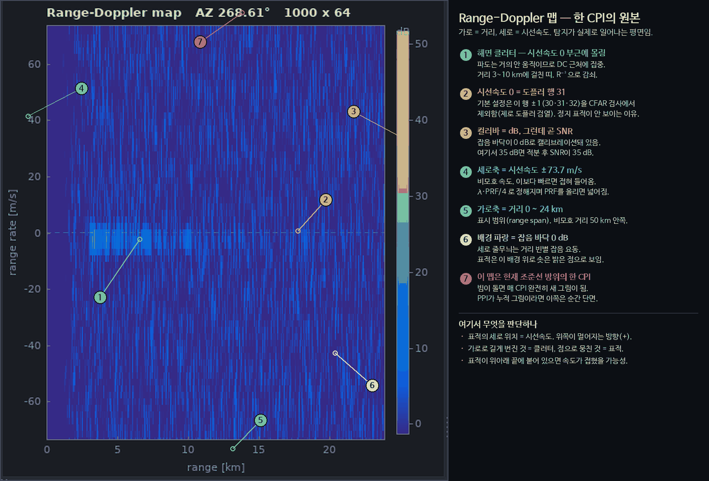

그림에서 확인할 것 셋.

- **가로로 번진 밝은 띠**(주석 ①)가 해면 클러터임. 파도는 거의 안 움직이므로
  시선속도 0 근처에 몰림 — 3.3절의 AR(1) 상관이 만든 좁은 도플러 폭이 이 두께임.
- **점선으로 표시된 시선속도 0 행**(주석 ②)이 위에서 계산한 `j = n/2 − 1 = 31`임.
  기본 설정은 이 행 ±1을 CFAR 검사에서 제외함(3.7절).
- **배경 파랑이 정확히 0 dB**(주석 ⑥). `doppler_norm`이 테이퍼와 FFT 이득을
  상쇄했기 때문이며, 이것이 2.4절 불변식이 눈에 보이는 형태임.

---

### 3.6 표시물 생성

**파일** `pwr_chain.c · pwr_chain_products`

**A-scope 프로파일** — 거리마다 도플러 축 최댓값(max-hold). 어떤 속도든 가장
강한 것을 보여줌. 이때 **argmax 행 번호를 `profile_peak_j`에 기록**해 두는데,
나중에 CFAR가 임계 트레이스를 만들 때 맵을 다시 훑지 않아도 되게 하기 위함.

**잡음 바닥 추정** — 표적과 클러터에 흔들리지 않아야 하므로 평균이 아니라
**중앙값**을 씀. 스트라이드 부분표본 약 2048개의 중앙값을 취한 뒤

```
평균 추정 = 중앙값 / ln(2)
```

로 나눔. 셀 전력이 지수분포이고 그 중앙값이 평균의 `ln2`배이기 때문. 이 보정이
있어야 깨끗한 맵이 정확히 0.0 dB로 읽힘.

**PPI 잔광** — 실제 레이다 스코프의 인광 잔상을 흉내 냄. 구현상 주의점이 하나
있는데, 누산을 **8비트가 아니라 Q8 고정소수(16비트, 하위 8비트가 소수부)로** 함.

감쇠는 누산기에 1보다 작은 계수를 곱하고 **버리는(절삭)** 연산이라, 곱할 때마다
저장 정밀도의 1단위씩 손실이 생김. 8비트로 저장하면 그 1단위가 곧 **화면 1레벨**임.

감쇠 패스는 전체 격자를 훑으므로 비용이 커서, 잔광 시간상수가 32 CPI 이상일
때만 **4 CPI에 한 번으로 묶어** 실행함. 기본값(6.0 s ≥ 32 × 10.67 ms = 0.341 s)은
이 조건을 만족하므로 배치가 적용됨.

| 저장 방식 | 회전당 절삭 횟수 | 회전당 손실 |
|---|---|---|
| 8비트 (배치 적용, 기본값) | 58.6 | 약 58 레벨 |
| 8비트 (배치 없음, 짧은 시간상수) | 234 | 255레벨 전소 |
| **Q8 (실제 구현)** | 58.6 | **0.23 레벨** |

즉 8비트로는 기본 설정에서도 한 바퀴에 잔광의 1/4가 양자화만으로 사라지고,
시간상수를 0.341초 미만으로 낮추면 한 스캔 만에 화면이 지워짐. 소수부 8비트가
그 손실을 256분의 1로 줄임.

> **주의** — `pwr_core.h`의 `ppi_accum` 필드 주석은 "CPI당 1레벨, 회전당 약
> 230레벨, 어떤 시간상수를 골라도 한 스캔에 전소"라고 적고 있으나, 이는
> `pwr_display_update_ppi`의 4 CPI 배치가 들어오기 전 기준임. 같은 주석의 Q8
> 수치(회전당 1/4레벨 미만)는 배치를 전제하므로 주석 내부가 서로 맞지 않음.
> 코드 동작은 위 표가 정확함.

**잔광에 관한 함정 두 가지.**

1. **`ppi_persistence_s = 0`은 "잔광 없음"이 아니라 "감쇠 없음"임.** 감쇠 블록
   전체가 `if (ppi_persistence_s > 0.0)` 안에 있으므로 0이면 아예 실행되지 않음.
   누산기는 max-hold로만 갱신되므로 화면이 **영원히 밝아지기만 하고 절대
   어두워지지 않음**. 잔광을 끄고 싶으면 0이 아니라 아주 작은 값(예: 0.05 s)을
   줄 것.
2. **PPI 비디오는 고정 60 dB 창에 매핑됨.** `−6 dB`부터 `+54 dB`까지가 0~255에
   대응(실제 로그 수신기가 하는 일). 따라서 60 dB를 넘는 아주 강한 표적은 전부
   같은 최대 밝기로 보이고, −6 dB 아래는 완전한 검정임. 세기를 정량적으로 읽어야
   하면 PPI가 아니라 A-scope나 R-D 맵을 볼 것.

**빔 페인트** — 각 CPI마다 조준선 ±빔폭 절반에 해당하는 방위 셀들을 칠하되,
가우시안 빔 형상으로 밝기를 가중함. 갱신은 `max`이므로 **칠하는 동작이 셀을
어둡게 만드는 일은 절대 없음**. 밝기를 낮추는 경로는 배치 감쇠 패스 하나뿐임.

**RTI 링버퍼** — `rti_head`를 먼저 전진시킨 뒤 그 행에 씀. 따라서 첫 CPI가 행 1에
기록되고 **행 0은 링이 한 바퀴 돌 때까지 초기값 −200 dB로 남음**. 워터폴 맨 아래
한 줄이 처음에 새까만 이유.

---

### 3.7 CFAR — 적응 임계 검출

**파일** `pwr_cfar.c`

1.6절에서 설명한 적응 임계값을 2차원 맵에 적용함.

**왜 고정 임계값이 안 되는지가 화면 두 장으로 끝남.**

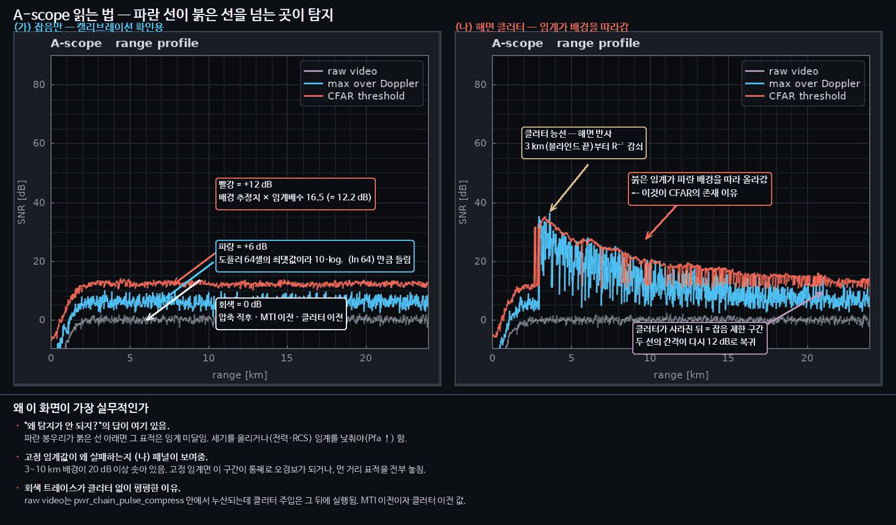

왼쪽은 잡음만 있는 상태임. 세 트레이스가 각각 **0 dB(원시) · +6 dB(도플러축
최댓값) · +12 dB(CFAR 임계)** 에 앉아 있고, 이 세 값이 이 문서가 계산으로 주장한
것과 정확히 일치함 — 잡음 바닥 0 dB(2.4절), max-hold의 `10·log₁₀(ln 64) = 6.2 dB`
상승(부록 F-5), 임계 배수 `α = 16.48 = 12.2 dB`(아래 표).

오른쪽은 해면 클러터가 있는 상태임. 배경이 20 dB 넘게 솟자 **붉은 임계선이 같이
올라감**. 고정 임계값이었다면 3~10 km 구간이 통째로 오경보가 되거나, 그 구간을
피하려고 임계를 올리면 먼 거리의 약한 표적을 전부 놓쳤을 것임. 두 선의 간격이
클러터 안에서도, 클러터가 사라진 뒤에도 12 dB로 유지되는 것이 CFAR가 하는 일의
전부임.

**참조창 기하**

```
        ← 훈련 →  ← 가드 →  [CUT]  ← 가드 →  ← 훈련 →
```

- 거리축은 맵 가장자리에서 **잘림(클램프)**
- 도플러축은 **감김(wrap)** — 도플러 스펙트럼이 PRF 주기로 반복되므로 물리적으로 옳음

**추정기 5종 — 그리고 참조창의 차원이 종류마다 다름**

| 종류 | 방식 | 참조창 | 기본 형상 참조셀 | 강점 |
|---|---|---|---|---|
| CA | 훈련셀 평균 | **2-D** (거리×도플러) | 368 | 균질 잡음에서 최적 |
| GO | 앞뒤 반쪽 중 큰 쪽 | 2-D | 반쪽 기준 | 클러터 경계에서 오경보 억제 |
| SO | 작은 쪽 | 2-D | 반쪽 기준 | 표적이 여럿 붙어 있을 때 |
| OS | k번째 순서통계량 | **1-D** (거리축만) | 24 | 다표적에 강함 |
| TM | 상하 절사 평균 | **1-D** (거리축만) | 24 − 절사 | OS와 CA의 절충 |

**OS와 TM이 1-D인 것은 성능상의 선택임.** 2차원 순서통계량은 셀마다 수백 개를
정렬해야 해서 실시간 처리기가 하지 않는 일이고, OS가 값을 하는 국면(가까이 붙은
다표적)은 애초에 거리축이기 때문.

임계 배수는 목표 `Pfa`에서 유도됨.

**다섯 종류 모두 자기 통계량의 정확한 오경보 식에서 유도됨.** CA 식을 빌려 쓰면
운용자의 임계 바이어스 노브보다 큰 오차가 조용히 들어가므로 그렇게 하지 않음.

```
CA:  Pfa = (1 + α/N)^(−N)                                → 폐형식
OS:  Pfa = Π_{i<k} (N−i)/(N−i+α)                         → 이분법
TM:  Pfa = Π_j 1/(1 + (α/k)·c_j),  c_j = min(k, N−t₂−j+1)/(N−j+1)
SO:  Pfa = 1 − (t/(t+2))·Σ_n u_n·r^n,  t = α/M, r = 2/(t+2)
GO:  Pfa = 2·(1+t)^(−M) − Pfa_SO(α, M)
```

TM 식은 순서통계량의 Renyi 표현에서 나옴: `x₍ᵢ₎ = μ·Σ_{j≤i} e_j/(N−j+1)`로 쓰면
각 `e_j`가 `min(k, N−t₂−j+1)`번 모이므로 절사평균이 지수변량의 가중합이 됨.
`t₁ = t₂ = 0`을 넣으면 `c_j ≡ 1`이 되어 CA 폐형식이 정확히 복원되는 것이 검산임.

SO 식은 `Q(w) = P(Gamma(M) > w)`로 두고 `Pfa = 1 − t∫e^{−tw}Q(w)²dw`를 전개한
것. `Q²`의 급수 계수를 `2ⁿ`으로 스케일하면 `u_n`이 **이항분포의 양측 확률**
`P(max(0,n−M+1) ≤ X ≤ min(n,M−1)), X ~ B(n,½)`이 되어 항상 [0,1]에 머무르므로
수치적으로 안정함. `u_n`은 α와 무관해 M마다 한 번만 만들면 됨. GO는 
`∫e^{−tw}Q dw = [1−(1+t)^{−M}]/t`에서 SO로부터 바로 따라옴.

**빌려 쓴 배수가 얼마나 틀렸었나** (기본 형상, 설계 `Pfa = 1e−7`)

| | 옛 배수 | 정확한 배수 | 임계 오차 | 실제 Pfa |
|---|---|---|---|---|
| TM | 26.07 (남은 개수로 CA) | 34.78 | −1.25 dB | **설계의 19.1배** |
| SO | 16.86 (반쪽 창에 CA) | 17.39 | −0.13 dB | 설계의 1.6배 |
| GO | 17.62 (반쪽 창에 Pfa/2) | 15.92 | +0.44 dB | 설계의 0.19배 |

TM은 오경보를 19배 쏟아내고 GO는 반대로 5배 둔감했음. 셀프테스트 T10이 다섯 종류
전부를 임계표본 형상에서 돌려 달성 Pfa가 설계값의 0.5~2배 안에 있는지 확인함
(현재 실측 0.97~1.04배).

GO와 SO의 정확식은 양쪽 반창의 셀 수가 같다고 가정함. 실제로는 가드밴드 분할
때문에 한 셀 단위로 어긋날 수 있어 작은 쪽을 취하는데, 기본 형상에서 180 대 188의
차이는 α로 0.02에 불과함. 두 통계량이 평균에서 `1/√(πM)`만큼 치우치는 것 —
기본 형상에서 0.2 dB 미만 — 은 보정하지 않음.

**기본 형상에서 실제로 쓰이는 숫자.** `train_range=12, guard_range=3,
train_doppler=4, guard_doppler=2`이므로

| | 참조셀 N | 임계 배수 α | dB |
|---|---|---|---|
| CA (2-D) | 368 | 16.48 | **12.2 dB** |
| OS (1-D, k = 18) | 24 | 20.52 | **13.1 dB** |

즉 "그 자리의 배경 추정치보다 12.2 dB 높으면 표적"임. OS가 0.9 dB 손해를 보는
이유는 참조셀이 24개뿐이라 배경 추정의 분산이 크고, 같은 Pfa를 지키려면 그만큼
여유를 더 줘야 하기 때문 — 다표적 내성의 대가임.

**CA 참조셀 368개가 나오는 셈법** (거리축 ±15, 가드 ±3 / 도플러축 ±6, 가드 ±2)

```
창 전체     31 거리열 × 13 도플러행
빼기 가드    7 거리열 ×  5 도플러행
= 앞뒤 훈련  12열 × 13행 × 2 = 312
+ 가드밴드   7열 ×  8행      =  56
                            = 368
```

**성능 설계** — 셀마다 창을 다시 더하면 CPI당 6.4만 셀 × 수백 셀이 되어 실시간이
불가능함. 두 가지로 해결.

1. 행별 **prefix sum** — 거리축 구간합이 뺄셈 한 번
2. 도플러축 **증분 슬라이딩** — CUT 행이 내려갈 때 들어오는 행을 더하고 나가는
   행을 빼서 O(1) 유지
3. `α`는 참조셀 개수와 검출기 파라미터에만 의존하고 그 개수는 맵 가장자리에서만
   변하므로 **메모이제이션**

3번의 캐시는 `PWR_CfarWork` 안에 있어 **CPI를 넘어 유지됨**. 다섯 종류 중 셋이
이분법으로 α를 푸는 이상 이건 선택이 아니라 필수임 — 매 CPI 다시 풀면 이분법이
핫패스로 들어옴. 캐시는 `pfa`, 종류, `os_rank`, 절사 개수 중 하나라도 바뀌면
통째로 무효화됨(`pwr_cfar_tuning_sync`). 그 결과 α 풀이 비용은 엔진 수명 동안
참조셀 개수의 가짓수만큼만 발생하고, 종류별 실행 시간 차이는 순서통계량 자체
(퀵셀렉트·정렬)에서만 나옴.

**피크 선택** — 임계값을 넘은 셀 중 자기 가드 영역 안에서 최댓값인 것만 남김.
없으면 강한 표적 하나가 거리·도플러 부엽에 **십자 모양 플롯 무리**를 만듦.
실제 운용 처리기가 모두 하는 처리.

**제로 도플러 검열** — 고정물이 몰려 있는 DC 열 주변을 통째로 제외. 기본값은
`censor_zero_doppler = 1`, `zero_doppler_guard = 1`이므로 **도플러 행 30·31·32**가
검사에서 빠짐(1.10절: 행 31이 시선속도 0). 검사 셀이 CPI당 64,000개에서
61,000개로 줄어듦.

이때 검열된 셀은 **분모에서도 빠져야** 함. 안 그러면 `measured_pfa`가 검열
비율만큼 낮게 편향됨.

> **이 검열의 부작용은 반드시 알아야 함.** 시선속도가 정확히 0인 표적(정지 표적,
> 또는 빔에 완전히 수직으로 지나가는 표적)은 검열 노치에 들어가 **주엽으로는
> 탐지되지 않음**. 게다가 표적이 강하면 도플러 창의 부엽이 먼 도플러 행에서
> 임계를 넘어 **엉뚱한 속도의 플롯 무리**를 만듦. 실측 사례와 대처법은 부록 F-1.

**남은 실무 사항 셋**

**① 맵 가장자리에서 참조셀이 줄어듦.** 거리축은 클램프이므로 거리 빈 0 근처에서
훈련셀이 368개에서 188개로 떨어짐. 다만 α는 참조셀 수에 약하게만 의존하므로
임계값은 12.17 → 12.26 dB, **0.09 dB 상승에 그침**. 실질적 영향이 없다는 뜻이고,
이것이 α를 메모이제이션할 수 있는 이유이기도 함(값의 종류가 몇 개뿐).

**② OS·TM을 고르면 도플러 노브가 사실상 무력해짐.** 두 추정기는 거리축 1-D 창만
쓰므로 `train_doppler`는 임계값에 **전혀** 영향을 주지 않음. `guard_doppler`도
임계값에는 영향이 없지만 **피크 선택에는 계속 쓰임**(가드 영역의 도플러 반폭).
CFAR 종류를 바꾼 뒤 도플러 훈련 셀을 조절해도 아무 변화가 없다면 이것 때문임.

**③ `stats.measured_pfa`의 분자는 셀이 아니라 플롯임.**

```
measured_pfa = detection_total / cells_tested_total
               ^^^^^^^^^^^^^^^ 발행된 플롯 개수 (클러스터링·드웰 병합 이후)
```

즉 셀 단위 오경보율이 아니라 **플롯 발생률**임. 인접 경보가 하나로 묶이고
드웰 병합이 여러 CPI를 한 플롯으로 합치므로, 셀 단위 값보다 낮게 나오는 것이
정상임. 설계 `Pfa`와 직접 비교할 때 이 차이를 감안할 것 (부록 G.1).

---

### 3.8 클러스터링과 드웰 병합 — 셀을 플롯으로

**클러스터링** (`pwr_cfar.c · pwr_cluster_run`)

표적 하나는 보통 인접한 여러 셀을 켬. 이를 하나로 묶어야 플롯 하나가 됨.

```
1. 플러드필로 연결 성분 라벨링 (연결 반경 tol_r, tol_d)
2. 전력 가중 중심
3. dB 표면에서 3점 포물선 보간 → 부빈(sub-bin) 정밀도
4. 셀 수 / 최소 SNR로 채택 판정
```

**연결 이웃은 원이 아니라 사각형임.** `±tol_r × ±tol_d` 직사각 이웃이며 기본값
`3 × 3`이므로 **7 × 7 = 49셀 이웃**임. 거리 3빈(72 m) 안이면서 도플러 3빈
(6.9 m/s) 안이면 같은 플롯으로 묶임. 도플러축은 감기고(modulo) 거리축은 경계에서
잘림 — CFAR 참조창과 같은 규약.

**포물선 보간을 dB 표면에서 하는 이유** — 압축·도플러 봉우리는 선형 전력으로
보면 뾰족하지만 **로그(dB)로 보면 봉우리 근처가 거의 정확한 포물선**임(가우시안
근사). 3점만으로 부빈 정밀도를 얻으려면 로그 영역이 훨씬 정확함.

**여기서 코드를 읽을 때 헷갈리는 지점이 하나 있음.** 플러드필은 도플러 중심을
시드 행 기준 상대값으로 누산하고(`acc.wd_sum`), `cen_d`를 일단 그 값으로 계산함.
wrap을 가로지르는 클러스터를 위한 장치처럼 보이지만, 바로 아래 블록이 **조건 없이**
`cen_d`를 봉우리 주변 포물선 보간값으로 덮어씀. 즉 **가중평균 도플러 중심은 플롯
출력에 도달하지 못함**(거리축 `cen_r`은 `peak_r`이 맵 내부일 때만 덮어쓰는 것과
대조적).

실제 wrap 안전성은 다른 경로에서 나옴 — 포물선 보간이 이웃 행을 `jm`, `jp`로
`nd` 모듈로 잡기 때문. 출력되는 도플러 좌표는 언제나 `peak_j + (−0.5..+0.5)`임.

**드웰 병합** (`pwr_cfar.c · pwr_plots_dwell_merge`) — 이 프로젝트에서 가장 중요한 단계 중 하나

문제: CPI별 플롯의 방위각은 **그 CPI의 빔 조준선**임. 강한 표적은 빔이 지나가는
여러 연속 CPI에서 전부 임계값을 넘음(SNR 66 dB 표적은 2-way −50 dB 지점까지
검출). 그대로 흘리면 표적 하나가 스캔마다 **방위 수 도에 걸친 플롯 문자열**을
만들고, 두 가지가 망가짐.

1. 남는 가장자리 플롯이 개시 억제 반경을 벗어나 **중복 트랙** 생성
2. CPI당 1.536°씩 옮겨가는 방위 갱신이 칼만 필터에 **빔 회전 방향의 가짜 접선
   속도**를 주입. 추정 침로가 실제와 무관해지고 때로는 정반대가 됨

해결: 실장비 플롯 추출기와 같이 **드웰 단위로 중심추정**.

```
연속 CPI에서 거리·시선속도가 한 셀 이내로 일치하는 히트 → 하나의 드웰 플롯에
전력 가중 누적 → 빔이 지나가면(기여 없는 CPI 1회) 닫고 발행
```

방위는 2-way 빔 형상에 대한 **전력 가중 중심**이며, 이것이 고전적인 **빔
분할(beam splitting)** 추정기. 빔폭의 수분의 일 정확도가 나옴 — 즉 1.6° 빔으로
그보다 훨씬 정밀한 방위를 얻음.

게이트를 좁게(거리 1.25빈 = 30 m, 속도 1.5빈 = 3.5 m/s) 잡은 이유는 **분해된
표적을 도로 병합하지 않기 위해서**. 시나리오 4가 이를 검증함(6.2절의 주의 참고).
같은 CPI의 플롯끼리는 정의상 서로 다른 표적이므로 병합 대상이 아님.

정지응시(스캔 0 rpm)에서는 드웰이 끝나지 않으므로 이 단계를 통째로 우회함.

**방위 평균은 산술평균이 아니라 원형평균(circular mean)임.** 359°와 1°의
산술평균은 180°라는 엉뚱한 값이 되므로, 전력 가중 sin/cos 합을 따로 누산한 뒤
`atan2`로 되돌림.

```c
waz_e += w · sin(az);   waz_n += w · cos(az);      /* 누산 */
azimuth = wrap360( atan2(waz_e, waz_n) );          /* 복원 */
```

북쪽(0°/360°)을 지나는 드웰이 반대편으로 튀지 않는 이유임.

**드웰의 종료 판정이 정확히 1 CPI 공백인 이유** — 공백이 정확히 1 CPI면 정상적인
드웰 종료로 보고 발행함. 그보다 오래된 것은 그 사이에 병합이 우회됐다는 뜻
(회전율이 0을 거쳐 토글됨)이므로 **발행하지 않고 버림**. 안 그러면 정지응시 CPI가
이미 발행한 플롯을 한 번 더 내보내게 됨.

**플롯 하나에 담기는 것** (`PWR_Detection`)

| 필드 | 뜻 |
|---|---|
| `range_m` · `azimuth_deg` · `radial_velocity_mps` | 위치·방위·시선속도 (드웰 가중 중심) |
| `centroid_range_bin` · `centroid_doppler_bin` | 부빈 보간된 격자 좌표 |
| `amplitude_db` · `snr_db` · `threshold_db` | 세기, SNR, 그 자리의 CFAR 임계값. `snr_db`는 **그 셀에서 CFAR가 실제로 상대한 간섭 레벨**(잡음+클러터의 국소 추정치) 기준임 — 맵 전체 중앙값이 아니라. 맵 전역 값은 MTI가 도플러축으로 잡음을 채색하거나, STC 램프·송신 블랭킹·클러터 능선이 있는 순간 전부 편향되고, `cluster.min_snr_db`가 그 값으로 게이트하기 때문 |
| `cell_count` | 이 플롯을 만든 셀 개수 (클러스터 크기) |
| `ambiguous` | **보고된** 거리/속도가 비모호 한계를 넘었으면 1 → 콘솔의 `AMB` 플래그 |
| `assoc_track_id` | 같은 CPI에서 이 플롯을 소비한 트랙, 미연관이면 0 |

`assoc_track_id`가 있어서 PPI가 **연관선**을 그리고 플롯 히스토리를 청록(연관)과
황색(미연관)으로 나눠 칠할 수 있음(6.3절).

> **`ambiguous` 플래그는 접힘을 잡아내지 못함.** 판정 기준이 *보고된* 값인데,
> 접힘의 정의상 접힌 측정값은 항상 비모호 구간 **안**에 들어오기 때문. 실측:
> 시나리오 6(시선속도 −298.7 m/s인 미사일)을 8 스캔 돌리면 플롯 122개 중 9개가
> 플래그를 받는데 전부 도플러축 최상단 빈(+74.0 m/s)에 앉은 것들이고 미사일은
> 하나도 없음.
>
> 발행 속도축이 비대칭인 것도 함께 알아 둘 것 — 기본 형상에서
> `−71.416 … +73.719 m/s`이고 `V_ua = 73.719`이므로, 속도 쪽 플래그는 **최상단
> 빈에서만** 켜질 수 있음. 거리 쪽은 표시 범위 24 km가 비모호 거리 50 km 안이라
> 기본 설정에서 절대 켜지지 않음.
>
> 접힘이 스스로를 신고하지 않는다는 것이 3.9절 도플러 모듈로 게이트가 필요한
> 이유임.

---

### 3.9 추적 — 플롯을 물체로

**파일** `pwr_track.c · pwr_tracker_update`

### 칼만 필터를 말로 먼저

칼만 필터는 **"내 예상"과 "방금 본 것"을 각각의 불확실성에 반비례하는 가중치로
섞는 장치**임. 매 갱신마다 두 걸음을 밟음.

```
① 예측(predict)  : 지난번 상태에서 dt초 흘렀다고 보고 위치를 밀어 놓음.
                   동시에 "얼마나 모르겠는지"(공분산 P)를 키움.
② 갱신(update)   : 새 관측이 오면 예측과의 차이(이노베이션)를 계산하고,
                   그 차이를 신뢰도만큼만 반영. P는 다시 줄어듦.
```

직관: **관측이 정확하면 관측 쪽으로 확 끌려가고, 예측이 확실하면 관측이 튀어도
잘 안 흔들림.** 그 저울이 칼만 이득 `K`이고, 관측 잡음 `R`과 예측 불확실성 `P`의
비로 자동 결정됨. 사람이 손으로 튜닝할 것은 "표적이 얼마나 급기동하는가"
(`process_noise_accel`)와 "측정이 얼마나 부정확한가"(`meas_sigma_*`) 둘뿐.

```
X = [x, y, vx, vy]ᵀ          ENU 미터 (1.10절)
F = [I  dt·I ; 0  I]         등속 전이
Q = 백색가속 이산 모델        σ_a로 구동 (기본 6 m/s²)
H = [I  0]                   위치만 관측
```

**등속 모델을 쓰는데 기동표적을 어떻게 따라가는가** — `Q`가 그 답임. "표적이
매초 σ_a만큼 제멋대로 가속할 수 있다"고 선언해 두면 예측 불확실성이 그만큼
빨리 커지고, 그러면 필터가 새 관측을 더 세게 받아들임. `σ_a`를 키우면 기동
추종이 좋아지지만 잡음에도 민감해짐 — 이것이 추적기의 가장 중요한 노브임.

측정은 극좌표(거리, 방위)로 들어오므로 야코비안으로 공분산을 변환함.

```
J = [ sin Az   R·cos Az ;  cos Az  −R·sin Az ]
```

거리 오차는 작고 횡거리 오차는 `R·Δθ`로 커지므로, 불확실성 타원이 **먼 거리일수록
옆으로 길쭉한 바나나 모양**이 됨. 콘솔에서 `G` 키로 이 타원을 볼 수 있음.

공분산 갱신은 **Joseph 형식** `P ← (I−KH)P(I−KH)ᵀ + KRKᵀ`을 씀. 짧은 형태
`(I−KH)P`는 이득 `K`가 정확히 최적일 때만 옳고, 반올림이나 클램프로 조금만
어긋나도 **대칭성과 양정부호성을 잃음**. Joseph 형식은 두 항이 모두 구조적으로
대칭 양반정부호라 `K`가 최적이 아니어도 유효한 공분산이 나옴.

> 코스팅 구간은 이 함수를 아예 실행하지 않음 — 관측이 없으므로 갱신 단계가
> 호출되지 않고, `P ← FPFᵀ + Q`만 진행됨. 이 예측식은 그 자체로 대칭·양반정부호를
> 보존하므로 코스팅 길이는 수치 안정성과 무관함. Joseph 형식이 지켜 주는 것은
> **갱신 횟수가 많이 누적됐을 때**임.

**데이터 연관** — 어느 플롯이 어느 트랙인가

비용은 표준 전역 최근접 척도.

```
이노베이션      y = z − H·X̂        (관측 − 예측)
이노베이션 공분산 S = H·P·Hᵀ + R     ("이만큼은 어긋나도 정상")
정규화 거리      d² = yᵀ·S⁻¹·y      (마할라노비스 제곱)

cost = d² + ln det(S)
```

`S`가 핵심 개념임. **예측이 얼마나 불확실한지(P)와 측정이 얼마나 부정확한지(R)를
합친 것**이고, 그 타원 안쪽이면 "정상적인 어긋남"으로 봄. `d²`는 그 타원 기준으로
잰 거리라 단위가 없음.

`ln det(S)` 항이 있어야 불확실성이 큰 트랙이 부당하게 유리해지지 않음. `S`가
크면 어떤 플롯이든 `d²`가 작게 나오므로, 그 이득을 `ln det(S)`가 정확히 상쇄함
(가우시안 우도의 정규화 상수와 같은 항).

3단 게이트로 후보를 줄임.

1. 직사각 사전게이트 (`gate_max_range_m`) — 값싼 배제
2. 마할라노비스 게이트 (`gate_sigma²`)
3. 도플러 게이트 — **2·V_ua 모듈로 비교**

3번이 미묘함. 측정 시선속도는 ±V_ua로 접혀서 들어오므로, 접힘을 무시하고 비교하면
표적의 실제 시선속도가 모호 경계를 넘는 순간(예: 횡단 표적의 방위가 커질 때)
수렴한 트랙이 **모든 후속 플롯을 기각하고 굶어 죽음**. 시나리오 6의 검증 항목.

할당은 **Jonker-Volgenant 최단증강경로**로 정확해를 구함. 탐욕적 방법은 국소적으로
가장 싼 쌍을 먼저 집어 전체 비용을 망칠 수 있음 — 자체검증 T4가 탐욕법이 8을 고르는
3×4 문제에서 최적해 6을 확인함. 정확 해법은 `행 ≤ 열` 제약이 있어, 빔 안 트랙이
플롯보다 많으면 탐욕법으로 되돌아감.

**회전 안테나 부기** — 시간 규약이 여기서 결정적

드웰 병합된 플롯은 **빔이 표적을 지나간 뒤**에 도착함. 따라서 "이번 CPI에 봤나"로
히트/미스를 판정할 수 없음. 대신

> 조준선이 트랙 방위를 **LAG**(빔폭 1.6배 + 2 CPI 여유)만큼 지나치는 순간에
> **회전당 한 번** 판정

여기에 두 보정이 붙음.

- **소급 정정** — 예측이 뒤처져 교차가 플롯보다 먼저 와 미스로 기록됐으면, 이후
  연관이 장부를 되돌림
- **시간 기반 캐치업** — 역행 겉보기 운동으로 교차 창을 건너뛴 트랙은 1.25 스캔이
  지나면 강제 판정. 회전당 1회를 보장

**후보 선정이 방위 창이 아닌 이유** — 방위 창은 통계 게이트보다 좁음. 2 km에서
접선 150 m/s로 횡단하는 표적은 스캔당 10°를 움직이지만 예측에서는 375 m밖에
떨어지지 않음. 방위로 자르면 자기 트랙에서 끊김.

**M-of-N 확인** — 트랙 생애

```
history_bits: 슬라이딩 비트 윈도우, 최신이 bit 0, 1 = 히트
최근 N회 중 M회 히트면 CONFIRMED  (기본 3-of-5)
```

상태 전이는 **두 계통**이 있고, 이것을 구분하지 않으면 화면이 이해가 안 됨.

- **장부 계통 (M-of-N)** — 판정이 적립될 때(회전당 1회) 평가됨
- **시간 계통 (노후화)** — **매 CPI**, 연관보다 **먼저** 평가됨

시간 계통이 대개 먼저 발동하므로 실제 화면 거동은 이쪽이 지배함.

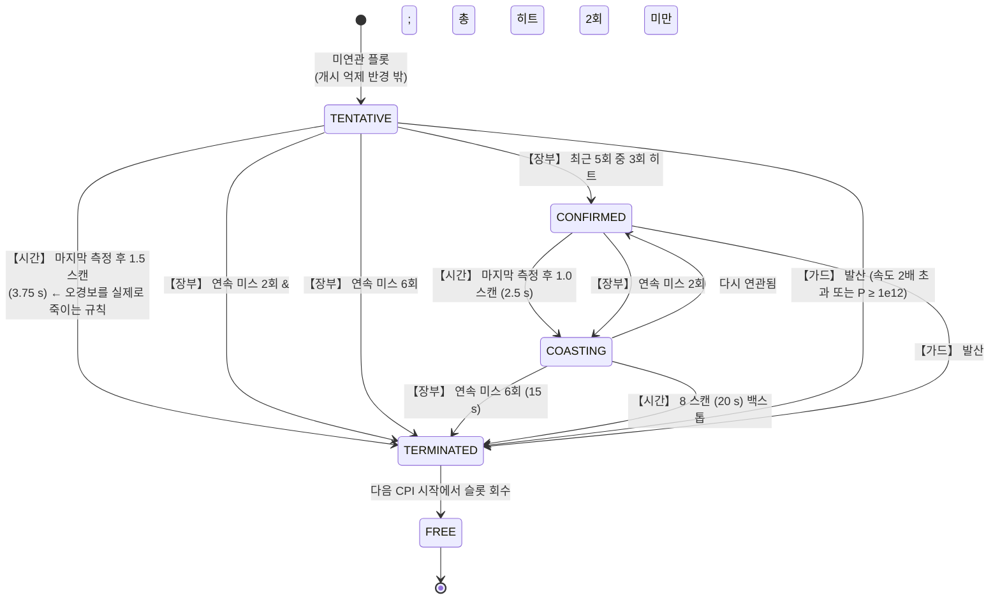

**은퇴는 두 단계임.** 트랙을 죽이는 규칙은 상태를 `PWR_TRACK_TERMINATED`로 옮기고,
그 상태로 **정확히 한 프레임 발행된 뒤** 다음 갱신 첫머리에서 슬롯이 회수됨. 그
한 번의 보고가 소비자에게 주는 **명시적 트랙 종료 통보**임 — 트랙 번호가 그냥
안 나타나기 시작하는 것으로 죽음을 추론하지 않아도 되게 하려는 것. 종료된 트랙은
예측·연관·장부 적립·개시 억제 어디에도 참여하지 않으며 `tracks_active`에도
세지 않음(`pwr_track_is_live`).

**시간 계통 세 규칙** (`scan_period > 0`일 때만, 즉 회전 모드에서만)

```c
missed = (now − last_meas_time_s) / scan_period;      /* 스캔 단위 경과 */

TENTATIVE && missed > 1.5                  → FREE      (3.75 s)
missed > max(2, delete_misses + 2) = 8     → FREE      (20 s, 백스톱)
CONFIRMED && missed > 1.0                  → COASTING  (2.5 s)
```

**왜 시간 계통이 따로 필요한가** — 회전 안테나에서는 빔이 트랙을 지나가야만
히트/미스가 적립됨. 커버리지 밖으로 나가 빔이 더 이상 지나지 않는 트랙은
M-of-N만으로는 **영원히 죽지 않음**. 경과 시간이 그 구멍을 막음.

**오경보를 실제로 죽이는 것은 `missed > 1.5` 규칙임.** 한 번 반짝한 tentative
트랙은 3.75초 만에 사라지므로 `delete_misses`(15 s)를 기다리지 않음. 잡음만 있는
시나리오 0에서 tentative 트랙이 159개 생겼다가 149개가 사라지고 **확정 트랙이
0개**인 이유(부록 G.1).

| 상태 | 한 줄로 | 코드 조건 | PPI 표시 |
|---|---|---|---|
| TENTATIVE | **"방금 뭔가 보였다"** — 진짜인지 아직 모름 | 개시됨, M-of-N 미충족 | 황색 **점만** (라벨·리더·트레일 없음) |
| CONFIRMED | **"진짜 물체로 인정"** | 최근 N회 중 M회 히트 | 초록 심볼 + 번호 + 방향 벡터 |
| COASTING | **"확정됐는데 이번엔 안 보인다"** — 예측으로 버팀 | 확정 상태에서 미스 누적 | 주황 |
| FREE | 삭제됨 | 노후화 또는 발산 가드 | 없음 (경로 끝에 × 표시) |

세 상태의 차이는 **관측 증거의 양**임. TENTATIVE는 증거가 한두 번뿐이라 오경보와
구분이 안 되는 단계이고, CONFIRMED는 M-of-N을 통과해 "이 자리에 반복해서 뭔가
있다"가 성립한 단계이며, COASTING은 증거가 끊겼지만 이전 증거가 충분해 곧바로
버리지 않고 예측으로 유예하는 단계임. 화면에서 노랑이 많은 것은 정상이고
(오경보는 같은 자리에 다시 안 나타나므로 승격되지 못함), **주황이 오래 남는 것이
문제 신호**임 — 표적은 있는데 연관에 실패하고 있다는 뜻이므로 `σ accel`이나
게이트 설정을 의심할 지점.

기본값에서 장부 판정은 **회전당 1회**이므로 시간으로 환산하면

| 사건 | 지배 규칙 | 시간 |
|---|---|---|
| 확정 (TENTATIVE → CONFIRMED) | 장부 3-of-5 | (M−1) × 2.5 s = **5.0 s** + 첫 드웰 시각 |
| 코스팅 진입 | **시간** `missed > 1.0` | **2.5 s** (장부의 5.0 s보다 빠름) |
| tentative 소멸 | **시간** `missed > 1.5` | **3.75 s** |
| 확정 트랙 삭제 | 장부 `delete_misses` 6 | **15 s** (시간 백스톱 20 s보다 빠름) |

실측 TTT가 5.35초인 이유가 이것임(부록 G.4).

이 비트열은 콘솔 트랙 테이블 HIT 열(`#`/`.`)에 그대로 표시되어, 확인 논리가
세는 증거를 눈으로 확인 가능함.

**트랙 하나에 담기는 것** (`PWR_Track`)

| 필드 | 뜻 |
|---|---|
| `x_m, y_m, vx_mps, vy_mps` | 필터 상태 (ENU 미터) — 이것이 진짜 상태 |
| `range_m, azimuth_deg` | 위를 극좌표로 다시 쓴 값 (편의용) |
| `speed_mps, course_deg` | 속력과 침로 (침로는 나침반 방위) |
| `pos_cov[4]` | 2×2 위치 공분산 → PPI의 불확실성 타원 (`G` 키) |
| `history_bits` | M-of-N 슬라이딩 창 → 트랙 테이블 HIT 열 |
| `dwell_state` | 이번 CPI의 빔 피드백 (IDLE / MISS / HIT) → 히트·미스 링 |
| `hits, misses, consecutive_misses, update_attempts` | 누적 장부 |
| `quality` | 0~1 트랙 점수 |
| `trail[64]` | PPI용 짧은 심볼 트레일 (긴 이력은 UI가 따로 누적) |

**트래커 상태가 ENU 미터라는 점이 중요함.** 격자 인덱스가 아니므로 거리 빈 수나
도플러 크기를 바꿔도 트랙 파일이 무효화되지 않음(4.6절).

**표적 분류는 순전히 추정 속력에서 나옴** (`pwr_track.c · pwr_classify`).

| 추정 속력 | 분류 | PPI 심볼 |
|---|---|---|
| < 18 m/s | SURFACE | 사각 |
| < 60 m/s | ROTARY | 삼각 |
| < 120 m/s | UAV | 삼각 |
| < 400 m/s | AIR | 원 |
| ≥ 400 m/s | MISSILE | 다이아몬드 |

시나리오가 준 진실 분류는 **전혀 참조하지 않음** — 추적기가 실제로 관측한 속력만
씀. 그래서 개시 직후 속도가 수렴하기 전에는 심볼이 엉뚱하게 그려지다가 몇 스캔 뒤
제자리를 찾음. 항공기가 처음 몇 스캔 동안 사각형(수상)으로 보이는 것이 정상임.

**정지응시(0 rpm)에서는 규약이 통째로 달라짐.**

| | 회전 (기본) | 정지응시 |
|---|---|---|
| 드웰 병합 | 수행 | **우회** (드웰이 끝나지 않음) |
| 플롯 방위 | 빔 분할 중심 | 조준선 그대로 |
| M-of-N 판정 | 회전당 1회 | **CPI당 1회** (93.75 Hz) |
| 시간 기반 노후화 | 적용 | **비활성** (`scan_period = 0`) |
| 연관 후보 | 직사각 미터 게이트 (`gate_max_range_m`) | 조준선 ±조사호(빔폭×0.8) 안의 트랙 |

즉 정지응시에서는 3-of-5가 **약 0.05초** 만에 채워짐. 회전 모드의 시간 감각을
그대로 가져가면 안 됨.

**트랙 개시** — 미연관 플롯에서 새 트랙 생성. 단일 플롯은 속도 정보가 시선방향
하나뿐이므로 그것만 시드로 넣음. `init_inhibit_m`(기본 600 m) 안에 기존 트랙이
있으면 개시하지 않음 — 없으면 한 드웰에 플롯이 둘 나올 때마다 중복 트랙이 생김.

**발산 가드** — 속도가 한계의 2배를 넘거나 위치 공분산이 1e12를 넘은 트랙은 즉시
삭제. 조건을 `sp > limit`이 아니라 `!(sp <= limit)`로 쓴 것은 NaN을 잡기 위함
(NaN은 모든 비교가 false라 부정형으로만 걸림).

다만 가드가 없어도 NaN이 비용 행렬로 번지지는 않음. `cost`는 `PWR_ASSOC_INFEASIBLE`로
초기화된 뒤 직사각 사전게이트와 `d2 >= 0.0 && d2 <= gate2`를 **모두** 통과해야
덮어써지는데, NaN이면 두 비교 다 false이므로 실현불가 상태로 남음. 가드의 실질적
효과는 **죽은 슬롯 회수**와, 발산했지만 유한한 트랙이 거대한 `P`로 게이트 상자
안의 플롯을 놓고 경쟁하는 것을 끊는 것임.
---

## 4. 엔진 — 실행과 동시성

**파일** `pwr_engine.c`, 상태는 `pwr_core.h`의 `struct PWR_Engine`

DSP가 "무엇을 계산하는가"라면 엔진은 "언제, 누가, 어떤 순서로"를 담당함.
UI가 60 fps로 그리는 동안 워커는 93.75 Hz로 CPI를 돌리고, 운용자는 그 사이에
슬라이더를 움직임. 이 셋이 서로를 멈추지 않게 하는 것이 이 장의 주제.

### 4.1 워커 루프

```c
for (;;) {
    ctrl_lock 잡고 run_state가 RUNNING이 될 때까지 조건변수에서 대기
    if (quit) break;

    proc_lock 잡고 → 펜딩 설정 반영 → CPI 1회 처리 → proc_lock 해제

    while (mutator_waiting > 0) yield;      // 공정성 게이트 (4.4절)

    벽시계 페이싱
}
```

**페이싱** — 시나리오 시간은 벽시계와 분리되어 있음. 목표 주기는

```
period = cpi_duration_s / time_scale      // 슬라이더 0.05×–8×
```

`max_cpi_per_second`로 상한을 더 걸 수 있음. 0.25초 넘게 뒤처지면 밀린 만큼
따라잡으려 하지 않고 **재동기화**하며, 건너뛴 개수를 `frames_dropped`에 기록함.
무한정 밀린 작업이 쌓이는 것을 막기 위함.

### 4.2 프레임 발행 — 3중 버퍼

워커는 계속 쓰고 UI는 계속 읽음. 락으로 묶으면 서로를 멈추므로 버퍼를 3개 둠.

```
publish_index : 가장 최근 완성 슬롯
held_index    : 소비자가 잡고 있는 슬롯
write_index   : 생산자가 쓰는 슬롯
```

생산자는 **"발행 슬롯도 아니고 점유 슬롯도 아닌"** 슬롯을 고름. 슬롯이 3개면
그런 슬롯이 항상 하나 존재하므로

- 생산자는 **절대 블록되지 않음**
- 소비자는 **찢어진 프레임을 절대 보지 않음**

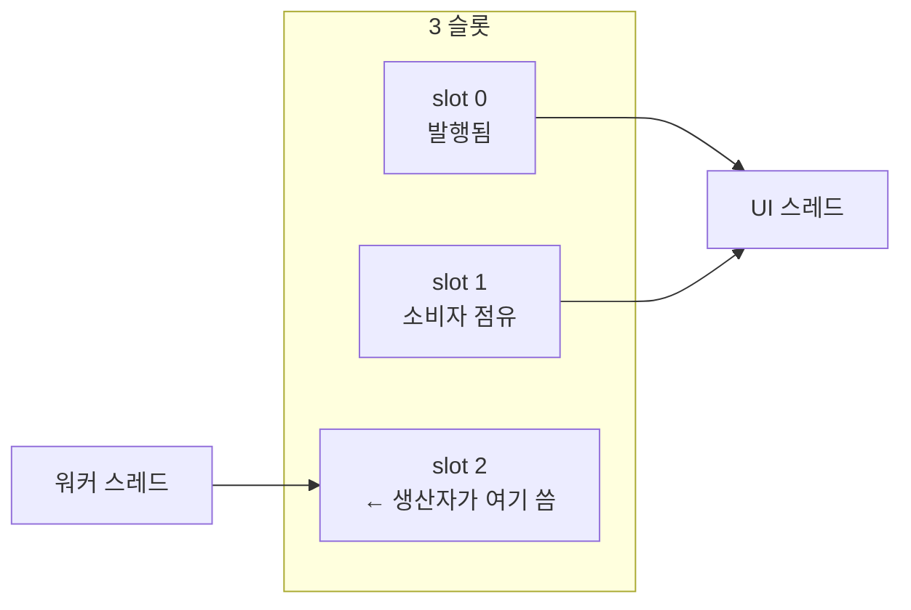

`pwr_engine_frame_acquire()`는 릴리스 없이 다시 부르면 `PWR_ERR_INVALID_STATE`를
반환하고, 발행된 프레임이 없으면 `PWR_STATUS_NO_DATA`(오류 아님)를 반환함.
`PWR_Frame` 안의 포인터는 acquire와 release 사이에서만 유효.

### 4.3 핫세터 메일박스 — UI를 멈추지 않는 설정 변경

운용자가 Pfa 슬라이더를 드래그하면 프레임마다 세터가 호출됨. 세터가 `proc_lock`을
기다리면 어떻게 되는가?

부하율이 1을 넘는 환경에서 워커는 `proc_lock`을 사실상 상시 점유함. 그러면
슬라이더 한 칸마다 UI 스레드가 **CPI 하나만큼(10 ms 이상) 멈춤**. 드래그가
끊겨 보임.

해결: 세터는 **절대 기다리지 않음**.

```
세터: 검증 → pending_* 에 적재 → pending_flags 비트 세움 → 즉시 반환
워커: 다음 CPI 시작 시 proc_lock 아래에서 병합
```

엔진이 유휴(정지·일시정지·수동 스텝)면 `trylock`이 성공하므로 그 자리에서 즉시
반영됨.

| 플래그 | 대상 |
|---|---|
| `PWR_PENDING_CFAR` / `CLUSTER` / `TRACKER` | 검출·추적 파라미터 |
| `PWR_PENDING_ENV` | 환경(클러터·재머·비) |
| `PWR_PENDING_TIME_SCALE` / `SCAN_RATE` / `STC` | 실행·기하 |

단 **CFAR 참조창 크기(`train_range`, `guard_range`)는 이 경로를 못 씀**.
`pwr_engine_set_cfar()`가 변경을 감지하면 전체 재구성 경로로 넘기고, 메일박스로
들어온 값은 되돌림.

이유는 안전성이 아니라 **일관성 규칙**임. 실제로는 스크래치가 넘칠 수 없는데,
용량이 `max(2·(train+guard)+4, 4096)`이고 클램프 상한(`train ≤ 64`,
`guard ≤ 32`)에서 창 유래 항이 최대 196이라 **바닥값 4096이 항상 이기기 때문**.
쓰기 지점도 `cnt < train_capacity`로 막혀 있음. 그럼에도 이 두 값을 전체 경로로
보내는 것은, 그것이 `pwr_cfar_alloc` 시점의 워크스페이스 계약에 속하므로
할당 경로 밖에서 바꾸지 않는다는 규칙을 지키기 위함.

### 4.4 공정성 게이트 — 기아 방지

`pwr_engine_reconfigure`와 표적 목록 변경자는 **블로킹**임(현재 CPI 종료를
기다림). 그런데 일반 뮤텍스는 **공정하지 않음**. 해제해도 대기자에게 소유권이
넘어가지 않고 단지 깨울 뿐이라, 포화된 워커는 대기자가 스케줄되기 전에 다음
CPI를 위해 락을 다시 잡음. 결과적으로 뮤테이터가 **수 초씩 굶을 수 있음**.

해결은 단순함.

```c
static void pwr_engine_lock_proc_fair(PWR_Engine* e) {
    atomic_add(&e->mutator_waiting, +1);     // "나 기다린다" 선언
    pwr_mutex_lock(&e->proc_lock);
    atomic_add(&e->mutator_waiting, -1);
}
```

워커는 CPI 사이에서 `mutator_waiting > 0`인 동안 양보함. 이로써 블로킹 뮤테이터의
대기 시간이 **최대 1 CPI**로 묶임.

### 4.5 락 세 개와 교착 불가능성

뮤텍스는 **네 개**임.

| 락 | 보호 대상 |
|---|---|
| `ctrl_lock` | 실행 상태, 조건변수 (워커가 여기서 잠듦) |
| `proc_lock` | CPI 처리 전 구간, 전체 재구성 |
| `pending_lock` | 메일박스 (구조체 복사 동안만, 리프 락) |
| `frame_lock` | 3중 버퍼 인덱스 (`pwr_frame_publish` / `_acquire` / `_release`) |

획득 순서.

```
워커     : ctrl → 해제 → proc → pending
           proc → frame          (발행이 proc_lock 안에서 일어남)
뮤테이터  : proc → 해제 → ctrl   또는  pending 단독
소비자    : frame 단독
```

중첩 방향이 `proc → pending`과 `proc → frame` **둘뿐이고 둘 다 proc에서
나가기만 함**. `pending`과 `frame`은 리프 락이라 그 안에서 다른 락을 잡지
않으므로 순환 대기가 성립할 수 없음. 즉 교착이 구조적으로 불가능함.

### 4.6 재구성 — 두 갈래 경로

설정이 바뀌면 버퍼를 다시 잡아야 할 때와 아닐 때가 있음. `pwr_dims_equal()`이
판정함.

```
전체 재할당 : 격자 크기가 바뀜 (거리 빈 수, 도플러 크기, 펄스 수, PPI/RTI 크기 …)
경량 경로   : 격자 동일 → 파형만 다시 만들고 캘리브레이션 갱신
```

경량 경로에서는 **PPI 잔광, RTI 워터폴, 트랙 파일이 전부 살아남음**. 운용자가
테이퍼 노브를 돌렸을 때 화면이 초기화되지 않는 것이 자연스럽기 때문.

두 가지 미묘한 점이 코드에 명시되어 있음.

1. **`sample_rate_hz`를 파생값이 아니라 직접 비교함** — 샘플율과 PRF를 같은
   비율로 함께 바꾸면 `samples_per_pri`, 빈 간격, FFT 크기가 전부 그대로인데도
   **샘플 영역 오프셋과 데시메이션은 바뀜**. 그 둘은 전체 경로에서만 다시
   계산되므로, 파생값만 보면 옛 격자로 데시메이션하면서 새 지표를 발행하게 됨.

2. **격자가 바뀌어도 트랙 파일은 보존됨** — 트래커 상태가 격자 인덱스가 아니라
   **ENU 미터 좌표**라 격자 변경으로 무효화되지 않음. 새 커버리지 밖에 남은
   트랙은 플롯을 못 받아 스캔 노후화 규칙으로 자연 소거됨.

### 4.7 설정에서 파생되는 값들

`pwr_config_derive()`는 순수 함수로 모든 파생 지표를 계산함. 두 곳이 특히 볼
만함.

**거리축 데시메이션 — 올림이 아니라 반올림**

```c
decim = (span_samples + bins/2) / bins;      // 반올림
```

24.0 km를 23.98 m 샘플로 덮으려면 1001 샘플이 필요함. 1000빈을 요청했을 때
올림을 쓰면 `decim = 2`가 되어 **거리 샘플링이 소리 없이 절반으로 떨어짐**.
반올림하면 요청한 빈 수가 그대로 유지되고 덮는 범위만 반 빈 이내로 달라짐.

**고속시간 FFT 게이팅**

```c
need  = offset + (bins−1)·decim + 1 + n_tx;
gated = pow2_ceil(need + 2·n_tx);
full  = pow2_ceil(spp + n_tx);
size  = min(gated, full);                    // 기본값에서 2048 (full은 4096)
```

표시 거리 빈에 도달 가능한 구간 + 펄스 1개 + 순환 겹침이 무음에 떨어지도록
펄스 2개분 패딩. 표시 범위를 좁히면 변환 비용이 비례해 줄어듦.

**링크 예산에 대역폭 항이 없는 이유**

```
SNR = Pt·Tp·Gt·Gr·λ²·σ / ( (4π)³·R⁴·k·T₀·F·L )
```

정합필터 이후의 SNR은 수신 대역폭이 아니라 **송신 에너지 `Pt·Tp`** 가 결정하기
때문. 그래서 에너지 형식에는 `B`가 등장하지 않음.

### 4.8 플랫폼 계층

`pwr_platform.[ch]`가 OS 의존성을 전부 흡수함. 다른 어떤 코어 파일도
`<windows.h>`나 `<pthread.h>`를 인클루드하지 않음.

- 스레드, 뮤텍스, 조건변수
- 원자연산 — `<stdatomic.h>` 대신 인트린식. MSVC의 C11 원자연산이 아직
  `/experimental:c11atomics` 뒤에 있기 때문
- 단조 시계 — Windows는 QPC, POSIX는 `CLOCK_MONOTONIC_RAW`
- 정렬 할당 — 64 B(AVX-512 친화)

`pwr_plat_sleep_s`는 **Windows에서만** 마지막 구간(잔여 1.5 ms 이하)을
`YieldProcessor()`로 스핀함. 기본 스케줄러 양자가 15.6 ms라 그냥 `Sleep`하면
CPI 페이싱이 뭉개지기 때문. POSIX 경로에는 스핀이 없음 — `s <= 0`이면
`sched_yield()`, 아니면 `nanosleep`을 `EINTR`일 때만 잔여시간으로 재시도할 뿐임
(리눅스의 고해상도 타이머로 충분하기 때문).

### 4.9 상태 코드 명명과 빌드 게이트

성공 코드가 `PWR_OK`가 아니라 `PWR_STATUS_OK`인 이유. `<winuser.h>`가 레거시
`WM_POWER` 상수를 **오브젝트형 매크로**로 정의함.

```c
#define PWR_OK  1        /* winuser.h */
```

매크로는 스코프와 무관하게 열거자를 이김. `<windows.h>`에 닿는 번역 단위에서
`PWR_OK = 0` 열거자가 `1`로 치환되면 `return PWR_OK;`가 `return 1;`이 되고
호출자의 성공 검사가 전부 실패함. 경고 없이 컴파일되고 Linux에서는 재현되지
않음.

방어가 세 겹으로 걸려 있음.

| 방어선 | 위치 |
|---|---|
| 이름을 아예 쓰지 않음 | `PWR_STATUS_OK` |
| 컴파일 타임 가드 | `pwr_guard.c` — `<windows.h>`를 **먼저** 인클루드하는 전용 TU |
| 빌드 게이트 | `tools/check_name_collisions.py` — SDK 전체 매크로 스윕 |

`pwr_guard.c`는 코드를 생성하지 않는 파일이며, 상태 코드 ABI 값과
`PWR_Complex` 레이아웃도 `_Static_assert`로 고정함. 헤더 안에 트립와이어를 두는
방식은 동작하지 않는데, 실제 번역 단위는 공개 헤더를 `<windows.h>`보다 먼저
인클루드하므로 평가 시점에 문제의 매크로가 아직 없기 때문.
---

## 5. UI 계층 — 화면은 전부 직접 그림

**파일** `PWRadarUI/src/*`

이 콘솔은 GUI 툴킷을 쓰지 않음. OS에서 받는 것은 **창 하나, 입력 이벤트,
그리고 픽셀 버퍼를 화면에 복사하는 함수** 뿐이고 나머지 픽셀은 전부 자체
렌더러가 만듦.

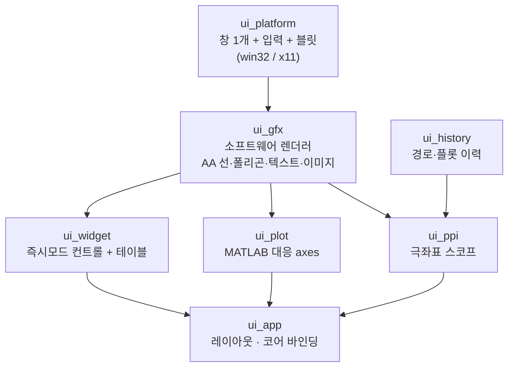

### 5.0 네 화면을 읽는 법

콘솔은 같은 CPI 데이터를 네 가지로 잘라 보여줌. 무엇이 어느 축인지만 알면 됨.


| 화면 | 가로축 | 세로축 | 데이터 출처 | 무엇을 보는 데 쓰나 |
|---|---|---|---|---|
| **PPI** | 극좌표 (방위 × 거리) | — | `ppi_video` | 운용자 시점의 전체 그림. 트랙 심볼·잔광 |
| **R-D 맵** | 거리 | 시선속도 | `rd_map_db` | **한 CPI의 원본.** 표적이 (거리, 속도) 어디에 있는지 |
| **A-scope** | 거리 | dB | `range_profile_db` + `cfar_threshold_db` | 임계값 대비 표적 여유, 거리 부엽 |
| **RTI** | 거리 | 시간(아래로) | `rti_db` | 시간에 따른 거리 변화 = 접근/개방 |

**각 화면이 답하는 질문이 다름.**

```
"뭐가 어디 있나"        → PPI
"이 표적이 얼마나 빠른가" → R-D 맵 (세로 위치가 곧 시선속도)
"왜 탐지가 안 되나"      → A-scope (봉우리가 임계 트레이스 아래인지 확인)
"이게 다가오나 멀어지나"  → RTI (줄무늬 기울기)
```

**세 가지 dB 기준이 다르다는 점만 주의.**

| 화면 | 잡음 바닥이 읽히는 위치 | 이유 |
|---|---|---|
| R-D 맵 | **정확히 0 dB** | 셀 단위 값 (2.4절) |
| A-scope · RTI | **약 +6 dB** | 도플러 64셀의 최댓값(max-hold), `10·log₁₀(ln N)` |
| PPI | 밝기만 | −6 ~ +54 dB의 고정 60 dB 창에 매핑 |

### 5.1 왜 픽셀 포맷이 딱 맞는가

프레임버퍼는 픽셀당 `uint32_t` 하나, `0xAARRGGBB`. 리틀엔디언 메모리에서는
바이트 순서가 B, G, R, A인데 이것이 **Win32 BI_RGB DIB**와 **X11 24/32비트
TrueColor 비주얼**이 둘 다 기대하는 배치임. 따라서 어느 플랫폼에서도 변환이
0회이고, 두 OS가 **픽셀 단위로 동일한 화면**을 냄.

- Windows: DIB 섹션을 메모리 DC에 선택 → `BitBlt` 한 번
- Linux: 클라이언트 버퍼를 `XImage`로 감싸 `XPutImage`

MIT-SHM을 쓰면 복사를 아낄 수 있지만 `libXext` 의존이 늘어나므로 일부러
쓰지 않음.

### 5.2 소프트웨어 렌더러

**알파 합성** — 소스오버 블렌딩을 픽셀당 곱셈 2회로 처리함. R/B 채널을 한
32비트 워드에 함께 담아 동시에 곱하는 방식.

```c
d_rb = dst & 0x00FF00FF;   s_rb = src & 0x00FF00FF;
o_rb = ((d_rb*ia + s_rb*a) >> 8) & 0x00FF00FF;   // R과 B를 한 번에
```

**안티에일리어싱 선** — 주축을 따라 걸으면서 수직 방향으로 짧은 구간만 칠함.
비용이 **경계상자가 아니라 O(길이 × 굵기)** 라, 긴 대각선이 수평선과 같은
비용임. 레이다 화면은 대각선 투성이라 이 성질이 중요함.

**폴리곤** — 스캔라인 채우기 + 수직 4배 슈퍼샘플 + 수평 방향은 정확한 구간
피복률. 할당이 전혀 없음.

**클립 스택** — 깊이 32. 위젯이 자기 클립을 밀어 넣고 복원할 수 있음.

**텍스트** — `ui_font_data.c`에 4개 페이스(11 px sans, 13 px sans, 13 px bold,
12 px mono)의 8비트 알파 아틀라스가 들어 있음. `tools/gen_font.py`가 오프라인에서
생성해 커밋한 산출물이며 빌드는 이를 건드리지 않음. 덕분에 **폰트 라이브러리
없이 제대로 안티에일리어싱된 텍스트**가 나옴.

글리프 조회는 ASCII(32–126)는 직접 인덱스, 그 외 공학 기호 22종(°, ±, µ, λ, σ,
Δ, ≤, ≥, ▲, ●, │ …)은 선형 탐색.

### 5.3 즉시모드 위젯

위젯 트리를 유지하지 않음. 위젯은 **그리기와 상호작용 결과 반환을 동시에 하는
함수 호출**임.

```c
if (ui_button(c, ui_id("tb.reset", 0), rect, "RESET")) { ...눌렸을 때... }
```

프레임 간에 남아야 하는 상태는 `UI_Context`에 해시 ID로만 보관함.

| 상태 | 의미 |
|---|---|
| `active` | 눌린 채 붙잡고 있는 위젯 |
| `focus` | 키보드 초점 |
| `hot` / `hot_next` | 포인터가 올라간 위젯. **`hot`은 기록만 되고 읽히는 곳이 없음** — 호버 하이라이트는 `ui_behave`가 같은 프레임 안에서 직접 판정하므로 프레임 간 상태가 필요 없었던 것 |

레이아웃이 매 프레임 라이브 설정에서 계산되는 콘솔에서는 유지형 트리보다
훨씬 단순하고, **표시 데이터와 어긋날 수가 없음**.

**드롭다운만 예외** — 팝업은 자기 뒤에 선언된 위젯 위에 그려져야 함. 그래서

```
프레임 시작 : 지난 프레임 기하로 팝업 입력 처리 (모달)
프레임 끝   : 팝업 그리기
```

선택값을 호출자 포인터가 아니라 컨텍스트(`popup_sel`)에 두는 이유도 있음.
콤보에 넘긴 `sel` 포인터는 대개 그 프레임에만 유효한 패널 스택을 가리키므로,
팝업이 값을 들고 있다가 **현재 프레임의 새 포인터로 커밋**함.

### 5.4 플롯 — MATLAB 어휘의 재현

`ui_plot.[ch]`가 `axes`, `plot`, `stairs`, `area`, `scatter`, `imagesc`,
`colorbar`, `legend`, `datacursormode`에 대응하는 것을 제공함.

**틱 알고리즘** — 고전적인 1-2-5 선택에 **2.5를 추가**함. dB 축에서 2.5 dB
간격이 2나 5보다 훨씬 읽기 좋기 때문.

**min/max 데시메이션** — 이 부분이 계측 장비다움을 결정함.

1000개 거리 빈을 400 픽셀 폭에 그릴 때 단순히 솎아내면 **부엽 스파이크가 사라짐**.
대신 목적지 컬럼마다 그 구간의 **최솟값과 최댓값 둘 다** 찍음. 오실로스코프가
쓰는 방식이며, 창이 좁아도 신호의 포락선이 보존됨.

**imagesc** — 축의 전체 범위를 목적지 사각형으로 매핑하되 클립으로 잘라내므로,
축을 확대하면 이미지도 같이 확대됨.

**상호작용** — 휠 줌(포인터 중심, Ctrl/Shift로 축 한정), 좌 드래그 박스 줌,
중간 드래그 팬, 더블클릭 전체 복귀, 우클릭 데이터 커서 고정. 네 디스플레이가
각자 독립적인 뷰를 가짐.

### 5.5 PPI 스코프

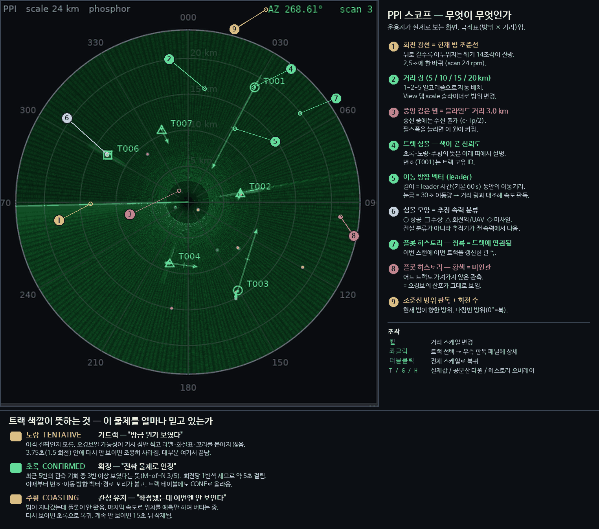

아래 설명은 이 그림의 각 요소가 코드에서 어떻게 만들어지는가임 — 무엇이 무엇인지는
그림이 답하고, 여기서는 그리는 방법을 다룸.

**극좌표 → 래스터 변환 캐시** — 목적지 픽셀마다 (방위 셀, 거리 게이트)를
구하려면 `atan2`와 `sqrt`가 필요함. 700 × 700이면 프레임당 **50만 번**.

그래서 매핑을 인덱스 LUT에 캐시하고 **기하나 거리 스케일이 바뀔 때만** 다시
만듦. 이후 픽셀 그리기는 인덱스 조회 두 번으로 끝남.

**빔 표시** — 이산적인 광선을 여러 개 그리면 부챗살처럼 보여 스코프답지 않음.
대신 **알파가 뒤로 갈수록 감쇠하는 채워진 쐐기** 14조각으로 잔광을 만들고,
현재 조준선에만 밝은 반경선을 하나 그림.

**심볼로지**

| 요소 | 표현 |
|---|---|
| 트랙 상태 | 황색 tentative / 초록 confirmed / 주황 coasting |
| 표적 분류 | 원(항공) · 사각(수상) · 삼각(회전익·UAV) · 다이아몬드(미사일) |
| 속도 | 화살촉 달린 방향 벡터. 길이 = leader 시간 동안 이동거리, 30초마다 눈금 |
| 불확실성 | 2σ 공분산 타원 (2×2 블록 고유분해, 24각형) |
| 드웰 증거 | 초록 실선 링 = 히트, 빨강 점선 호 = 미스 |

**tentative 트랙은 일부러 조용하게** 그림 — 라벨·리더·트레일 없이 점만. 대부분
한 스캔 안에 사라질 오경보인데 확정 트랙만큼 눈에 띄면 화면이 읽히지 않기 때문.
그렇다고 숨기지는 않음. 검출기 거동을 보여주는 것이 이 콘솔의 목적이므로.

### 5.6 히스토리와 Verify 탭

엔진은 **현재 그림 + 짧은 심볼 트레일**만 발행함. 장기 이력은 표시 계층의
관심사이므로 `ui_history.[ch]`가 콘솔이 이미 받은 프레임에서 누적함.

- 경로 점은 입력 시 최소 간격(25 m)으로 합쳐짐 — 정지 표적이 점 하나로 유지됨
- 보존 창을 넘긴 점은 나이로 제거됨. 수 시간 시나리오가 수백 KB에 들어감

**Verify 탭**은 실제값-트랙 자동 페어링으로 채점함(`app_verify_update`).

| 지표 | 의미 |
|---|---|
| ST | 표적별 추적 상태 (SEARCH / TRACK / LOST / OUT) |
| ERR / RMSE | 현재 오차 / 누적 제곱평균 |
| CMP% | 추적 완성도 = 추적된 시간 / 활성 시간 |
| TTT | 최초 트랙 소요 시간 |
| spurious | 어떤 실제값도 주장하지 않는 확정 트랙 = 가짜 트랙 |
| redundant | 같은 게이트 안의 추가 확정 트랙 = 중복 트랙 |

`spurious`와 `redundant`가 중요한 이유: 3.8절의 드웰 병합과 `init_inhibit_m`이
제대로 동작하는지를 **숫자로** 확인하는 창구임.

### 5.7 앱 프레임 루프

```
1. 입력 배수  (ui_plat_poll)
2. 대기 중인 단일 스텝 소진 (청크 단위)
3. 이전 프레임 릴리스 → 최신 프레임 획득 → 히스토리 갱신
4. 레이아웃 계산 → 툴바 · 제어패널 · 4개 디스플레이 · 테이블 · 상태바
5. 팝업 그리기 (ui_frame_end) → 커서 설정 → present
6. 지연된 재구성
7. 60 fps 페이싱
```

두 군데가 설계적으로 중요함.

**설정 변경을 프레임 끝으로 미룸** — 컨트롤은 로컬 `PWR_RadarConfig` 복사본을
편집하고 `cfg_dirty` 플래그만 세움. 실제 `pwr_engine_reconfigure`는 **아무 위젯도
잡고 있지 않고 편집 중인 필드도 없을 때**만 호출됨.

```c
if (a->cfg_dirty && a->ui.active == 0u && a->ui.edit_id == 0u) { ... }
```

이렇게 하지 않으면 슬라이더를 드래그하는 동안 **픽셀마다 엔진을 재구성**하게 됨.
거부된 설정은 롤백되고 사유가 상태바에 표시됨.

**단일 스텝을 청크로 나눔** — `+1 SCAN`은 CPI 234개를 요구함. 한 번에 처리하면
콘솔이 몇 초간 얼어붙음. 대신 요청을 `step_pending`에 쌓아 두고 UI 프레임마다
**약 20 ms 분량씩** 소진함. 그 결과 전체 스캔 스텝이 **애니메이션처럼** 진행됨.

**RTI 자동 색상 한계** — 워터폴은 도플러 축 최댓값을 보여주므로 잡음 바닥이
셀 단위 바닥보다 위에 있음. 하한을 들어 올리지 않으면 배경 전체가 중간 색으로
떠서 대비가 사라짐.

코드가 실제로 쓰는 상승분은 **이론값이 아니라 경험 계수**임.

```c
lift = 10*log10(max(N_doppler, 2)) * 0.55;   /* 64빈 → 18.06 × 0.55 = 9.93 dB */
clim_lo = noise_floor_db + lift;
clim_hi = clim_lo + 44.0;                    /* 창 폭도 고정 44 dB */
```

최댓값 통계의 이론 상승분 `10·log₁₀(ln 64) = 6.2 dB`보다 3.7 dB 높게 잡혀 있음.
0.55는 화면 대비를 보고 고른 값이며, 상한이 하한 + 44 dB로 묶여 있으므로
워터폴의 표시 동적범위는 항상 44 dB임.
---

## 6. 이 시스템이 스스로를 검증하는 방법

레이다 신호처리는 **틀려도 그럴듯해 보이는** 분야임. 축이 반대로 뒤집혀도,
캘리브레이션이 3 dB 어긋나도 화면은 여전히 레이다처럼 보임. 그래서 이 프로젝트는
검증 장치를 여러 겹으로 두고 있음.

### 6.1 수치 자체검증 스위트

`PWRadarUI --selftest` (CTest에도 `core_selftest`로 등록). 각 케이스는 체인의
결함이 있으면 반드시 깨지는 성질을 하나씩 검사함.

| 케이스 | 검사 대상 | 결함이 있으면 |
|---|---|---|
| T1 | FFT vs 직접 DFT, 왕복 | 버터플라이·트위들 오류 |
| T2 | 창 함수 9종 | 음수 계수, 잘못된 ENBW |
| T3 | 정렬 / 퀵셀렉트 | OS-CFAR 임계 오류 |
| T4 | JV 할당 최적성 | 데이터 연관 열화 |
| T5 | 2×2 역행렬·게이트·대칭화 | 칼만 발산 |
| T6 | 압축 봉우리 거리 정확도 | 축 오프셋·군지연 오류 |
| T7 | 도플러 축 캘리브레이션 | 속도 부호·스케일 오류 |
| T8 | 잡음 전용 오경보율 | 임계 배수 공식 오류 |
| T9 | 종단 추적 정확도 | 통합 회귀 |

**T4가 특히 잘 설계됨** — 비용 행렬이 이렇게 생김.

```
row0: 1  2  9  9
row1: 2  4  9  9
row2: 9  9  9  2
```

탐욕법(전역 최소 짝을 반복 선택)은 `(0,0)=1`을 먼저 집고 `(2,3)=2`, `(1,1)=4`로
끝나 **합 7**을 냄. 최적해는 `(0,1)+(1,0)+(2,3) = 2+2+2 = **6**`. 즉 증강경로
탐색이 실제로 동작하지 않으면 통과할 수 없음. 단순히 "돌아간다"가 아니라
"**옳은 답을 낸다**"를 검사함.

> **주의** — `pwr_selftest.c · pwr_test_assignment`의 주석은 "탐욕법은 8에 도달한다"고 적고 있으나
> 틀림. 이 행렬로 만들 수 있는 1:1 할당의 총합은 {6, 7, 12, 13, 14, 15, 19, 20,
> 22, 27}뿐이라 **8은 애초에 나올 수 없는 값**임. 탐욕법이 `(0,0)`을 먼저 집는다는
> 서술은 맞고, 결과값만 오기임. 테스트 자체는 총합 6을 검사하므로 정상 동작함.

출력 예 (GCC 13.3 / Linux x86-64 Release):

```
T1 FFT vs direct DFT            fwd rel 1.10e-07, round trip 1.26e-07
T6 pulse compression range      truth 12000 m, peak 11992 m
T7 Doppler axis calibration     truth -35.0 m/s, peak -34.6 m/s
T8 CFAR false-alarm rate        design 1.0e-04, achieved 8.63e-05 over 614400 cells
T9 end-to-end tracking          1 confirmed, best |dy| = 293 m
9/9 cases passed
```

수치는 컴파일러·최적화에 따라 변동하며 판정은 항목별 허용범위로 함. T8은 설계
Pfa의 0.05배–20배 구간인데, 유한 표본 추정이고 클러스터링이 인접 경보를 병합하므로
한 자릿수 이내 일치가 유효 범위임.

### 6.2 시나리오 — 현상별 검증

각 시나리오는 특정 거동 하나를 고립시킴. 정의는 `pwr_scenario.c`이며, 표적은
전부 `pwr_add_polar(방위, 거리, 고도, 침로, 속력, RCS, Swerling, 분류)` 한 줄로
기술됨.

| # | 시나리오 | 무엇을 확인하는가 | 환경 |
|---|---|---|---|
| 0 | 잡음만 | 설계 Pfa 대비 실측 오경보율 | 잡음만 |
| 1 | 단일 접근 항공기 | 기본 탐지·트랙 개시·TTT | 잡음만 |
| 2 | 해면 클러터 속 해상 표적 | MTI, R⁻³ 법칙, 클러터 무릎 근방 | 해상 3, CNR 26 dB |
| 3 | 공중·수상 혼합 | 정상 운용 (6표적) | 해상 2, CNR 20 dB |
| 4 | 분해능 페어 | 도플러 분리, 같은 CPI 플롯 비병합 | 잡음만 |
| 5 | 교차 트랙 | 데이터 연관 (같은 셀 통과) | 해상 1, CNR 14 dB |
| 6 | 고속 접근 | 도플러 폴딩, 모듈로 게이트 | 해상 2, CNR 18 dB |
| 7 | 비 + 재머 | CFAR 클러터 경계, 재밍 스트로브, 다중경로 | 해상 4, CNR 28 dB, 비 12 mm/h, 재머 135°/22 dB |
| 8 | 탐지거리 워크 | 레이다 방정식 대비 실측 | 해상 1, CNR 12 dB |

**시나리오 4의 주의점** — 방위 90°의 "거리 분해능 페어"(PAIR-A/B)는 **정지
표적**이라 시선속도가 정확히 0이고, 따라서 3.7절의 제로 도플러 검열 노치에 들어가
**기본 설정에서는 플롯이 하나도 나오지 않음**(실측 확인, 부록 F-1). 기본 설정에서
이 시나리오가 실제로 검증하는 것은 방위 270°의 **도플러 분리 페어**(DOPP-C/D)임 —
t = 0에 거리가 같고 시선속도만 ∓118 m/s로 다른 두 표적이 끝까지 서로 다른 확정
트랙으로 유지되는지. **같은 CPI의 플롯은 병합하지 않는다**는 드웰 병합 규칙이
여기서 검증됨.

거리 분해능 자체를 보려면 제로 도플러 검열을 끌 것. A-scope에 1.4 dB 깊이의
이중 봉우리가 나타남. 다만 두 표적 간격 35 m는 `init_inhibit_m = 600 m` 안이므로
**트랙은 끝까지 하나**임 — 거리 분해능은 플롯·A-scope 수준의 항목이지 트랙 수준
항목이 아님.

**시나리오 6이 보여주는 것** — MSL-01의 실제 시선속도는 −298.7 m/s인데 비모호
속도가 ±73.7 m/s이므로 도플러가 **두 번 접혀** −3.8 m/s로 측정됨. 그런데도 트랙은
299.1 m/s / 침로 190.5°로 수렴함(진실값 300 m/s / 190°). **속도는 위치 갱신에서
나오고 도플러는 게이트에서 모듈로 비교로만 쓰이기 때문**임. 모듈로를 빼면 이
트랙이 모든 후속 플롯을 기각하고 굶어 죽음 — 그것이 이 시나리오가 지키는 회귀임.

4번과 6번은 **회귀 방지용**임. 드웰 병합 게이트를 넓히면 4번의 도플러 페어가
뭉치고, 도플러 게이트의 모듈로를 빼면 6번이 깨짐.

### 6.3 화면 자체가 검증 도구

콘솔은 예쁘게 보여주는 물건이 아니라 **처리 사슬을 눈으로 검증**하려고 만든 것.

- **플롯 히스토리** — 청록(트랙에 연관됨) vs 황색(미연관). 오경보 산포가 그대로 보임
- **연관선** — 이번 드웰에 어느 플롯이 어느 트랙을 갱신했는지
- **드웰 히트/미스 링** — M-of-N이 세는 증거를 심볼 위에 직접 표시
- **HIT 열** — `history_bits`를 `#`/`.`로 그대로 노출
- **Verify 탭** — 실제값 대비 정량 채점

즉 "탐지가 되는 것 같다"가 아니라 **드웰 → 히트 → 플롯 → 트랙** 각 단계를 따로
확인할 수 있음.

### 6.4 빌드 게이트

| 게이트 | 무엇을 막는가 |
|---|---|
| 엄격 C17 + 확장 끔 | 컴파일러 종속 코드 |
| GCC/Clang `-Wall -Wextra -Wpedantic -Wshadow -Wconversion` 무경고 | 암묵 변환·섀도잉 |
| MSVC `/W4` 무경고 | 위와 동일, 다른 진단 집합 |
| `-DPWR_WERROR=ON` (옵트인) | 경고 유입 |
| `tools/check_name_collisions.py` | 공개 식별자 vs Windows SDK 매크로 충돌 (4.9절) |
| `tools/check_windows_build.sh` | mingw-w64 교차 컴파일 + **wine 실제 실행** |
| `--capture N FILE` | 헤드리스 렌더 회귀 (PPM 출력, 이미지 라이브러리 불필요) |
| CTest `core_selftest` | 수치 회귀 |

`check_windows_build.sh`가 **컴파일에서 멈추지 않고 wine으로 실행까지** 하는 것이
핵심임. 4.9절의 매크로 충돌 같은 결함은 `-Werror`를 무경고로 통과하고 런타임에만
드러나기 때문. "빌드된다"와 "동작한다"는 다른 주장임.

---

## 7. 파라미터는 서로 어떻게 얽혀 있는가

앞 장들이 "각 단계가 무엇을 하는가"였다면 이 장은 **"노브 하나를 돌리면 무엇이
같이 움직이는가"** 임. 제어 패널의 값은 독립적이지 않고, 대부분 하나를 좋게 하면
다른 하나가 나빠지는 관계로 묶여 있음.

아래가 그 노브 전체임. 각 번호가 이 장에서 다루는 관계에 대응함.

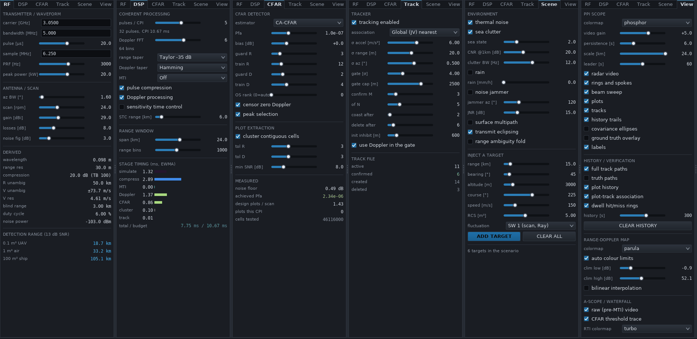

### 7.1 뿌리 파라미터 다섯 개

나머지는 전부 이 다섯에서 유도됨(`pwr_config.c · pwr_config_derive`).

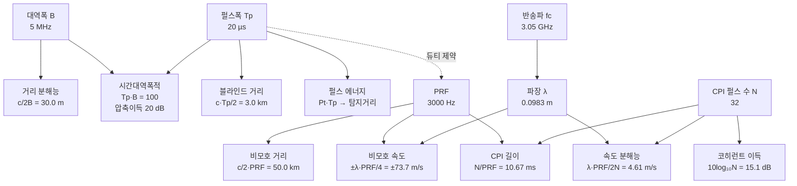

**샘플율은 분해능을 바꾸지 않음.** `sample_rate_hz`는 **거리 빈 간격**
`c/2fs = 24.0 m`만 정하고, 분해능은 대역폭이 정함(30.0 m). 기본값이 1.25배
오버샘플이라 30 m 분해능을 24 m 격자로 찍는 것이며, 빈을 촘촘히 해도 두 표적을
더 잘 나누지는 못함. 봉우리 위치 추정만 매끄러워짐.

### 7.2 가장 중요한 관계 — PRF 딜레마

PRF를 올리면 속도 모호가 넓어지고 거리 모호가 좁아짐. 정확히 반비례라서 **곱이
상수**임.

```
R_ua × V_ua = (c/2·PRF) × (λ·PRF/4) = c·λ/8      ← PRF가 소거됨
```

기본값 확인: `49.97 km × 73.72 m/s = 3.68e6`, `c·λ/8 = 3.68e6`. 일치함.

즉 **PRF로는 둘 중 하나만 살 수 있고, 총량은 반송파(λ)가 정함.** 이것이 실제
레이다가 저PRF(거리 우선)·고PRF(속도 우선)·중PRF(둘 다 모호하되 PRF를 바꿔가며
푸는 방식)로 갈리는 이유임.

| PRF | 비모호 거리 | 비모호 속도 | 성격 |
|---|---|---|---|
| 1000 Hz | 149.9 km | ±24.6 m/s | 원거리 감시, 대부분의 항공기가 접힘 |
| **3000 Hz (기본)** | **50.0 km** | **±73.7 m/s** | 연안 감시 |
| 10000 Hz | 15.0 km | ±245.7 m/s | 근거리, 고속 표적 |

곱을 늘리는 유일한 방법은 **파장을 늘리는 것**(반송파를 낮추는 것)임. 다만 같은
개구 면적에서 이득이 떨어지고 빔이 넓어지므로 그 역시 공짜가 아님.

### 7.3 분해능과 에너지 — 펄스 압축이 푸는 매듭

압축이 없으면 거리 분해능이 `c·Tp/2`라서 30 m를 얻으려면 Tp = 0.2 µs가 필요하고,
그러면 에너지가 100배 부족해짐. 압축은 이 둘을 **분리**함.

```
분해능 ← 대역폭 B      (Tp와 무관)
에너지 ← Pt · Tp       (B와 무관)
압축이득 = Tp · B = TB  (둘의 곱)
```

기본값은 3 km 길이의 펄스로 30 m 분해능을 얻음. 대가는 두 가지.

- **블라인드 거리** `c·Tp/2 = 3.0 km` — 송신 중에는 수신 불가
- **거리 부엽** — 압축 봉우리 옆의 잔여 응답. 테이퍼로 억제(3.2절)

Tp를 늘리면 탐지거리가 좋아지지만 블라인드 거리가 같이 늘어나고, 듀티비 제약
`Tp × PRF ≤ duty_limit`이 PRF의 상한을 끌어내림. 기본값은 6.0 %로 한계 10 %의
절반쯤에 있음.

### 7.4 시간 예산 — 속도 분해능 ↔ 갱신률

회전 레이다에서는 **시간이 곧 예산**임. 안테나가 한 바퀴 도는 2.5초 안에 360°를
전부 훑어야 하므로, 한 표적에 쓸 수 있는 시간은 빔이 지나가는 동안뿐임.

```
스캔 주기      = 60/rpm                      = 2.5 s
CPI 길이       = N/PRF                       = 10.67 ms
스캔당 CPI     = 2.5/0.01067                 = 234.4
CPI당 방위 진행 = 360 × 10.67ms/2.5s          = 1.536°
빔폭당 펄스 수  = (빔폭/360) × 스캔주기 × PRF  = 33.3
```

**여기에 설계의 핵심 균형점이 있음.**

```
빔폭당 펄스 33.3  ≈  CPI당 펄스 32
```

우연이 아님. CPI가 빔폭 통과 시간보다 길면 하나의 코히런트 묶음 안에서 빔이
표적을 지나가 버려 **도플러 처리 도중에 진폭이 변조**되고, 그 변조가 도플러
스펙트럼을 넓혀 분해능을 깎음. 그래서 `pulses_per_cpi`는 `pulses_per_beamwidth`
바로 아래에 두는 것이 상한임.

이 상한이 속도 분해능의 한계를 정함.

```
속도 분해능 = λ·PRF/(2N)    N을 늘리면 좋아짐
그런데       N ≤ 빔폭당 펄스 수 = (빔폭/360)·(60/rpm)·PRF
∴ 속도 분해능 ≥ λ·360·rpm/(2·60·빔폭) = λ·3·rpm/빔폭
```

**PRF가 소거됨.** 즉 회전 레이다의 속도 분해능 한계는 PRF가 아니라 **파장·회전율·
빔폭** 셋이 정함. 기본값: `0.0983 × 3 × 24 / 1.6 = 4.42 m/s`, 실제 4.61 m/s로
거의 한계에 붙어 있음.

속도 분해능을 좋게 하려면 셋 중 하나 — **회전을 늦추거나**(갱신률 희생),
**빔을 좁히거나**(개구를 키움), **파장을 늘림**(비모호 속도 희생).

### 7.5 탐지 사슬 — SNR이 임계를 넘기까지

표적 하나가 화면에 뜨려면 SNR이 세 번 쌓이고 한 번 잘림.

```
단일 펄스 SNR = Pt·Tp·G²·λ²·σ / ((4π)³·R⁴·k·T₀·F·L)
      + 압축이득  10log₁₀(Tp·B)        = +20.0 dB
      + 코히런트 적분 10log₁₀(N)        = +15.1 dB (이상)
      − 도플러 테이퍼 손실              = −1.4 dB (Hamming)
      ────────────────────────────────
      = 화면에 표시되는 dB (= SNR)
      > CFAR 임계 (배경 + 12.2 dB)      → 탐지
      > cluster.min_snr_db (8 dB)       → 플롯 채택
```

**링크 예산에 대역폭 항이 없는 이유** — 정합필터 이후의 SNR은 수신 대역폭이 아니라
**송신 에너지 `Pt·Tp`** 가 정하기 때문. B를 넓히면 잡음도 같이 들어오지만 압축
이득도 같은 비율로 커져 정확히 상쇄됨. 그래서 **대역폭은 분해능만 바꾸고 탐지거리는
바꾸지 않음** — 이 사실이 파라미터 조정에서 가장 자주 오해되는 지점임.

거리 의존성은 R⁻⁴이므로 **거리 2배 = SNR 12 dB 손실**이고, 뒤집으면 탐지거리는
느리게 늘어남.

| 바꾸는 것 | 탐지거리 변화 |
|---|---|
| 첨두전력 2배 | ×1.19 (+19 %) |
| 펄스폭 2배 | ×1.19 |
| 안테나 이득 +3 dB (송수신 모두) | ×1.41 |
| RCS 10배 | ×1.78 |
| CPI 펄스 수 2배 | ×1.19 |

즉 **탐지거리를 2배로 늘리려면 전력을 16배** 써야 함. 안테나 이득이 훨씬 값싼
지렛대인 이유이고, 실제 감시 레이다가 개구부터 키우는 이유임.

### 7.6 검출 사슬 — Pfa에서 트랙까지

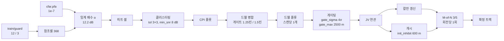

**각 단계가 서로를 어떻게 제약하는가**

| 관계 | 내용 |
|---|---|
| `pfa` ↔ `train_range` | 참조셀이 많을수록 배경 추정이 안정되어 같은 Pfa를 낮은 임계로 지킬 수 있음. 다만 창이 넓어지면 클러터 경계에서 엉뚱한 배경을 섞음 |
| `guard_range` ↔ 분해능 | 가드는 표적 누설을 막지만, 가드 안의 두 번째 표적은 피크 선택에서 지워짐. 가드 3빈 = 72 m 안의 표적 쌍은 하나로만 보고됨 |
| `cluster.tolerance` ↔ 분해능 | 연결 반경 3×3은 72 m / 6.9 m/s 안의 셀을 한 플롯으로 묶음. 분해된 표적을 도로 붙이지 않으려면 가드보다 크게 잡지 말 것 |
| 드웰 게이트 ↔ `cluster.tolerance` | 드웰 게이트(1.25빈)가 클러스터 허용치(3빈)보다 **좁음**. 이미 클러스터링이 합칠 것은 합쳤으므로, 드웰 단계는 CPI 간 동일 표적만 이으면 됨 |
| `init_inhibit_m` ↔ 분해능 | 600 m 안에는 트랙이 하나만 생김. 근접 편대는 트랙 하나로 보임 — **분해능보다 20배 큰 값**이며 중복 트랙 억제를 우선한 선택 |
| `gate_max_range_m` ↔ 표적 속도 | 스캔당 이동거리 `v × 2.5 s`를 덮어야 함. 2500 m면 1000 m/s까지 커버 |
| `confirm_m/n` ↔ `pfa` | 오경보가 늘면 M-of-N을 빡세게 해야 가짜 트랙이 안 생김. 대신 확정이 느려짐 |

**수치로 본 연쇄** — Pfa를 10배 올리면(1e-7 → 1e-6)

```
임계 배수  12.17 dB → 11.49 dB   (0.68 dB 완화)
오경보     스캔당 3.9개 → 약 39개
tentative 트랙  스캔당 4개 → 40개
확정 가짜 트랙  0개 → 발생 시작
탐지거리 이득   0.68 dB → 거리로 +4.0 %
```

**4 %를 벌자고 오경보를 10배** 감수하는 셈이며, 이것이 §1.9에서 Pfa를 셀
발생률로 정해야 한다고 말한 이유임.

### 7.7 노브 하나를 돌리면 무엇이 따라오는가

가장 자주 쓰는 조작에 대한 파급 표.

| 조작 | 즉시 효과 | 따라오는 것 | 주의 |
|---|---|---|---|
| **대역폭 ↑** | 거리 분해능 ↑ | TB ↑ → 압축이득 ↑, 필요 샘플율 ↑ | **탐지거리는 안 변함** |
| **펄스폭 ↑** | 탐지거리 ↑ | 블라인드 거리 ↑, 듀티비 ↑ | 듀티 한계에 걸리면 펄스폭이 자동으로 잘림 |
| **PRF ↑** | 비모호 속도 ↑ | 비모호 거리 ↓, CPI 짧아짐 | 곱은 상수(7.2절) |
| **CPI 펄스 수 ↑** | 속도 분해능 ↑, 적분이득 ↑ | CPI 길어짐 → 스캔당 CPI ↓ | 빔폭당 펄스 수(33)를 넘기면 빔 이동이 도플러를 뭉갬 |
| **회전율 ↑** | 갱신률 ↑ | 빔폭당 펄스 ↓ → 속도 분해능 한계 악화, 드웰 짧아짐 | M-of-N 시간이 전부 짧아짐 |
| **빔폭 ↓** | 방위 정확도 ↑, 이득 ↑ | 드웰 짧아짐, 스캔당 CPI는 그대로 | 이득은 `26000/(az×el)`로 자동 반영되지 않음 — RF 탭에서 직접 맞출 것 |
| **Pfa ↑** | 약한 표적 탐지 ↑ | 오경보 급증, tentative 트랙 급증 | 로그 스케일이라 한 자릿수씩 움직임 |
| **train 셀 ↑** | 배경 추정 안정 | 클러터 경계 대응 ↓, **전체 재구성 발생** | 슬라이더 드래그 중 버퍼 재할당 |
| **거리 테이퍼 깊게** | 거리 부엽 ↓ | 주엽 넓어짐(분해능 ↓), 정합손실 | −64 dB 아래는 ε이 막음(3.2절) |
| **MTI 차수 ↑** | 클러터 제거 ↑ | 유효 펄스 수 ↓ → 속도 분해능 ↓, 저속 표적도 지워짐 | 기본이 OFF인 이유 |
| **σ_accel ↑** | 기동 추종 ↑ | 게이트 커짐 → 오연관 위험 ↑, 경로가 떨림 | 추적기의 가장 중요한 노브 |
| **gate_sigma ↑** | 연관 성공률 ↑ | 오연관 ↑, 교차 표적에서 ID 교환 위험 | 4σ가 표준 |

### 7.8 설정이 거부되는 조합

`pwr_config_validate`가 **클램프가 아니라 오류를 반환**하는 경우. 상태바에 사유가
표시되고 이전 설정으로 롤백됨.

| 조건 | 이유 |
|---|---|
| `sample_rate < bandwidth` | 나이퀴스트 위반 |
| `Tp × PRF > duty_limit` | 송신기 듀티 한계 |
| PRI가 펄스 + 4 표본보다 짧음 | 수신 창이 없음 |
| `pulses_per_cpi`가 2의 거듭제곱이 아님 | FFT 제약 |
| `doppler_bins < pulses_per_cpi` | 제로패딩은 되지만 잘라내기는 안 됨 |
| MTI 차수 ≥ `pulses_per_cpi` | 남는 펄스가 없음 |
| CFAR 창 > 맵 크기 | 참조셀을 뽑을 수 없음 |

클램프(조용히 잘림)와 검증(거부)의 차이는 부록 C 참조.

---

## 부록 A. 숫자로 따라가는 표적 하나

기본 설정에서 **RCS 1 m², 거리 20 km, 시선속도 −60 m/s(접근)** 인 표적이 어떻게
화면에 나타나는지 실제 값으로 추적함.

**1. 링크 예산** — `pwr_snr_single_pulse_db`

```
단일 펄스 SNR = 21.83 dB
```

**2. 시뮬레이터 주입** — 진폭 `sqrt(10^2.183) · sigma_pc`로 처프를 삽입.
왕복 지연은

```
tau = 2 × 20000 / c × 6.25 MHz = 833.9 샘플     (정수가 아님 → 해석적 위상 평가)
```

**3. 펄스 압축** — 20 µs에 퍼진 에너지가 0.2 µs 봉우리로 모임. 출력 인덱스가 곧
지연이므로 봉우리는

```
거리 빈 833.9 → 834번 빈 (= 20,002 m)
```

**4. 도플러 FFT** — 32펄스, Hamming 테이퍼, 64점.

```
처리 이득 = (Σw)²/Σw² = 22.95 = 13.61 dB      (이상적 15.05 dB 대비 1.44 dB 테이퍼 손실)
```

속도축은 `first = −71.416 m/s`, `step = 2.304 m/s` 이므로

```
−60 m/s → 빈 4.96 ≈ 5번 빈
```

**5. 화면 표시** — 잡음 바닥이 0 dB로 캘리브레이션되어 있으므로

```
21.83 + 13.61 = 35.44 dB
```

Range-Doppler 맵의 `(도플러 5, 거리 834)` 위치가 **35.4 dB**로 뜸. 이 값이 곧
적분 후 SNR이며 별도 환산이 필요 없음(2.4절).

**6. CFAR** — 그 자리의 배경(잡음만이면 0 dB 부근)에 임계 배수를 곱한 값과 비교.
35 dB는 압도적으로 넘으므로 검출.

**7. 클러스터링** — 인접 셀 몇 개가 함께 켜졌을 것이므로 하나로 묶고, dB 표면
포물선 보간으로 부빈 중심을 구함.

**8. 드웰 병합** — 빔이 이 표적을 지나가는 CPI 여러 개에서 같은 히트가 나옴.
그것들을 전력 가중으로 합쳐 **방위 중심**을 구함(빔 분할). 빔이 지나가면 플롯
하나가 발행됨.

**9. 추적** — 극→직교 변환 후 게이팅·연관·칼만 갱신. 스캔당 1회 M-of-N 적립.
3-of-5를 채우면 CONFIRMED로 승격되어 PPI에 초록 원으로 표시됨.

---

## 부록 B. 용어집

| 용어 | 뜻 |
|---|---|
| **PW** | Pulsed Waveform. 펄스를 반복 송신하는 방식 |
| **PRF / PRI** | 초당 펄스 수 / 그 역수인 펄스 간격 |
| **CPI** | 함께 도플러 처리하는 펄스 묶음 (여기서는 32펄스, 10.67 ms) |
| **드웰** | 빔이 한 표적을 지나가는 동안 |
| **스캔** | 안테나 한 바퀴 (여기서는 2.5 s) |
| **빠른 시간 / 느린 시간** | 펄스 내 샘플 축 / 펄스 번호 축 |
| **거리 빈(range bin)** | 거리축 한 칸 (여기서는 23.98 m) |
| **LFM 처프** | 펄스 안에서 주파수를 선형으로 쓸어가는 파형 |
| **TB (시간대역폭적)** | `Tp × B`. 압축비이자 SNR 이득 (여기서는 100 = 20 dB) |
| **펄스 압축** | 긴 처프를 정합필터로 짧은 봉우리로 모으는 처리 |
| **거리 부엽** | 압축 봉우리 양옆의 잔여 응답. 큰 표적 주변 가짜 봉우리의 원인 |
| **테이퍼(창)** | 부엽을 낮추려고 곱하는 가중 함수. 대가로 주엽이 넓어짐 |
| **정합손실** | 이상적 정합필터 대비 SNR 손해 |
| **도플러** | 표적 운동에 의한 주파수 변이. 속도 측정의 근거 |
| **시선속도** | 레이다 방향 성분 속도. 이 코드는 **멀어지는 쪽이 양수** |
| **비모호 거리/속도** | 되풀이 없이 측정 가능한 상한 (50 km / ±73.7 m/s) |
| **블라인드 거리** | 송신 중이라 못 보는 근거리 (3.0 km) |
| **이클립싱** | 송신 중 수신 차단 |
| **MTI** | 고정 반사체를 지우는 펄스축 필터 |
| **클러터** | 표적이 아닌 반사 (해면, 지면, 비) |
| **CNR / JNR** | 클러터 / 재머 대 잡음비 |
| **CFAR** | 주변 배경으로 임계값을 매 셀 다시 계산해 오경보율을 일정하게 유지 |
| **CUT / 가드셀 / 훈련셀** | 검사 대상 셀 / 누설 차단용 여백 / 배경 추정용 셀 |
| **Pfa** | 셀 하나당 오경보 확률 |
| **Swerling 모델** | 표적 반사 세기 요동의 통계 모델 (0/1/2/3/4) |
| **RCS** | 레이다 반사 단면적 [m²]. 표적이 얼마나 잘 보이는지 |
| **플롯 / 트랙** | 한 번의 관측 점 / 여러 스캔을 이은 물체 |
| **빔 분할** | 빔 통과 중 전력 가중 중심으로 빔폭보다 정밀한 방위를 얻는 기법 |
| **M-of-N** | 최근 N회 기회 중 M회 검출되면 트랙을 확정하는 규칙 |
| **게이팅** | 트랙 예측 주변에 후보 영역을 잡아 연관 대상을 제한 |
| **마할라노비스 거리** | 불확실성으로 정규화한 거리. 게이트 판정 기준 |
| **JV 할당** | Jonker-Volgenant. 전역 최소 비용 매칭 정확 해법 |
| **코스팅** | 관측이 없어 예측만으로 트랙을 유지하는 상태 |
| **PPI** | Plan Position Indicator. 극좌표 레이다 화면 |
| **A-scope** | 거리 대 세기 1차원 표시 |
| **RTI** | Range-Time Intensity. 거리축 이력 워터폴 |
| **STC** | 근거리 포화를 막는 감도 시간 제어 램프. 진폭 `(R/R_stc)²` |
| **ENBW** | 등가 잡음 대역폭. 창 함수의 SNR 손실 척도 |
| **다중경로 로빙** | 해면 반사파와의 간섭으로 고도에 따라 밝기가 진동하는 현상 |
| **재밍 스트로브** | 재머 방위에 반경 방향으로 뻗는 밝은 띠. 재머는 1-way라 모든 거리에 걸침 |
| **클러터 무릎** | 근거리 클러터 제한과 원거리 잡음 제한이 갈리는 거리 |
| **제로 도플러 검열** | 고정물이 몰린 DC 열을 CFAR 검사에서 제외하는 것 (부록 F-1) |
| **원형평균** | 각도 평균을 sin/cos 합의 `atan2`로 구하는 법. 0°/360° 경계에서 필수 |
| **TTT** | Time To Track. 표적 등장부터 확정 트랙까지 걸린 시간 |
| **CMP%** | 추적 완성도 = 추적된 시간 / 표적 활성 시간 |
| **spurious / redundant** | 진실값 없는 확정 트랙 / 같은 표적에 붙은 여분 확정 트랙 |
| **ε (등화 하한)** | 압축 필터 등화의 분모 하한. 정합손실 상한이자 **부엽 하한**(약 −64 dB) |
| **Q8 고정소수** | PPI 잔광 누산 형식. 16비트 중 하위 8비트가 표시 레벨의 소수부 |

---

## 부록 C. 설정 파라미터 전체 레퍼런스

`PWR_RadarConfig` 전 필드. 기본값은 `pwr_config_default`, 클램프 범위는
`pwr_config_clamp`, 거부 조건은 `pwr_config_validate`에서 옴. 클램프는 값을 조용히
잘라 넣고, 검증은 아예 거부함 — 둘의 차이가 중요함.

### C.1 송신기 / 파형

| 필드 | 기본값 | 범위 | 무엇을 정하는가 |
|---|---|---|---|
| `carrier_hz` | 3.05 GHz | 0.1–100 GHz | 파장 λ → 도플러 감도, 비모호 속도 |
| `bandwidth_hz` | 5 MHz | 10 kHz–500 MHz | **거리 분해능** `c/2B` |
| `pulse_width_s` | 20 µs | 0.1 µs–2 ms | 에너지(탐지거리), 블라인드 거리, TB |
| `sample_rate_hz` | 6.25 MHz | ≥ B, ≤ 1 GHz | 거리 빈 간격 `c/2fs` |
| `prf_hz` | 3000 Hz | 50 Hz–100 kHz | 비모호 거리·속도, CPI 길이 |
| `peak_power_w` | 20 kW | 1 W–100 MW | 링크 예산 |
| `duty_limit` | 0.10 | 0.001–0.5 | 초과 시 **PRF가 아니라 펄스폭을 줄임** |

> 듀티비 상한을 펄스폭으로 흡수하는 이유: PRF를 낮추면 운용자가 고른 비모호
> 거리가 소리 없이 바뀌기 때문.

### C.2 안테나 / RF 예산

| 필드 | 기본값 | 범위 | 비고 |
|---|---|---|---|
| `tx_gain_db` / `rx_gain_db` | 29 / 29 dB | 0–70 | 1.6°×20° 개구의 실제 이득 |
| `noise_figure_db` | 3 dB | 0–20 | 잡음 전력 `kT₀BF` |
| `system_loss_db` | 8 dB | 0–30 | 링크 예산 손실 |
| `receiver_bandwidth_hz` | 0 (= `sample_rate_hz`) | — | 잡음 전력 계산용 |
| `azimuth_beamwidth_deg` | 1.6° | 0.2–30 | 방위 분해능, 드웰 길이, M-of-N LAG |
| `elevation_beamwidth_deg` | 20° | 0.5–90 | 고각 커버리지 |
| `antenna_height_m` | 25 m | 0–2000 | 수평선, 다중경로 로빙 |
| `scan_rate_rpm` | 24 | 0–120 | **0이면 정지응시** — 드웰 병합·스캔 판정이 전부 바뀜 |

### C.3 신호처리

| 필드 | 기본값 | 범위 | 비고 |
|---|---|---|---|
| `range_start_m` / `range_span_m` | 0 / 24 km | 0–1000 km / 200 m–1000 km | 표시 창. 좁히면 고속시간 FFT가 작아짐 |
| `pulses_per_cpi` | 32 | 2–256, **2의 거듭제곱** | 속도 분해능 ↔ 갱신률 |
| `doppler_bins` | 64 | ≥ `pulses_per_cpi`, ≤ 512, 2의 거듭제곱 | 오버샘플 배수 |
| `range_bins` | 1000 | 64–4096 (0 = 자동) | 처리 격자 |
| `range_window` | Taylor −35 dB | 9종 | 거리 부엽 ↔ 주엽폭 (3.2절) |
| `doppler_window` | Hamming | 9종 | 도플러 부엽 ↔ 분해능 |
| `mti_mode` | **OFF** | OFF / DC / 2 / 3 / 4-pulse | 차수 K는 펄스 K개를 소모 |
| `enable_pulse_compression` | 1 | 0/1 | 끄면 원시 비디오. `sigma_pc`가 1로 바뀌어 dB 축은 유지됨 |
| `enable_doppler_processing` | 1 | 0/1 | 끄면 비코히런트 평균을 모든 행에 복제 |
| `enable_stc` / `stc_range_m` | 0 / 6 km | 100 m–1000 km | R⁻⁴ 보상 램프. 에코와 클러터에만 걸리고 열잡음에는 걸리지 않음 (3.2절, 부록 F-4·G.3) |

### C.4 CFAR

| 필드 | 기본값 | 범위 | 비고 |
|---|---|---|---|
| `cfar.type` | CA | CA/GOCA/SOCA/OS/TM | OS·TM은 **거리축 1-D** 창 |
| `cfar.pfa` | **1e-7** | 1e-12–0.1 | 셀당 확률. 셀 발생률로 정해야 함 (1.9절) |
| `cfar.extra_threshold_db` | 0 | −20–+40 | 운용자 바이어스 |
| `cfar.guard_range` | 3 | 0–32 | 표적 누설 차단. **변경 시 전체 재구성** |
| `cfar.guard_doppler` | 2 | 0–16 | 표적 누설 차단 (핫세터) |
| `cfar.train_range` | 12 | 1–64 | 배경 추정. **변경 시 전체 재구성** |
| `cfar.train_doppler` | 4 | 0–16 | 배경 추정 (핫세터) |
| `cfar.os_rank` | 0 (= 0.75·N) | 1–N | OS의 k |
| `cfar.trim_low` / `trim_high` | 2 / 4 | — | TM 절사 개수 |
| `cfar.censor_zero_doppler` | 1 | 0/1 | DC 열 검열 (부록 F-1) |
| `cfar.zero_doppler_guard` | 1 | 0–16 | 검열 반폭 → 행 30·31·32 |
| `cfar.peak_selection` | 1 | 0/1 | 가드 영역 내 국소 최댓값만 채택 |

### C.5 클러스터링

| 필드 | 기본값 | 범위 | 비고 |
|---|---|---|---|
| `cluster.enable` | 1 | 0/1 | 끄면 셀 하나하나가 플롯 |
| `cluster.range_tolerance` / `doppler_tolerance` | 3 / 3 | 0–16 | 플러드필 연결 반경 |
| `cluster.min_cells` / `max_cells` | 1 / 400 | 1–64 / 1–100000 | 너무 큰 덩어리는 클러터로 기각 |
| `cluster.min_snr_db` | 8 dB | −10–60 | 약한 플롯 제거. 트랙 개시 문턱이기도 함 |

### C.6 추적기

| 필드 | 기본값 | 범위 | 비고 |
|---|---|---|---|
| `tracker.enable` | 1 | 0/1 | |
| `tracker.assoc_mode` | GLOBAL (JV) | NEAREST / GLOBAL | 탐욕 vs 전역 최적 |
| `tracker.process_noise_accel` | 6 m/s² | 0.01–200 | **가장 중요한 노브.** 기동 추종 ↔ 부드러움 |
| `tracker.meas_sigma_range_m` | 20 m | 0.5–5000 | 거리 측정 1σ |
| `tracker.meas_sigma_azimuth_deg` | 0.5° | 0.01–20 | 방위 1σ → 먼 거리에서 횡거리 오차 지배 |
| `tracker.meas_sigma_velocity_mps` | 3 m/s | 0.1–200 | 도플러 1σ |
| `tracker.gate_sigma` | 4.0 | 1–12 | 마할라노비스 게이트 |
| `tracker.gate_max_range_m` | 2500 m | 50–50000 | 직사각 사전게이트 |
| `tracker.init_velocity_sigma` | 150 m/s | 1–1000 | 개시 시 속도 불확실성 |
| `tracker.max_speed_mps` | 600 m/s | 5–2000 | 발산 가드 (2배 초과 시 삭제) |
| `tracker.min_speed_for_course` | 1.5 m/s | — | 이하에서는 침로를 고정 |
| `tracker.confirm_m` / `confirm_n` | 3 / 5 | 1–31 | M-of-N. 판정은 **회전당 1회** |
| `tracker.coast_misses` | 2 | 1–60 | 코스팅 진입 |
| `tracker.delete_misses` | 6 | ≥ coast, ≤120 | 삭제 |
| `tracker.use_doppler_in_gate` | 1 | 0/1 | **2·V_ua 모듈로** 비교 |
| `tracker.init_inhibit_m` | 600 m | 0–20000 | 중복 트랙 억제 |

### C.7 표시 / 실행

| 필드 | 기본값 | 범위 | 비고 |
|---|---|---|---|
| `ppi_azimuth_cells` | 1024 | 64–2048 | PPI 각도 해상도 (0.35°/셀) |
| `rti_rows` | 256 | 16–512 | 워터폴 깊이 |
| `ppi_persistence_s` | 6.0 s | 0–60 | **0은 "감쇠 없음"** (부록 F-3) |
| `time_scale` | 1.0 | 0.01–100 | 0.05×–8× 슬라이더 |
| `max_cpi_per_second` | 0 (무제한) | 0–100000 | 처리량 상한 |
| `worker_thread` | 1 | 0/1 | 0이면 `pwr_engine_step`으로만 진행 |
| `deterministic` | 1 | 0/1 | **0도 무작위가 아님** (3.1절 (8)) |

### C.8 환경 (`PWR_SimEnvironment`)

| 필드 | 기본값 | 비고 |
|---|---|---|
| `sea_state` | 2.0 | Douglas 등급. `5·(sea_state−2)` dB 가 CNR에 더해짐 → 등급 1당 5 dB |
| `clutter_to_noise_db` | 20 dB | **1000 m 기준** CNR (`PWR_CLUTTER_REF_RANGE_M`). `pwr_types.h` 주석은 "first range gate"라고 적었으나 코드는 1 km 고정 |
| `clutter_spread_hz` | 12 Hz | 내부 클러터 운동 스펙트럼 폭 → AR(1) 계수 |
| `rain_rate_mmph` / `rain_extent_km` | 0 / 8 km | 강우 셀 |
| `jammer_azimuth_deg` / `jammer_power_db` / `jammer_bandwidth_frac` | 120° / 15 dB / 1.0 | **1-way** 패턴으로 진입 |
| `rng_seed` | `0x5150524152` | ASCII "PWRAR" |
| `enable_*` | 열잡음 1, 해면 1, 비 0, 재머 0, 다중경로 0, 이클립싱 1, 거리모호 0 | |

### C.9 검증에서 거부되는 조합

클램프가 아니라 **오류를 반환**하는 경우. 사유가 상태바에 표시됨.

- 표본율 < 대역폭 (나이퀴스트 위반)
- 듀티비 > `duty_limit`
- 펄스가 2 표본 미만, 또는 PRI가 펄스 + 4 표본보다 짧음
- `pulses_per_cpi`가 2의 거듭제곱이 아님
- `doppler_bins` < `pulses_per_cpi`
- MTI 차수 ≥ `pulses_per_cpi`
- **CFAR 창이 맵보다 큼** (`2(guard+train)+1 > bins`)
- `pfa`가 (0, 1) 밖

---

## 부록 D. 공개 API 지도

`PWRadarCore/include/pwradar/pwr_api.h` 전체. DLL 경계를 넘는 것은 이 헤더 집합뿐임.

### D.1 기능별 분류

| 그룹 | 함수 | 스레드 규약 |
|---|---|---|
| **식별** | `pwr_abi_version` · `pwr_version_string` · `pwr_status_string` · `pwr_*_name`(6종) | 순수 |
| **설정 (엔진 불필요)** | `pwr_config_default` · `pwr_sim_environment_default` · `pwr_config_validate` · `pwr_config_derive` · `pwr_config_clamp` | 순수 |
| **링크 예산** | `pwr_snr_single_pulse_db` · `pwr_max_range_for_snr` | 순수 |
| **수명주기** | `pwr_engine_create` · `_destroy` · `_set_log` · `_last_error` | 호출자가 직렬화 |
| **실행 제어** | `_start` · `_stop` · `_pause` · `_resume` · `_reset` · `_step` · `_run_state` | 안전 |
| **재구성** | `_reconfigure` | **블로킹** (최대 1 CPI) |
| **조회** | `_get_config` · `_get_metrics` · `_get_stats` | 락 없는 구조체 복사, 논블로킹 |
| **핫세터 (메일박스)** | `_set_cluster` · `_set_tracker` · `_set_scan_rate` · `_set_time_scale` · `_set_stc` · `_set_cursor_range_bin` | **논블로킹** |
| **핫세터처럼 보이지만 블로킹** | `_set_mti` · `_set_windows` (항상), `_set_cfar` (참조창 변경 시), `_set_log` | 내부적으로 `reconfigure` 또는 `proc_lock`을 잡음 |
| **시나리오** | `_set_environment` · `_get_environment` · `_target_add/update/remove/clear/count/at` · `pwr_scenario_name` · `_load_scenario` | 표적 변경자는 **블로킹** |
| **프레임 소비** | `_frame_acquire` · `_frame_release` · `_frame_sequence` · `_get_stats` | 소비자 1스레드 |
| **유틸리티** | `pwr_time_now_s` · `pwr_sleep_s` · `pwr_window_fill` · `pwr_fft_forward/_inverse` · `pwr_next_pow2` · `pwr_self_test` | 순수 |

### D.2 최소 사용 예

```c
PWR_RadarConfig cfg;
PWR_Engine*     eng;
PWR_Frame       frame;

pwr_config_default(&cfg);          /* 검증된 S밴드 기본값 */
cfg.cfar.pfa = 1e-8;               /* 원하는 것만 수정 */
pwr_engine_create(&cfg, &eng);
pwr_engine_load_scenario(eng, 1);
pwr_engine_start(eng);

for (;;) {
    if (pwr_engine_frame_acquire(eng, &frame) == PWR_STATUS_OK) {
        /* frame.tracks, frame.rd_map_db ... 를 여기서만 읽을 것 */
        pwr_engine_frame_release(eng);
    }
}
pwr_engine_destroy(eng);
```

`worker_thread = 0`으로 만들면 스레드 없이 `pwr_engine_step(eng, n)`으로 직접
CPI를 돌릴 수 있음 — 오프라인 분석이나 회귀 테스트에 쓰는 방식이고, 이 문서
부록 G의 실측치도 그렇게 뽑은 것임.

### D.3 상태 코드

성공은 `PWR_STATUS_OK`(0). 왜 `PWR_OK`가 아닌지는 4.9절.
`PWR_STATUS_NO_DATA`는 **오류가 아님** — 아직 발행된 프레임이 없다는 뜻이므로
루프에서 정상적으로 만나는 값임.

---

## 부록 E. 코드 지도 — 질문에서 파일로

| 알고 싶은 것 | 볼 곳 |
|---|---|
| 표적 반사가 어떻게 만들어지나 | `pwr_sim.c · pwr_sim_generate_cpi` |
| 해면 클러터 레벨과 도플러 폭 | `pwr_sim.c · pwr_sim_add_clutter` |
| 압축 필터를 어떻게 설계하나 | `pwr_waveform.c · pwr_waveform_build` |
| 압축을 매 CPI 어떻게 거나 | `pwr_chain.c · pwr_chain_pulse_compress` |
| MTI 계수와 정규화 | `pwr_chain.c · pwr_chain_mti` |
| 도플러 축 순서를 왜 바꾸나 | `pwr_chain.c · pwr_chain_doppler` |
| A-scope·잡음바닥·PPI 잔광 | `pwr_chain.c · pwr_chain_products`, `pwr_display_update_ppi` |
| CFAR 임계 배수 공식 | `pwr_cfar.c · pwr_alpha_ca`, `pwr_alpha_os` |
| CFAR 슬라이딩 최적화 | `pwr_cfar.c · pwr_cfar_run` |
| 셀을 플롯으로 묶는 법 | `pwr_cfar.c · pwr_cluster_run` |
| 드웰 병합 / 빔 분할 | `pwr_cfar.c · pwr_plots_dwell_merge` |
| 칼만 예측·갱신 | `pwr_track.c · pwr_tracker_update` |
| JV 할당 | `pwr_track.c` 의 할당 블록 |
| M-of-N 장부 | `pwr_track.c · pwr_track_book_attempt` |
| 워커 루프·페이싱 | `pwr_engine.c · pwr_worker_main` |
| CPI 한 번의 전체 순서 | `pwr_engine.c · pwr_engine_process_cpi` |
| 3중 버퍼 발행 | `pwr_engine.c · pwr_frame_publish` |
| 핫세터 메일박스 | `pwr_engine.c · pwr_engine_apply_pending_locked` |
| 파생 지표 계산 | `pwr_config.c · pwr_config_derive` |
| 링크 예산 | `pwr_config.c · pwr_snr_single_pulse_db` |
| 시나리오 정의 | `pwr_scenario.c` |
| 수치 자체검증 | `pwr_selftest.c` |
| 화면 레이아웃·제어패널 | `ui_app.c` |
| Verify 탭 채점 | `ui_app.c · app_verify_update` |
| PPI 심볼로지·타원·리더 | `ui_ppi.c` |
| MATLAB 대응 플롯 | `ui_plot.c` |
| 소프트웨어 렌더러 | `ui_gfx.c` |
| 위젯·테이블·스플리터 | `ui_widget.c` |

---

## 부록 F. 흔히 걸리는 함정 10가지

실제로 화면을 보며 헷갈리기 쉬운 것들. 전부 코드를 읽거나 돌려서 확인한 내용임.

**F-1. 정지 표적이 안 보임 / 부표가 70 m/s로 움직임**

시선속도가 정확히 0이면 제로 도플러 검열(3.7절)에 걸려 주엽으로는 탐지되지 않음.
그런데 표적이 강하면 **도플러 창의 부엽**(Hamming −43 dB)이 검열 밖 행에서 임계를
넘고, 그 부엽 플롯들은 자기 가드 영역 안에서 국소 최댓값이라 피크 선택도 통과함.

실측(시나리오 2의 정지 부표, 적분 후 약 60 dB): 거리는 8800 m로 정확한데
시선속도가 매 CPI `+29.7 / −25.2 / −67.0 / +71.5 m/s`로 제멋대로이고 SNR이 전부
`피크 − 43 dB` 부근에 몰림. 이 서명을 보면 도플러 부엽임.

더 약한 정지 표적(시나리오 4의 PAIR, 적분 후 약 51 dB)은 부엽이 8 dB로 임계
아래라 **아예 안 보임**. 대처: 검열 끄기 / 도플러 테이퍼를 Blackman 계열로 /
`zero_doppler_guard`를 0으로.

**F-2. 표적을 멀리 놓았는데 아무것도 안 뜸**

시뮬레이터는 `fast_copy` 표본까지만 신호를 만듦. 기본 형상에서 약 **27 km**이고,
그 밖의 표적은 압축기가 읽지도 않으므로 존재 자체가 없음. 표시 범위
(`range_span_m`)를 늘리면 같이 늘어남.

**F-3. `ppi_persistence_s = 0`으로 했더니 화면이 하얗게 탐**

0은 "잔광 없음"이 아니라 **"감쇠 없음"** 임. 감쇠 블록 전체가
`if (persistence > 0)` 안에 있고 누산기는 max-hold이므로 밝아지기만 함.
잔광을 끄려면 0이 아니라 0.05 s 같은 작은 값을 줄 것.

**F-4. STC를 켰더니 근거리 표적이 약해짐**

정상이고 그것이 STC의 값임. 램프는 수신기 앞단 감쇠기를 모사하므로 그 거리에서
도달한 것 — 표적 에코와 표면 클러터 — 만 `40·log₁₀(R/stc_range)` dB 줄이고
열잡음 바닥은 0 dB에 그대로 둠. 따라서 **신호대클러터비는 보존되고 근거리
SNR을 감쇠분만큼 지불함**. 근거리는 SNR이 과잉이므로 남는 거래임.

바꿔 말해 STC를 켜서 잡음 바닥이 내려간다면 그건 버그임 — 램프가 잡음에 걸렸다는
뜻이니. 실측 표는 부록 G.3.

**F-5. A-scope 잡음 바닥이 0 dB가 아니라 +5~9 dB로 읽힘**

A-scope와 RTI는 도플러축 **최댓값**(max-hold)임. 64개 셀의 최댓값이므로 잡음
바닥이 셀 단위 바닥보다 약 `ln(64) ≈ 4.2` 배(= 6.2 dB) 위에 있음. 셀 단위 0 dB를
확인하려면 R-D 맵을 볼 것.

RTI의 자동 색상 하한도 들어 올려져 있지만 **같은 값이 아님** — 코드는
`10·log₁₀(N)×0.55`(64빈에서 9.93 dB)를 쓰는 경험 계수이고 상한은 하한 + 44 dB로
고정임(5.7절).

**F-9. RTI에서 줌을 했는데 다음 프레임에 풀림**

`app_draw_rti`가 매 프레임 `ui_axes_set_full`을 호출하고, 그 함수는 전체 범위뿐
아니라 **현재 뷰까지** 되돌림. 나머지 세 축은 생성 시점과 재구성 직후에만
호출하므로 뷰가 유지됨. RTI의 데이터 커서는 정상 동작함.

**F-10. `Ctrl`+휠과 `Shift`+휠이 예상과 반대**

`ui_axes_input`은 수식키를 **끄는 마스크**로 씀.

```c
do_x = ((mods & UI_MOD_CTRL)  == 0);   /* Ctrl 을 누르면 x 줌이 꺼짐  */
do_y = ((mods & UI_MOD_SHIFT) == 0);   /* Shift 를 누르면 y 줌이 꺼짐 */
```

따라서 **`Ctrl`+휠 = y축만, `Shift`+휠 = x축만**임. `ui_plot.c` 상단의 블록
주석은 반대로 적혀 있으나 코드가 위와 같음.

**F-6. 클러터가 A-scope 실선에는 있는데 raw 트레이스에는 없음**

`range_profile_raw_db`는 `pwr_chain_pulse_compress` 안에서 누산되는데 클러터
주입은 그 **뒤에** 실행됨(3.3절). 따라서 raw 트레이스는 MTI 이전이자 **클러터
이전**임.

**F-7. 거리 모호가 안 보임**

`enable_range_ambiguity`가 **기본 꺼짐**임. 켜지 않으면 비모호 거리 밖 표적은
접히지 않고 그냥 사라짐.

**F-8. 압축을 껐는데 SNR이 20 dB 떨어지지 않음**

`enable_pulse_compression = 0`이면 `sigma_pc`가 1.0으로 바뀌어 dB 축이 새 기준으로
다시 캘리브레이션됨(2.4절). 잡음 바닥은 여전히 0 dB이고, 표적만 압축이득
20 dB 만큼 낮게 보임. 즉 축이 아니라 표적이 내려감 — 이것이 올바른 동작임.

---

## 부록 G. 실측으로 확인한 동작

이 부록의 값은 저장소를 그대로 빌드해서(`GCC 13.3 / Linux x86-64 / Release`)
`worker_thread = 0`으로 CPI를 돌리고 프레임을 읽어 얻은 것임. 시뮬레이터가
결정적이므로(3.1절 (8)) 재현 가능함.

### G.1 오경보율 — 왜 설계값보다 높은가

시나리오 0(잡음만), 20 스캔.

| 도플러 FFT | 도플러 테이퍼 | 실측 Pfa | 설계 대비 | 오경보 플롯/스캔 |
|---|---|---|---|---|
| 64 빈 (2× 오버샘플) | Hamming | 2.59e-7 | 2.6× | 3.89 |
| 64 빈 | Rectangular | 1.96e-7 | 2.0× | 2.95 |
| 32 빈 | Hamming | 1.40e-7 | 1.4× | 1.00 |
| **32 빈** | **Rectangular** | **1.03e-7** | **1.0×** | 0.74 |

마지막 행 — 교과서 가정(독립 지수분포 셀)이 성립하는 조건 — 에서 **실측이 설계
Pfa와 정확히 일치**함. 임계 배수 공식(3.7절)이 옳다는 직접 증거임.

기본 설정이 2.6배 높은 것은 두 가지 의도된 선택 때문.

- **2배 도플러 오버샘플** — 32 펄스를 64 빈으로 제로패딩하므로 이웃 도플러 셀이
  강하게 상관됨. 참조셀 368개의 *유효 독립 개수*가 절반 수준으로 떨어져 배경
  추정 분산이 커지고 임계가 상대적으로 낮게 잡힘 (전형적인 CFAR 상관 손실).
- **Hamming 도플러 테이퍼** — 주엽이 4빈으로 퍼져 상관 길이가 더 늘어남.

40 스캔으로 늘리면 실측 Pfa 2.83e-7, 플롯 162개. 그동안 tentative 트랙이 159개
생겼다가 149개 소멸했고 **확정 트랙은 0개**임 — 오경보는 같은 자리에 다시
나타나지 않으므로 3-of-5를 절대 채우지 못함.

### G.2 압축 테이퍼 — ε이 부엽의 바닥을 정함

엔진이 시작 시 로그로 내보내는 값. `PWR_EQ_EPSILON`을 바꿔 가며 측정.

| 테이퍼 | 설계 부엽 | ε = 0.02 (기본) | ε = 0.002 | ε = 0.0002 |
|---|---|---|---|---|
| Taylor −35 dB | −35 | −37.4 | −37.4 | −37.4 |
| Hamming | −42.7 | −43.8 | −43.8 | −43.8 |
| Blackman | −58 | −64.5 | −64.3 | −64.2 |
| Chebyshev −60 dB | −60 | −64.4 | −83.9 | −86.2 |
| Blackman-Harris | −92 | **−63.6** | −83.4 | **−93.6** |

설계 부엽이 −64 dB보다 깊은 테이퍼는 기본 ε에서 막힘. 정합손실은 ε을 줄일수록
커짐(Rectangular 0.42 → 0.47 dB).

**끝단 측정** — 잡음·클러터·이클립싱을 끄고 정지응시로 강한 점표적(적분 후
73 dB)을 12 km에 놓고 A-scope를 읽은 값(피크 대비 dB, 거리 빈 단위).

| 테이퍼 | +1 | +2 | +3 | +4 | ±6빈 밖 최악 |
|---|---|---|---|---|---|
| Rectangular | −5.3 | **−12.8** | −21.5 | −43.3 | −23.2 |
| Taylor −35 dB | −2.7 | −21.7 | −46.8 | −45.4 | −36.3 |
| Hamming | −2.3 | −15.6 | −42.0 | −65.3 | −37.2 |
| Blackman | −1.4 | −9.0 | −25.8 | −63.6 | −35.4 |

Rectangular의 첫 부엽 −12.8 dB는 교과서값(−13.2 dB)과 일치함. 엔진이 로그로 내는
−25.4 dB는 그보다 바깥의 바닥이며, 그 차이의 원인은 3.2절의 측정 방식 설명 참고.

### G.3 STC 감쇠

정지응시, 해면클러터 CNR 30 dB, `stc_range_m = 6 km`. 압축 후 pre-MTI 프로파일,
dB는 열잡음 바닥 기준.

| 거리 | STC 끔 | STC 켬 | 이론 램프 `40·log₁₀(R/6km)` |
|---|---|---|---|
| 750 m | +28.4 | +0.6 | −36.1 |
| 1.5 km | +19.5 | +1.4 | −24.1 |
| 3 km | +13.1 | +3.7 | −12.0 |
| 6 km | +4.9 | +4.9 | 0 |
| 12 km | +0.5 | +0.5 | 0 |

읽는 법: 램프는 클러터에 온전히 걸리지만 측정값은 클러터+잡음 합이라 감쇠폭이
램프보다 작게 보임. 750 m에서 클러터는 28.4 → −7.7 dB로 내려가고 열잡음 0 dB는
그대로이므로 합이 0.6 dB에서 멈춤. **클러터가 잡음 바닥까지 눌렸고 바닥은 움직이지
않았다** — 이것이 확인하려는 전부임.

### G.4 추적 — 시나리오 1, 8 스캔

```
진실값  TGT-01 AIR   R = 14711 m  방위 45.0°  rdot = −176.2 m/s  RCS 6 m²
트랙    id=1 CONF    R = 14705 m  방위 45.1°  속력 177.2 m/s  침로 223.9°
                     hits=8  misses=0  SNR 32.8 dB
첫 확정 t = 5.35 s   (= 첫 드웰 0.35 s + (M−1)×스캔주기 5.0 s)
```

위치 오차 6 m, 속도 오차 1.2 m/s, 침로 오차 1.1° (진실 침로 225°).

### G.5 도플러 폴딩에도 속도가 맞는 이유 — 시나리오 6

```
진실값  MSL-01  rdot = −298.7 m/s   (비모호 속도 ±73.7 → 두 번 접혀 −3.8로 측정)
트랙    id=1    속력 299.1 m/s  침로 190.5°     (진실 300 m/s / 190°)
```

속도는 **위치 갱신에서** 나오고 도플러는 게이트에서 모듈로 비교로만 쓰이므로,
측정 시선속도가 접혀도 트랙 속도는 정확함(3.9절).

### G.6 시나리오 4 — 거리 페어는 한 트랙, 도플러 페어는 두 트랙

방위 90°의 거리 페어는 1.2 분해능셀(35 m) 간격으로 함께 벌어짐. 보어사이트가
90°를 지나는 CPI의 A-scope(24 m 빈):

```
  12303 m   18.7 dB
  12327 m   42.1 dB  #########################
  12351 m   43.0 dB  #########################
  12375 m   42.2 dB  #########################
  12399 m   42.9 dB  #########################
  12423 m   24.0 dB
```

봉우리 폭이 약 70 m로 단일 표적의 두 배지만 정점은 갈라지지 않음 — 35 m 간격이
24 m 빈으로 1.5 빈이고 테일러 −35 dB 테이퍼가 주엽을 더 넓히기 때문. **분해능은
봉우리 폭으로 읽는 항목**이며, 갈라진 두 정점을 보려면 대역폭을 올려야 함.

트랙 수준에서는 35 m 간격이 `init_inhibit_m = 600 m` 안이므로 **트랙이 하나만**
생성됨. 반면 방위 270°의 도플러 분리 페어는 두 트랙으로 정확히 유지되므로,
시나리오 4의 정상 결과는 확정 트랙 **3개**(거리 페어 1 + 도플러 페어 2)임.
