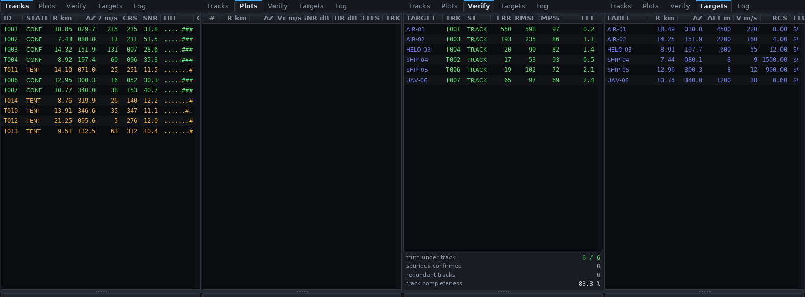

# PWRadarSystem

해상·공중 감시용 PW(Pulsed Waveform) 레이다 탐지 시스템.
순수 C17, 외부 라이브러리 의존성 없음, Windows / Linux 크로스플랫폼.

| 프로젝트 | 산출물 | 역할 |
|---|---|---|
| `PWRadarCore` | `PWRadarCore.dll` / `libPWRadarCore.so` | 신호처리 엔진 (시뮬레이터 → 펄스압축 → MTI → Doppler → CFAR → 클러스터링 → 트래커) |
| `PWRadarUI`   | `PWRadarUI.exe` / `PWRadarUI`           | 실시간 탐지 검증 콘솔. MATLAB 스타일 플로팅 자체 구현 |

링크 대상은 OS가 기본 제공하는 것뿐. Windows는 `user32` + `gdi32`,
Linux는 `libX11` + `pthread` + `libm`. 수치 라이브러리·GUI 툴킷·폰트
라이브러리 미사용. FFT, 난수 생성기, 칼만 필터, 안티에일리어싱 렌더러,
폰트 래스터라이저 모두 저장소 내 구현.

### 문서 지도

| 문서 | 답하는 질문 |
|---|---|
| **README.md** (이 문서) | 무엇인가 · 어떻게 빌드하나 · 어떻게 쓰나 · 왜 이렇게 설계했나 |
| **[ARCHITECTURE.md](ARCHITECTURE.md)** | 코드가 무엇을 어떤 순서로 계산하나 · 각 알고리즘이 어떻게 동작하나 · **파라미터가 서로 어떻게 얽혀 있나** |

레이다를 처음 접한다면 ARCHITECTURE.md **1장(레이다 기초)** 을 먼저 읽으면
이 README의 §3(설계) 내용이 훨씬 쉽게 읽힘.

---

## 0. 개요 — 이 프로그램이 하는 일

한 문장으로: **가짜 레이다 수신기를 만들어 놓고, 실제 레이다 신호처리기가 하는
계산을 그대로 돌려서, 그 결과를 실시간으로 화면에 그려 주는 프로그램**임.

안테나도 송신기도 없음. 대신 `PWRadarCore`가 매 10.67 ms마다

1. "이런 표적이 이 거리, 이 방위, 이 속도에 있다면 수신기 출력은 이런 모양일
   것"이라는 복소 신호를 **합성**하고 (열잡음·해면클러터·재밍·다중경로 포함),
2. 그 신호를 실제 처리기와 동일한 순서로 **처리**해
   (펄스압축 → MTI → 도플러 FFT → CFAR → 클러스터링 → 드웰 병합 → 칼만 추적),
3. 화면에 그릴 수 있는 형태로 **발행**함.

`PWRadarUI`는 그 결과를 받아 PPI(원형 스코프)·Range-Doppler 맵·A-scope·RTI
워터폴 네 화면과 트랙 테이블로 그림.

```
 실세계 표적            시뮬레이터가 대신함           처리기가 하는 일
 ┌──────────┐          ┌───────────────────┐        ┌──────────────────────┐
 │ 항공기   │          │ 반사파를 합성     │        │ 압축 → 도플러 → CFAR │
 │ 선박     │  ──────▶ │ + 잡음 + 클러터   │ ─────▶ │ → 플롯 → 트랙        │ ──▶ 화면
 │ 미사일   │          │ + 재밍            │        │                      │
 └──────────┘          └───────────────────┘        └──────────────────────┘
      진실값                  원시 I/Q                     탐지 결과
        │                                                     │
        └──────────────── Verify 탭이 이 둘을 대조해 채점 ─────┘
```

**왜 이런 물건이 필요한가.** 레이다 신호처리는 틀려도 그럴듯해 보임. 축이
뒤집혀도, 캘리브레이션이 3 dB 어긋나도 화면은 여전히 레이다처럼 보임. 진실값을
아는 합성 환경에서 돌리면 "탐지된 것 같다"가 아니라 **"20 km의 1 m² 표적을
평균 몇 스캔 만에 확정 트랙으로 올렸고 오차는 몇 m인가"** 를 숫자로 말할 수 있음.

### 한눈에 보는 처리 사슬

| 단계 | 하는 일 | 입력 → 출력 | 상세 |
|---|---|---|---|
| 시뮬레이터 | 수신기 출력 합성 | 표적 목록 → 복소 I/Q `32×2083` | [3.1절](ARCHITECTURE.md#31-시뮬레이터--가짜-수신기-만들기) |
| 펄스 압축 | 긴 펄스를 뾰족하게 | I/Q → 거리 프로파일 `32×1000` | [3.2절](ARCHITECTURE.md#32-펄스-압축--긴-펄스를-뾰족하게) |
| 클러터 주입 | 해면·강우 반사 추가 | (압축 영역에서) | [3.3절](ARCHITECTURE.md#33-클러터-주입--왜-여기인가) |
| MTI | 안 움직이는 것 제거 | 펄스축 필터 | [3.4절](ARCHITECTURE.md#34-mti--안-움직이는-것-지우기) |
| 도플러 FFT | 속도로 분리 | → Range-Doppler 맵 `64×1000` | [3.5절](ARCHITECTURE.md#35-도플러-필터뱅크--속도로-분리) |
| CFAR | 적응 임계 검출 | 맵 → 히트 셀 마스크 | [3.7절](ARCHITECTURE.md#37-cfar--적응-임계-검출) |
| 클러스터링 | 인접 셀 → 점 하나 | 마스크 → CPI 플롯 | [3.8절](ARCHITECTURE.md#38-클러스터링과-드웰-병합--셀을-플롯으로) |
| 드웰 병합 | 빔 통과분을 한 점으로 | CPI 플롯 → 드웰 플롯 | [3.8절](ARCHITECTURE.md#38-클러스터링과-드웰-병합--셀을-플롯으로) |
| 추적 | 점을 물체로 | 플롯 → 트랙 | [3.9절](ARCHITECTURE.md#39-추적--플롯을-물체로) |

---

## 1. 빌드

CMake가 빌드 기술의 단일 소스. Windows용 `.sln` / `.vcxproj`는 저장소에
포함하지 않고 CMake의 Visual Studio 제너레이터가 생성. 생성된 솔루션은
MSBuild 자신의 산출물이므로 IDE 로딩이 보장됨.

### Windows

```bat
build.bat                :: Release x64  → 구성 + 빌드 + 수치 검증
build.bat Debug          :: Debug
build.bat Release run    :: 빌드 후 콘솔 실행
build.bat clean          :: build 디렉터리 삭제
```

빌드 후 IDE 작업은 `build\PWRadarSystem.sln` 열기. F5로 바로 실행됨.

`build.bat`은 CMake를 PATH → Visual Studio 2022 번들 → 독립 설치 순으로
탐색하므로 별도 설정 불필요. 요구 조건은 Visual Studio 2022 +
**"C++를 사용한 데스크톱 개발"** 워크로드.

산출물: `build\Release\PWRadarUI.exe`, `build\Release\PWRadarCore.dll`

### Linux

```sh
./build.sh                # Release → 구성 + 빌드 + 수치 검증
./build.sh Debug
./build.sh Release run
./build.sh clean
```

산출물: `build/PWRadarUI`, `build/libPWRadarCore.so`
사전 설치: `sudo apt install build-essential cmake libx11-dev`

### 수동 CMake 호출

```sh
# Windows
cmake -S . -B build -G "Visual Studio 17 2022" -A x64
cmake --build build --config Release
build\Release\PWRadarUI.exe --selftest

# Linux
cmake -S . -B build -DCMAKE_BUILD_TYPE=Release
cmake --build build -j
./build/PWRadarUI --selftest
```

CMake 없이 Linux에서 빌드하려면 `make -j && make test`.

경고 정책: GCC/Clang은 `-Wall -Wextra -Wpedantic -Wshadow -Wconversion`
계열, MSVC는 `/W4`에서 무경고 빌드. 경고를 오류로 승격하는
`-DPWR_WERROR=ON`은 옵트인. 컴파일러 신규 진단 때문에 첫 빌드가 실패하는
것을 막기 위한 기본값.

### Windows 코드 경로 교차 검증

Linux에서 MSVC 없이 Win32 계층 전체를 컴파일·링크·실행 가능.

```sh
sudo apt install mingw-w64
./tools/check_windows_build.sh
```

세 단계 게이트로 구성.

1. **이름 충돌 게이트** — `tools/check_name_collisions.py`가 공개 헤더의 모든
   식별자를 Windows SDK 헤더의 오브젝트형 매크로 전체와 대조. §1.1 참조.
2. **컴파일·링크** — `-Werror`로 `PWRadarCore.dll`(`pwr_*` 심볼 60개 export) +
   `PWRadarUI.exe` 생성. 창 프로시저, DIB 프레임버퍼, Win32 스레딩/원자연산,
   dllexport/dllimport 배선 전 구간 통과.
3. **실행** — wine 설치 시 `PWRadarUI.exe --selftest` 실제 실행.

### 1.1 상태 코드 명명 규약

성공 코드는 `PWR_OK`가 아니라 `PWR_STATUS_OK`. `<winuser.h>`가 레거시
`WM_POWER` 브로드캐스트 상수를 오브젝트형 매크로로 정의하기 때문.

```c
#define PWR_OK              1        /* winuser.h */
#define PWR_FAIL            (-1)
#define PWR_SUSPENDREQUEST  1
#define PWR_CRITICALRESUME  3
```

매크로는 스코프와 무관하게 열거자를 이김. `<windows.h>`에 닿는 번역 단위에서
`PWR_OK = 0` 열거자가 전처리기에 의해 `1`로 치환되면 `return PWR_OK;`가
`return 1;`이 되고 호출자의 `status != PWR_STATUS_OK` 검사가 성사됨.
`-Werror`를 무경고 통과하며 Linux 빌드는 영향 없음.

방어는 세 겹.

| 방어선 | 위치 | 성질 |
|---|---|---|
| 이름 미사용 | `PWR_STATUS_OK`로 명명 | 근본 해결 |
| 컴파일 타임 가드 | `PWRadarCore/src/pwr_guard.c` | `<windows.h>`를 **먼저** 인클루드하는 전용 TU에서 `#if defined(...)` + `_Static_assert` |
| 빌드 게이트 | `tools/check_name_collisions.py` | 인클루드 순서와 무관하게 SDK 전체 스윕 |

`#undef PWR_OK`는 해결책이 아님. 해당 매크로를 정당하게 사용하는 소비자가
있고, 인클루드 순서가 바뀌면 충돌이 재발.

`pwr_status.h` 안의 `#if defined(PWR_OK)` 트립와이어는 동작하지 않음. 실제
번역 단위는 공개 헤더를 `<windows.h>`보다 먼저 인클루드하므로 트립와이어
평가 시점에 해당 매크로가 아직 존재하지 않음. 그래서 가드가 인클루드 순서를
통제할 수 있는 `pwr_guard.c`에 위치.

### 명령행 옵션

```
--selftest             코어 수치 검증 스위트 실행 후 종료 (CI 게이트용, 실패 시 non-zero)
--scenario N           시작 시 N번 시나리오 로드
--list-scenarios       시나리오 목록 출력
--capture N FILE       N 프레임 렌더 후 프레임버퍼를 PPM으로 저장하고 종료 (헤드리스 회귀 검증)
--version / --help
```

---

## 2. 처음 5분

### 2.1 실행과 첫 화면

```sh
./build/PWRadarUI --scenario 1        # 단일 접근 항공기
```

시작 직후에는 화면이 비어 있음. **툴바의 `RUN`을 누르거나 `Space`** 를 누르면
안테나가 돌기 시작함. 기본 회전 주기가 2.5초이므로

- **빔이 표적을 처음 지나가는 순간**(방위 45°이므로 약 0.3초) PPI에 노란 점
  (tentative 트랙)이 찍히고
- **약 5.4초 뒤** 초록 원(confirmed 트랙)으로 승격되며 트랙 번호와 이동 방향
  화살표가 붙음

승격 시점은 M-of-N 규칙에서 바로 나옴. 판정은 회전당 1회이므로 3-of-5를
채우려면 최소 3회전분 판정이 필요하고, 첫 판정이 첫 드웰에서 이뤄지므로
`확정 시각 ≈ 첫 드웰 + 2 × 스캔주기 = 0.35 + 5.0 = 5.35 s`. 실측값도 5.35초임.

> Verify 탭의 **TTT** 열은 이 값이 아님. TTT는 진실값에 **아무 트랙이나 처음
> 붙은** 시각을 재며, 페어링 루프가 트랙 상태를 가리지 않으므로 tentative가
> 생기는 즉시(≈ 0.35 s) 확정됨. 확정까지의 시간을 화면에서 보려면 Tracks
> 테이블의 HIT 열이나 선택 트랙 판독의 dwell window를 볼 것.

### 2.2 네 개의 디스플레이를 읽는 법


각 화면과 노브의 의미·효과는 [§4 콘솔 화면 구성](#4-콘솔-화면-구성)에 주석 그림으로
정리돼 있음 — PPI 심볼로지, R-D 맵, A-scope 읽는 법, 제어 패널 6탭.

| 화면 | 가로축 | 세로축 | 무엇을 보는가 |
|---|---|---|---|
| **PPI** | 극좌표 (방위 × 거리) | — | 운용자가 실제로 보는 그림. 잔광·트랙 심볼·이동 방향 벡터 |
| **R-D 맵** | 거리 | 시선속도 | **한 CPI의 원본 데이터.** 표적이 (거리, 속도) 평면 어디에 있는지 |
| **A-scope** | 거리 | dB(=SNR) | 속도축 최댓값 프로파일. CFAR 임계 트레이스가 겹쳐 그려짐 |
| **RTI** | 거리 | 시간(아래로) | 워터폴. 표적이 시간에 따라 거리축을 어떻게 이동하는지 |

**핵심 규약 하나만 기억하면 됨.** 모든 dB 값이 곧 SNR이고 **잡음 바닥이 0 dB**임
([§3.1](#31-모든-db-값은-snr로-캘리브레이션)). A-scope에서 35 dB로 읽히는 봉우리는
적분 후 SNR이 35 dB라는 뜻이고, 별도 환산이 필요 없음.

### 2.3 무엇을 눌러 보면 되는가

| 해 볼 것 | 방법 | 관찰 대상 |
|---|---|---|
| 표적을 한 CPI씩 뜯어보기 | `PAUSE` → `S`(1 CPI) 반복 | R-D 맵에서 봉우리가 어느 속도 빈에 앉는지 |
| 한 스캔씩 넘기기 | `A` (+1 SCAN) | 애니메이션처럼 234 CPI가 진행됨 |
| 오경보를 눈으로 세기 | 시나리오 0 로드 → View 탭에서 플롯 히스토리 켜기 | 황색(미연관) 플롯 산포 = 실측 Pfa |
| CFAR를 망가뜨려 보기 | CFAR 탭에서 Pfa를 1e-4로 | PPI가 오경보와 tentative 트랙으로 뒤덮임 |
| 부엽을 보기 | RF 탭에서 거리 테이퍼를 Rectangular로 | A-scope에서 큰 표적 양옆 −25 dB 부엽 등장 |
| 도플러 폴딩 | 시나리오 6 | 미사일 트랙에 `AMB` 플래그, 시선속도가 접혀 표시됨 |
| 추적을 흔들어 보기 | 시나리오 5 | 두 트랙이 같은 셀을 통과할 때 ID가 바뀌지 않는지 |
| MTI 효과 | 시나리오 2 → DSP 탭에서 MTI 3-pulse | 클러터 능선이 내려앉고 도플러 분해능이 나빠짐 |

### 2.4 제어 패널 6탭

| 탭 | 키 | 다루는 것 |
|---|---|---|
| **RF** | `1` | 반송파·대역폭·펄스폭·PRF·첨두전력·안테나 이득/빔폭·회전율. 링크 예산 판독 |
| **DSP** | `2` | 거리/도플러 테이퍼, MTI 모드, 압축·도플러 on/off, STC, 단계별 처리시간 |
| **CFAR** | `3` | CFAR 종류·Pfa·훈련/가드 셀·OS rank·제로도플러 검열·클러스터링 |
| **Track** | `4` | 칼만 프로세스 잡음, 측정 σ, 게이트, M-of-N, 개시 억제 반경, 연관 방식 |
| **Scene** | `5` | 시나리오 선택, 해상상태·CNR·강우·재머, 표적 추가/편집 |
| **View** | `6` | 컬러맵, dB 범위, 잔광, 히스토리 보존시간, 오버레이 레이어, leader 시간 |

우측 패널은 5탭 — **Tracks**(트랙 테이블) · **Plots**(플롯 목록) ·
**Verify**(진실값 대비 채점) · **Targets**(시나리오 표적) · **Log**.

### 2.5 조작

| 입력 | 동작 |
|---|---|
| 휠 | 포인터 중심 줌 (`Ctrl`+휠 = **y축만**, `Shift`+휠 = **x축만**) |
| 좌 드래그 | 사각 영역 줌 |
| 중 드래그 / `Shift`+좌 드래그 | 팬 |
| 더블클릭 | 전체 범위로 복귀 |
| 우클릭 | 데이터 커서 고정/해제 |
| PPI 휠 / 좌클릭 / 더블클릭 | 거리 스케일 / 트랙 선택 / 전체 스케일 |
| `Space` `S` `A` `R` | 실행·정지 / 1 CPI / 1 스캔 / 리셋 |
| `T` `G` `H` | 실제값 오버레이 / 공분산 타원 / 히스토리 오버레이 |
| `1`–`6` `F1` | 제어 패널 탭 / 도움말 |

모든 경계는 드래그 가능한 스플리터이고, 네 디스플레이가 각각 독립적인 줌·팬·데이터
커서를 가짐.

> 예외 하나 — **RTI 워터폴은 줌·팬이 유지되지 않음.** `app_draw_rti`가 매 프레임
> `ui_axes_set_full`을 호출하는데 그 함수가 전체 범위뿐 아니라 현재 뷰까지
> 되돌리기 때문. 데이터 커서는 정상 동작함.

### 2.6 "제대로 도는가"를 30초에 확인하는 법

```sh
./build/PWRadarUI --selftest        # 9/9 cases passed 가 나와야 함
```

그 다음 콘솔에서 시나리오 1을 30초 돌리고 **Verify 탭**을 봄. 정상이라면

- `ST` = TRACK, `CMP%` 90 이상
- `ERR` 수십 m 대, `RMSE`도 같은 자릿수
- `spurious` 0~1, `redundant` 0

`redundant`가 계속 올라가면 드웰 병합이나 개시 억제가 깨진 것이고,
`spurious`가 많으면 Pfa 설정이나 CFAR 임계가 잘못된 것임.

---

## 3. 설계

### 3.1 모든 dB 값은 SNR로 캘리브레이션

시뮬레이터가 복소 샘플당 열잡음 분산을 정확히 1.0으로 주입하고, 신호처리
체인이 그 기준을 끝까지 보존.

> Range-Doppler 맵, A-scope, RTI 워터폴의 dB 값은 곧 SNR. 잡음 바닥이 0 dB.

화면에서 18 dB로 읽히는 표적은 적분 후 SNR 18 dB. 따라서 임계값·탐지·트랙
품질 수치에 추가 스케일링이 불필요하고, 디스플레이를 SNR 계측기로 그대로
사용 가능.

정규화 상수는 가정이 아니라 측정값(`pwr_waveform.c`). 압축 필터를 단위 피크
이득으로 정규화한 뒤, 단위 분산 백색 입력에 대한 실제 진폭 이득
(`noise_gain`)을 파스발 관계로 계산해 `sigma_pc`로 사용.

### 3.2 펄스압축은 시간영역 테이퍼가 아니라 스펙트럼 등화

```
H(f) = conj(TX(f)) · W(f) / ( |TX(f)|² + ε )
```

LFM 레플리카에 시간영역 창을 곱하는 구현은 시간↔주파수 정상위상 근사에
의존하며, 오차는 `1/sqrt(Tp·B)`로 감소. 실제 감시 레이다의 시간대역폭적
100 수준에서는 LFM 스펙트럼의 Fresnel 리플이 ±Tp 전 구간에 −40 dBc 수준의
평탄한 페어드 에코 대(pedestal)를 남김. 대형 선박 양쪽 ±2.9 km에 유령 탐지를
만들 정도의 크기. `|TX(f)|`를 등화하면 선택한 테이퍼의 설계 부엽 레벨이
실제로 구현됨. `ε`은 등화 동적범위와 잡음 증폭의 상한이며, 그로 인한
정합손실은 측정·보고됨.

측정 결과 (기본 형상에서 엔진이 시작 시 실제로 계산해 로그로 출력하는 값):

| 거리 테이퍼 | 달성 PSL | 주엽 폭 | 정합손실 | `sigma_pc` |
|---|---|---|---|---|
| Rectangular | −25.4 dB | 2.0 bin | 0.42 dB | 0.0939 |
| **Taylor −35 dB** (기본) | **−37.4 dB** | 2.0 bin | 0.05 dB | 0.0999 |
| Hamming | −43.8 dB | 2.0 bin | 0.02 dB | 0.1047 |
| Taylor −50 dB | −47.9 dB | 2.0 bin | 0.02 dB | 0.1064 |
| Hann | −55.2 dB | 2.0 bin | 0.01 dB | 0.1097 |
| Kaiser β=6 | −59.9 dB | 2.0 bin | 0.01 dB | 0.1085 |
| Blackman-Harris | −63.6 dB | 4.0 bin | 0.01 dB | 0.1268 |
| Chebyshev −60 dB | −64.4 dB | 4.0 bin | 0.01 dB | 0.1195 |
| Blackman | −64.5 dB | 4.0 bin | 0.01 dB | 0.1177 |

부엽을 낮추면 주엽이 넓어지는 상충이 표에 그대로 보임. 기본값이 Taylor −35 dB인
이유는 **주엽을 2 bin으로 유지하면서** 부엽을 −37 dB까지 내리는 지점이기 때문.
Blackman 계열은 부엽이 −64 dB로 훨씬 좋지만 주엽이 2배로 넓어져 거리 분해능을
절반 잃음.

`sigma_pc`는 그 필터가 단위분산 백색잡음에 가하는 진폭 이득이며, §3.1의 dB
캘리브레이션이 이 값으로 상쇄됨.

### 3.3 Pfa는 셀 개수가 아니라 셀 발생률 기준

기본 형상은 CPI당 1000 × 64 셀을 검사하고 1회전당 약 234 CPI를 처리하므로
회전당 1.5e7 셀. "스캔당 오경보 1개"를 목표로 하면 Pfa ≈ 1e-7. 관습적으로
쓰이는 1e-6은 스캔당 오경보 15개를 발생시켜 트랙 파일을 tentative 트랙으로
채움. 기본값은 **1e-7**이며, 제어 패널이 셀당 Pfa와 스캔당 설계 플롯 수를
함께 표시.

기본 형상에서 CA-CFAR가 실제로 쓰는 값은 참조셀 **368개**, 임계 배수
**16.48배 = 12.2 dB**. 즉 "그 자리의 배경 추정치보다 12.2 dB 높으면 표적"임.

**실측은 설계값의 약 2.6배.** 시나리오 0(잡음만)을 20 스캔 돌리면 실측 Pfa가
2.6e-7, 오경보 플롯이 스캔당 약 3.9개 나옴. 임계 배수 공식이 틀린 것이 아니라
**도플러 셀이 서로 독립이 아니기 때문**임. 노브를 하나씩 되돌려 보면 원인이
분리됨.

| 도플러 FFT | 도플러 테이퍼 | 실측 Pfa | 설계 대비 | 오경보 플롯/스캔 |
|---|---|---|---|---|
| 64 빈 (2× 오버샘플) | Hamming | 2.59e-7 | 2.6× | 3.89 |
| 64 빈 | Rectangular | 1.96e-7 | 2.0× | 2.95 |
| 32 빈 (오버샘플 없음) | Hamming | 1.40e-7 | 1.4× | 1.00 |
| **32 빈** | **Rectangular** | **1.03e-7** | **1.0×** | 0.74 |

즉 교과서 가정(독립 지수분포 셀)이 성립하는 마지막 행에서는 **실측이 설계값과
정확히 일치**함. 이것이 임계 배수 공식이 옳다는 직접 증거임. 기본 설정이 그보다
높은 이유는 두 가지 의도된 선택 때문.

- **2배 오버샘플** — 32 펄스를 64 빈으로 제로패딩하므로 이웃 도플러 셀이 강하게
  상관됨. 참조셀 368개의 **유효 독립 개수**가 절반 수준으로 떨어져 배경 추정
  분산이 커지고, 그만큼 임계가 낮게 잡힘 (전형적인 CFAR 손실).
- **Hamming 테이퍼** — 주엽이 4빈으로 퍼지므로 상관 길이가 더 늘어남.

둘 다 봉우리 위치 추정과 부엽 억제를 위해 일부러 넣은 것이고, 대가가 오경보율
2.6배임. 자체검증 T8의 허용범위(설계값의 0.05×–20×)는 이 효과를 포함한 값.

한편 **오경보가 트랙으로 승격되지는 않음.** 40 스캔 동안 tentative 트랙이 159개
생겼다가 149개가 소멸했고 **확정 트랙은 0개**임. 오경보는 같은 자리에 다시
나타나지 않으므로 3-of-5를 절대 채우지 못함. M-of-N이 존재하는 이유가 이것임.

### 3.4 회전 안테나 트랙 관리

M-of-N 히트/미스는 스캔(안테나 1회전)당 1회 적립. 드웰 병합된 플롯(§3.7)은
빔이 표적을 지나간 뒤 도착하므로 조사 CPI마다 판정 불가. 대신 조준선이 트랙
방위를 LAG(빔폭의 1.6배 + 2 CPI 여유)만큼 지나치는 순간, 즉 그 드웰의 플롯이
이미 발행·연관된 시점에 1회 판정.

- 예측이 뒤처져 교차가 플롯보다 먼저 와 미스가 기록된 경우, 이후 연관이
  장부를 소급 정정.
- 역행 겉보기 운동으로 교차 창을 건너뛴 트랙은 시간 기반 캐치업(1.25 스캔)이
  회전당 1회 판정을 보장.
- 연관 후보는 고정 방위 창이 아니라 비용 행렬과 동일한 직사각 미터 게이트
  (`gate_max_range_m`)로 선정. 방위 창은 통계 게이트보다 좁아, 접선 150 m/s
  횡단 표적처럼 스캔당 10°를 이동해도 예측에서 375 m밖에 떨어지지 않은
  플롯을 자기 트랙에서 분리시킴.
- 스캔 기반 노후화 백스톱 유지. 커버리지 밖으로 나가 빔이 더 이상 지나지 않는
  트랙 회수용이며, 시한은 `delete_misses + 2` 스캔이므로 운용자의 삭제 설정을
  선점하지 않음.
- 정지응시(스캔 0 rpm)에서는 CPI당 1회 판정.

도플러 게이트는 측정이 ±V_ua로 접혀 들어오는 것을 감안해 **2·V_ua 모듈로**로
비교. 접힘을 무시하면 실제 시선속도가 모호 경계를 넘는 순간(예: 횡단 표적의
방위가 커질 때) 수렴한 트랙이 모든 후속 플롯을 기각하고 소멸. 시나리오 6의
검증 항목.

### 3.5 분산 클러터는 압축 영역에 주입

해면/체적 클러터는 송신 펄스 에코의 조밀한 중첩. 원시 I/Q에 변조되지 않은
난수열을 더하면 두 가지가 틀림. 정합필터가 이를 압축하지 않고 펄스 길이
전체로 확산시키며, 레벨도 압축이득만큼 낮게 나옴.

반사율 필드를 처프와 컨볼루션하면 정확하지만 펄스당 고속시간 FFT 2회가 추가.
압축이 선형이고 표면 반사율이 백색이므로, 압축 후 클러터의 통계는 압축
데이터에 직접 더한 백색 필드와 (압축 펄스폭 상관거리 이내에서) 동일. 따라서
펄스압축 직후·MTI 직전에 주입.

펄스 간 상관은 AR(1) 재귀로 구현하며, 계수가 설정된 폭의 가우시안 클러터
스펙트럼을 재현하므로 MTI와 도플러 필터뱅크가 올바른 내부 클러터 운동을
관측함.

### 3.6 프레임 발행

3중 버퍼. 생산자는 항상 "최신 발행 슬롯도 아니고 소비자가 점유한 슬롯도
아닌" 슬롯에 기록. 3개면 그런 슬롯이 항상 존재하므로 생산자는 블록되지 않고
소비자는 찢어진 프레임을 보지 않음.

### 3.7 플롯은 CPI가 아니라 드웰 단위

CPI별 탐지의 방위각은 그 CPI의 빔 조준선이고, 강한 표적은 빔이 지나가는 여러
연속 CPI에서 모두 임계값을 초과(SNR 66 dB 표적은 2-way −50 dB 지점까지 탐지).
병합 없이 통과시키면 표적 하나가 스캔마다 방위 수 도(°)에 걸친 플롯 문자열을
생성하며, 두 가지 문제가 발생.

1. 남는 가장자리 플롯이 개시 억제 반경을 벗어나 **중복 트랙**을 생성.
2. CPI당 1.5°씩 스텝하는 방위 갱신이 칼만 필터에 빔 회전 방향의 **가짜 접선
   속도**를 주입해 실속도와 무관한, 때로는 반대 방향의 벡터를 산출.

따라서 실장비 플롯 추출기와 동일하게 드웰 단위로 중심추정. 연속 CPI에서
거리·시선속도가 한 셀 이내로 일치하는 히트를 하나의 드웰 플롯에 전력 가중
누적하고, 빔이 지나가면(기여 없는 CPI 1회) 닫아서 발행. 방위는 2-way 빔
형상에 대한 전력 가중 중심, 즉 고전적 빔 분할(beam splitting) 추정기이므로
빔폭의 수분의 일 정확도를 확보.

거리/속도 게이트는 의도적으로 한 셀 수준으로 좁게 설정. 분해능 페어(시나리오
4)가 병합되지 않게 하기 위함이며, 같은 CPI의 플롯끼리는 정의상 서로 다른
표적이므로 병합 대상에서 제외. 정지응시에서는 드웰이 종료되지 않으므로 이
단계를 우회.

### 3.8 CFAR 참조창은 종류마다 차원이 다름

CA / GO / SO는 거리·도플러 **2차원** 참조창을 씀. OS / TM은 **거리축 1차원**만
씀. 2차원 순서통계량은 셀마다 수백 개를 정렬해야 하므로 실시간 처리기가 하지
않는 일이고, OS가 값을 하는 국면(가까이 붙은 다표적)은 애초에 거리축이기 때문.

이 차이는 참조셀 개수로 바로 드러남 — 기본 형상에서 CA는 368셀,
OS는 24셀. 참조셀이 적으면 배경 추정의 분산이 커지므로 같은 Pfa를 지키기 위해
임계 배수가 올라감(12.2 dB → 13.1 dB). 그것이 OS-CFAR가 균질 잡음에서 손해를
보는 대신 다표적에서 이기는 교환임.

### 3.9 시선속도가 정확히 0인 표적은 보이지 않음 (의도된 동작)

기본 설정은 제로 도플러 열을 **검열**함(`censor_zero_doppler = 1`,
`zero_doppler_guard = 1` → 도플러 행 30·31·32 제외). 지면·건물·해면 같은 고정
반사체가 몰려 있는 열이라 검사에서 빼는 것이 표준 처리임.

부작용이 하나 있고, 이것을 모르면 화면이 이해가 안 됨.

> **정지 표적, 또는 빔에 정확히 수직으로 지나가는 표적은 시선속도가 0이므로
> 검열 노치 안에 들어가 주엽으로는 탐지되지 않음.**

여기에 두 번째 효과가 겹침. 검열된 것은 **탐지 검사**뿐이고 신호 자체는 맵에
남아 있으므로, 표적이 충분히 강하면 **도플러 창의 부엽**(기본 Hamming, −43 dB)이
검열되지 않은 먼 도플러 행에서 임계를 넘음. 이 부엽 플롯들은 자기 가드 영역
(±2행) 안에서는 국소 최댓값이라 피크 선택도 통과함.

실측 (시나리오 2의 BUOY-04, 정지 부표, 적분 후 약 60 dB):

```
plot R=8797 rdot=+29.73 dbin=44 snr=15.3      ← 전부 같은 표적의 도플러 부엽
plot R=8803 rdot=-25.15 dbin=20 snr=15.1
plot R=8803 rdot=-66.96 dbin= 2 snr=12.7
plot R=8801 rdot=+71.54 dbin=62 snr=14.4
```

거리는 8800 m로 정확한데 **시선속도가 CPI마다 제멋대로**이고 SNR이 전부
`피크 − 43 dB` 부근에 몰려 있음. 이 서명이 보이면 "강한 제로도플러 표적의 도플러
부엽"임. 추적기는 이것으로 트랙을 만들지만 속도 추정이 흔들림.

반대로 **약한 정지 표적은 아예 안 보임.** 시나리오 4의 PAIR-A/PAIR-B(적분 후
약 51 dB)는 부엽이 8 dB로 임계 아래라 플롯이 하나도 안 나옴. CFAR 탭에서
제로도플러 검열을 끄면 즉시 나타남.

정지 표적을 보려면 셋 중 하나. **① 검열 끄기**(대신 클러터가 통과) ·
**② 도플러 테이퍼를 Blackman 계열로**(부엽 −64 dB로 억제) · **③ MTI 대신 도플러
필터뱅크만 신뢰하고 `zero_doppler_guard`를 0으로**.

---

## 4. 콘솔 화면 구성

모든 화면 그림은 저장소를 빌드해 `--capture`로 뽑은 실제 출력임(가상 X 서버에서
헤드리스 렌더). 손으로 그린 목업이 아니므로 문서와 코드가 어긋날 수 없음.


시나리오 3 "Mixed air and surface picture", 9.4초 경과 시점. 화면은 다섯 구역으로
나뉘고, 모든 경계는 드래그 가능한 스플리터임.

### 4.1 ① 툴바

| 항목 | 뜻 | 효과 |
|---|---|---|
| `PAUSE` / `RUN` | 실행 토글 (`Space`) | 워커 스레드의 CPI 처리를 멈추거나 재개 |
| `STEP` | 1 CPI 진행 (`S`) | 10.67 ms 어치. 봉우리 하나를 뜯어볼 때 |
| `+1 SCAN` | 1 회전 진행 (`A`) | 234 CPI. UI 프레임마다 20 ms씩 나눠 처리해 애니메이션으로 보임 |
| `RESET` | 초기화 (`R`) | 시나리오 시간·트랙·PPI 잔광·RTI를 지움. 설정과 표적은 유지 |
| 시나리오 드롭다운 | 9종 선택 | 표적 목록과 환경을 통째로 교체 |
| `speed` 슬라이더 | 0.05× – 8× | **벽시계 페이싱만** 바꿈. 시나리오 시간은 분리돼 있어 물리는 변하지 않음 |
| `RUNNING` 표시등 | 엔진 상태 | STOPPED / RUNNING / PAUSED / FAULTED |
| `CPI` · `scan` | 누적 카운터 | 처리한 CPI 수, 안테나 회전 수 |
| `95.0 CPI/s` | 실제 처리율 | 이론값 93.75 Hz. 넘으면 speed 배속 중 |
| `load 0.78` | 부하율 | `단계 합계 / CPI 예산`. **1을 넘으면 실시간 미달** |
| `UI 59 fps` | 렌더 프레임률 | 60 fps 목표 |

### 4.2 ③ PPI 스코프

운용자가 실제로 보는 그림. 극좌표(방위 × 거리)이며, 잔광 위에 트랙 심볼이 얹힘.


**트랙 색깔 = 이 물체를 얼마나 믿고 있는가.** 화면에서 가장 먼저 읽어야 할 정보임.

| 색 | 상태 | 뜻 | 화면에서 |
|---|---|---|---|
| **노랑** | TENTATIVE | **"방금 뭔가 보였다"** — 진짜인지 아직 모름 | 점만. 라벨·화살표·꼬리 없음. 3.75초 안에 다시 안 보이면 소멸 |
| **초록** | CONFIRMED | **"진짜 물체로 인정"** — 최근 5번 기회 중 3번 이상 보임 | 번호 + 이동 방향 벡터 + 경로 꼬리가 붙음 |
| **주황** | COASTING | **"확정됐는데 이번엔 안 보인다"** — 예측으로 버티는 중 | 심볼은 유지되지만 위치가 추정값. 15초간 안 보이면 삭제 |

노랑이 화면에 많이 떠 있어도 정상임 — 오경보는 같은 자리에 다시 나타나지 않으므로
대부분 초록으로 승격되지 못하고 사라짐. **노랑이 초록이 되는 데 약 5초**(회전당
1번씩 3번 세야 하므로 2회전 + 첫 드웰)가 걸리고, 이 시간이 Verify 탭에서 확인하는
추적 성능의 핵심 지표임.

주황이 오래 유지되면 표적을 놓치고 있다는 뜻이므로, Track 탭의 `σ accel`(기동
추종)이나 `gate σ`(연관 관대함)를 의심할 지점임.

### 4.3 ③ Range-Doppler 맵

**한 CPI의 원본 데이터.** 가로 = 거리, 세로 = 시선속도. 탐지가 실제로 일어나는
평면이 이것이고, PPI는 그 결과를 누적해 그린 것임.


### 4.4 ③ A-scope — 가장 실무적인 화면

가로 = 거리, 세로 = dB(= SNR). 세 트레이스가 겹쳐 그려지고, **파란 선이 붉은 선을
넘는 곳이 탐지**임. 왼쪽은 잡음만 있는 상태(캘리브레이션 확인용), 오른쪽은 해면
클러터가 있는 상태(CFAR가 배경을 따라가는 모습).


### 4.5 ③ RTI 워터폴

가로 = 거리, 세로 = 경과 시간(아래로 갈수록 과거). 수평 줄무늬 하나가 표적 하나의
궤적이고 **기울기가 거리 변화율**임 — 왼쪽으로 기울면 접근, 오른쪽이면 개방.
수직으로 길게 뻗은 띠는 클러터. 탭을 바꾸면 `Doppler spectrum`(커서 거리빈의 속도
단면)이 나옴.

> RTI만 줌·팬이 유지되지 않음(부록 F-9). 데이터 커서는 정상 동작함.

### 4.6 ② 제어 패널 6탭

`1`–`6` 키로 전환. 아래 그림이 여섯 탭 전체와, 각 노브가 실제로 무엇을 바꾸는지임.


노브끼리의 상충 관계(PRF 딜레마, 속도 분해능의 한계, 탐지거리 지렛대)는
[ARCHITECTURE 7장](ARCHITECTURE.md#7-파라미터는-서로-어떻게-얽혀-있는가),
전체 파라미터의 단위·기본값·클램프 범위는
[부록 C](ARCHITECTURE.md#부록-c-설정-파라미터-전체-레퍼런스)에 있음.

**View 탭만 성격이 다름** — 표시 전용이라 물리에 전혀 영향을 주지 않음. 컬러맵,
잔광, 거리 스케일, leader 시간, 오버레이 레이어(플롯 히스토리·경로·연관선·히트/미스
링), R-D 맵과 RTI의 색상 한계가 여기 있음.

### 4.7 ④ 보고 패널 5탭



**Tracks** — 트랙 파일. `ID · STATE · R km · AZ · V m/s · CRS · SNR · HIT`.
`HIT` 열의 `#`/`.`이 **M-of-N이 세는 비트열 그대로**임(§3.4). 헤더 클릭으로 정렬.

**Plots** — 이번 CPI에 발행된 플롯. 거리·방위·시선속도·SNR·임계·셀 수·연관 트랙.

**Verify** — 진실값 대비 자동 채점. 표적별로

| 열 | 뜻 |
|---|---|
| `TARGET` / `TRK` | 진실 표적과 짝지어진 트랙 번호 |
| `ST` | SEARCH / TRACK / LOST / OUT |
| `ERR` / `RMSE` | 현재 오차 / 누적 제곱평균 [m] |
| `CMP%` | 추적 완성도 = 추적된 시간 / 활성 시간 |
| `TTT` | 최초로 **아무 트랙이나** 붙은 시각 (확정 시각이 아님) |

하단 요약의 `spurious confirmed`(가짜 트랙)와 `redundant tracks`(중복 트랙)가
0인지가 드웰 병합과 개시 억제가 제대로 도는지의 지표임.

**Targets** — 시나리오 표적 원본(진실값). **Log** — 엔진 진단 메시지.

### 4.8 ⑤ 상태바

`1000 range bins @ 24.0 m · 64 Doppler bins @ 2.30 m/s · CPI 10.67 ms ·
scan 2.50 s · plots 0 · tracks 6/12` — 현재 격자와 시간 규약, 이번 CPI의 플롯 수,
확정/전체 트랙 수. 커서를 디스플레이 위에 올리면 그 지점의 판독값이 함께 표시됨.

### MATLAB 대응표

| MATLAB | 이 구현 |
|---|---|
| `axes`, `xlim`, `ylim`, `xlabel`, `ylabel`, `title` | `UI_Axes` 필드 |
| `plot`, `stairs`, `area`, `scatter` | `ui_plot_line`, `ui_plot_stairs`, `ui_plot_area`, `ui_plot_scatter` |
| `semilogx`, `semilogy` | `UI_Axes::xlog`, `ylog` |
| `grid on`, `grid minor` | `UI_Axes::grid` (0/1/2) |
| `legend` | `ui_legend` |
| `imagesc` + `colormap` + `caxis` + `colorbar` | `ui_imagesc`, `ui_colormap`, `ui_colorbar` |
| `datacursormode` | `UI_Axes::cursor_*` (우클릭으로 고정) |
| `zoom`, `pan`, `axis tight`, `axis equal` | `ui_axes_input`, `UI_Axes::equal_aspect` |
| `uitable` | `ui_table` (헤더 클릭 정렬, 스크롤, 행 선택) |
| `uicontrol` 계열 | 버튼·토글·체크박스·라디오·슬라이더(선형/로그)·숫자입력·드롭다운·탭·스크롤바·스플리터 |
| `colormap` 이름 | parula, jet, turbo, viridis, hot, gray, bone, cool + phosphor / amber (레이다 스코프용) |

틱은 1-2-5 알고리즘으로 자동 생성. dB축 가독성을 위해 2.5 배수 포함. 트레이스는
목적지 컬럼당 min/max 데시메이션을 수행하므로 창이 좁아도 부엽 스파이크가
소실되지 않음. 오실로스코프와 동일한 방식.

### 히스토리 오버레이와 Verify 탭

드웰 → 히트 → 플롯 → 트랙으로 이어지는 처리 사슬을 화면에서 직접 검증 가능.
PPI에 다음 네 계층이 중첩됨.

1. **플롯 히스토리** — 보존 시간 동안 유지. 청록은 트랙에 연관된 플롯, 황색은
   미연관 플롯이므로 오경보 산포가 그대로 드러남.
2. **전체 경로 폴리라인** — 트랙·실제값 경로. 나이에 따라 감쇠하며, 확정 트랙
   소실 지점은 ×로 표시.
3. **연관선** — 이번 드웰에 어떤 플롯이 어떤 트랙을 갱신했는지 연결.
4. **드웰 히트/미스 링** — 트랙 심볼 위. 초록은 히트, 빨강 점선은 미스.

트랙 테이블의 HIT 열과 선택 트랙 판독의 dwell window는 M-of-N 확인 논리가
집계하는 비트를 그대로 표시. 우측 **Verify 탭**은 실제값-트랙 자동 페어링으로
표적별 추적 상태·현재 오차·RMSE·추적 완성도(CMP%)·최초 트랙 소요시간(TTT)과
전역 요약(추적률·가짜 트랙·중복 트랙)을 집계. 보존 시간과 레이어는 View 탭에서
조절.

| Verify 지표 | 뜻 | 정상 범위 (시나리오 1 기준) |
|---|---|---|
| `ST` | SEARCH / TRACK / LOST / OUT | TRACK |
| `ERR` | 현재 트랙-진실값 거리 오차 | 수십 m |
| `RMSE` | 누적 제곱평균 오차 | ERR과 같은 자릿수 |
| `CMP%` | 추적 완성도 = 추적된 시간 / 활성 시간 | 90 이상 |
| `TTT` | 최초로 **아무 트랙이나** 페어링된 시간 (확정 시각이 아님) | ≈ 첫 드웰 시각 |
| `spurious` | 어떤 진실값도 주장하지 않는 확정 트랙 | 0~1 |
| `redundant` | 같은 게이트 안의 추가 확정 트랙 | 0 |

진실값-트랙 페어링은 반경 1500 m 최근접 매칭이며, 한 트랙은 한 표적에만
배정됨(`ui_app.c: app_verify_update`).

트랙 속도는 화살촉이 달린 이동 방향 벡터(MIL-STD-2525 스타일)로 표시. 길이는
View 탭의 leader 시간(기본 60 s) 동안의 이동 거리이고, 30초 이동량마다 눈금이
찍히므로 거리 링과 대조해 속도를 정량적으로 판독 가능. `T` 오버레이를 켜면
실제 침로가 점선 화살표로 중첩되어 추정 침로 오차가 두 화살촉 사이의 각도로
표시됨.

---

## 5. 검증 시나리오

`--list-scenarios` 또는 툴바 드롭다운으로 선택. 정의는 `pwr_scenario.c`.

| # | 시나리오 | 검증 대상 | 화면에서 확인할 것 |
|---|---|---|---|
| 0 | Noise only | 설계 Pfa 대비 실제 오경보율 | 황색(미연관) 플롯 스캔당 약 4개, **확정 트랙 0개** |
| 1 | Single inbound aircraft (SW1) | 기본 탐지·트랙 개시 | TTT, CMP%, 위치 오차 |
| 2 | Maritime picture in sea clutter | MTI, R⁻³ 클러터 법칙, 클러터 무릎 근방 표면표적 | A-scope 근거리 클러터 능선, MTI on/off 비교 |
| 3 | Mixed air and surface picture | 정상 운용 상태 | 6표적 전부 확정, redundant 0 |
| 4 | Resolution pair (range + Doppler) | 거리 분해능, 도플러 분리, OS-CFAR 다표적 | 270° 쪽 두 트랙이 **분리 유지**되는지 (아래 주의) |
| 5 | Crossing tracks | 데이터 연관 (동일 셀 통과) | 교차 후 트랙 **ID가 바뀌지 않는지** |
| 6 | High-speed inbound | Doppler 모호성 폴딩, 모듈로 게이트 | 접힌 미사일 트랙이 **살아남고 속도가 맞는지** |
| 7 | Rain plus noise jammer | CFAR 클러터 경계, 재밍 스트로브 | 135° 방위 잡음 상승, 그래도 Pfa 유지 |
| 8 | Detection-range walk | 레이다 방정식 대비 실측 탐지거리 | 트랙이 끊기는 거리 vs RF 탭 링크예산 |

### 각 시나리오의 표적 구성

| # | 표적 | 방위 | 거리 | 고도 | 침로/속도 | RCS | Swerling |
|---|---|---|---|---|---|---|---|
| 1 | TGT-01 AIR | 45° | 18 km | 3000 m | 225° / 180 m/s | 6 m² | 1 |
| 2 | SHIP-01 | 20° | 6.5 km | 8 m | 110° / 7 m/s | 2000 m² | 1 |
| 2 | SHIP-02 | 118° | 11.5 km | 6 m | 300° / 11 m/s | 800 m² | 1 |
| 2 | BOAT-03 | 250° | 4.2 km | 3 m | 35° / 14 m/s | 25 m² | 3 |
| 2 | BUOY-04 | 305° | 8.8 km | 2 m | 정지 | 10 m² | 0 |
| 4 | PAIR-A / PAIR-B | 90° | 12 km / +1.2·ΔR | 2000 m | **정지** (rdot = 0) | 5 m² | 0 |
| 4 | DOPP-C / DOPP-D | 270° | 12 km (동일) | 2000 m | ±120 m/s (반대) | 5 m² | 0 |
| 5 | CROSS-A/B/C | — | 약 18~26 km | 약 3000 m | 150 m/s, 서로 직교 | 8 m² | 1 |
| 6 | MSL-01 | 10° | 22 km | 1500 m | 190° / **300 m/s** | 0.3 m² | 0 |
| 6 | MSL-02 | 12° | 20 km | 120 m | 192° / **260 m/s** | 0.15 m² | 2 |
| 7 | AIR-01 | 135° | 17 km | 3000 m | 315° / 200 m/s | 10 m² | 1 |
| 8 | WALK-01 / -02 | 0° / 180° | 2 km 출발 | 2500 m | 외향 200 m/s | 1 m² / 10 m² | 1 |

**아홉 시나리오 전부가 환경을 설정함**(각 빌더의 첫 줄이 `pwr_env()` 호출).
0·1·4번은 해면 클러터를 끄고 CNR 0, 2번 해상 3/26 dB, 3번 해상 2/20 dB,
5번 해상 1/14 dB, 6번 해상 2/18 dB, 7번 해상 4/28 dB + 강우 12 mm/h +
135° 재머 22 dB + 다중경로, 8번 해상 1/12 dB. 반대로 **어느 시나리오도
`PWR_RadarConfig`는 건드리지 않음** — 레이다 제원은 항상 기본값임.

시나리오 4와 6은 **회귀 방지용**임. 드웰 병합 게이트를 넓히면 4번의 도플러
페어가 뭉치고, 도플러 게이트의 모듈로를 빼면 6번이 깨짐.

> **시나리오 4 주의.** 방위 90°의 거리 분해능 페어(PAIR-A/B)는 **정지 표적**이라
> 시선속도가 정확히 0이고, 따라서 §3.9의 제로도플러 검열 노치에 들어가
> **기본 설정에서는 탐지되지 않음**. 기본 설정에서 이 시나리오가 실제로 검증하는
> 것은 방위 270°의 **도플러 분리 페어**(DOPP-C/D)임 — t = 0에서 거리가 같고
> 시선속도만 ∓118 m/s로 다른 두 표적이 서로 다른 확정 트랙으로 유지되는지.
> 같은 CPI의 플롯은 병합하지 않는다는 드웰 병합 규칙이 여기서 검증됨.
>
> 거리 분해능 자체를 보려면 CFAR 탭에서 제로도플러 검열을 끄면 됨. 그러면
> A-scope에 12.16~12.25 km 구간에 **1.4 dB 깊이의 이중 봉우리**가 나타남
> (1.17 분해능셀 간격의 두 표적이 간섭한 결과). 다만 두 표적은 35 m 떨어져 있어
> `init_inhibit_m = 600 m` 안이므로 **트랙은 끝까지 하나만 생성됨** — 분해능은
> 플롯·A-scope 수준에서 확인하는 항목이지 트랙 수준 항목이 아님.

시나리오 6이 특히 볼 만함. MSL-01의 실제 시선속도는 −298.7 m/s인데 비모호
속도가 ±73.7 m/s이므로 도플러가 **두 번 접혀** −3.8 m/s로 측정됨. 그런데도 트랙은
299.1 m/s / 침로 190.5°로 수렴함(진실값 300 m/s / 190°). 속도가 위치 갱신에서
나오고 도플러는 게이트에서 모듈로 비교로만 쓰이기 때문(§3.4).

> **`AMB` 플래그를 오해하지 말 것.** `PWR_Detection::ambiguous`는 **보고된**
> 거리·속도가 비모호 한계를 넘었을 때만 켜짐. 그런데 접힘의 정의상 접힌 측정값은
> 항상 비모호 구간 **안**에 들어옴 — 따라서 **접힌 표적은 플래그가 켜지지 않음.**
> 시나리오 6을 8 스캔 돌리면 플롯 122개 중 9개가 플래그를 받는데, 전부 도플러축
> 최상단 빈(+74.0 m/s)에 앉은 것들이고 미사일이 아님. 기본 표시 범위 24 km는
> 비모호 거리 50 km 안이라 거리 쪽으로는 플래그가 절대 켜지지 않음.
> 접힘은 스스로를 신고하지 않으며, 그래서 추적기의 모듈로 게이트가 필요함.

---

## 6. 내장 수치 검증 스위트

`PWRadarUI --selftest`로 실행. CTest에도 `core_selftest`로 등록됨.

출력 예 (GCC 13.3 / Linux x86-64 Release):

```
T1 FFT vs direct DFT            fwd rel 1.10e-07, round trip 1.26e-07
T2 amplitude tapers             9 tapers checked
T3 sort and quickselect         97 samples
T4 global nearest neighbour     optimum 6, got 6.0
T5 tracker linear algebra       2x2 inverse, gate, symmetrise
T6 pulse compression range      truth 12000 m, peak 11992 m
T7 Doppler axis calibration     truth -35.0 m/s, peak -34.6 m/s
T8 CFAR false-alarm rate        design 1.0e-04, achieved 8.63e-05 over 614400 cells
T9 end-to-end tracking          1 confirmed, best |dy| = 293 m at t = 0.42 s
9/9 cases passed
```

각 항목은 통과 여부만 고정이고 수치는 컴파일러·최적화에 따라 변동. 판정
기준은 항목별 허용범위이며, 예를 들어 T8은 설계 Pfa의 0.05배–20배 구간.
유한 표본 추정이고 클러스터링이 인접 경보를 병합하므로 한 자릿수 이내 일치가
유효 범위.

T4는 greedy 알고리즘이 7을 선택하는 3×4 문제를 사용(최적해 6). 증강경로 탐색의
실제 동작 여부를 확인하기 위함. `pwr_selftest.c`의 주석은 greedy 결과를 8로
적고 있으나, 이 행렬로 만들 수 있는 할당 총합에 8은 존재하지 않음.

---

## 7. 기본 형상

S밴드 연안 감시 레이다.

| 항목 | 값 |
|---|---|
| 반송파 / 대역폭 / 펄스폭 | 3.05 GHz / 5 MHz / 20 µs (TB = 100, 압축이득 20 dB) |
| 표본율 / PRF | 6.25 MHz / 3000 Hz |
| 거리 분해능 / 셀 간격 | 30.0 m / 24.0 m |
| 비모호 거리 / 속도 | 50.0 km / ±73.7 m/s |
| 속도 분해능 | 4.61 m/s |
| CPI / 스캔 주기 | 32 펄스, 10.67 ms / 2.5 s (24 rpm, 방위 빔폭 1.6°) |
| 처리 격자 | 1000 거리 빈 × 64 Doppler 빈 |
| 안테나 이득 | 29 dBi (1.6°×20° 개구의 실제 이득. 링크 예산 자체 일관성 확보) |
| 잡음 전력 | −103.0 dBm |
| 탐지거리 (13 dB SNR) | 0.1 m² 18.7 km / 1 m² 33.2 km / 100 m² 105 km |

도플러 FFT는 32 펄스를 64 빈으로 2배 오버샘플. 따라서 속도 분해능(4.61 m/s)과
축 간격(2.30 m/s)이 다름.

### 자주 만지는 노브

| 파라미터 | 기본값 | 올리면 | 내리면 |
|---|---|---|---|
| `cfar.pfa` | 1e-7 | 탐지 민감 ↑, 오경보 ↑ | 오경보 ↓, 약한 표적 놓침 |
| `cfar.train_range` | 12 | 배경 추정 안정 ↑, 클러터 경계 대응 ↓ | 반대 |
| `cfar.type` | CA | OS는 다표적 강함·연산비 높음 | — |
| `cluster.min_snr_db` | 8 dB | 약한 플롯 제거 | 오경보 유입 |
| `tracker.confirm_m/n` | 3 / 5 | 확정 느림·가짜 트랙 적음 | 확정 빠름·가짜 트랙 많음 |
| `tracker.gate_sigma` | 4.0 | 연관 관대(오연관 위험) | 연관 엄격(트랙 굶음) |
| `tracker.init_inhibit_m` | 600 m | 중복 트랙 억제 ↑ | 근접 표적 분리 ↑ |
| `tracker.process_noise_accel` | 6 m/s² | 기동 추종 ↑, 잡음 민감 ↑ | 부드러움 ↑, 기동 놓침 |
| `pulses_per_cpi` | 32 | 속도 분해능 ↑, 갱신률 ↓ | 반대 |
| `ppi_persistence_s` | 6 s | 잔광 길어짐 | 화면 깔끔 |
| `time_scale` | 1.0 | 빠른 재생 | 슬로모션 관찰 |

전체 파라미터 목록·단위·클램프 범위는
[ARCHITECTURE.md 부록 C](ARCHITECTURE.md#부록-c-설정-파라미터-전체-레퍼런스),
노브끼리의 상충 관계(PRF 딜레마, 속도 분해능의 한계, 탐지거리 지렛대)는
[7장 파라미터 관계](ARCHITECTURE.md#7-파라미터는-서로-어떻게-얽혀-있는가) 참조.

단계별 처리 시간은 상태바와 DSP 탭에 EWMA로 표시되며, 부하율은
`t_total / CPI 예산`. 부하율이 1을 넘는 환경에서는 `speed` 슬라이더(0.05×–8×)로
슬로모션 적용 가능. 시나리오 시간은 벽시계와 분리되어 있으므로 물리적 일관성이
유지됨.

---

## 8. 소스 구성

```
PWRadarSystem/
├── CMakeLists.txt                   빌드 기술의 단일 소스 (Windows/Linux 공통)
├── build.bat                        Windows: .sln 생성 + 빌드 + 수치 검증
├── build.sh                         Linux:   구성 + 빌드 + 수치 검증
├── Makefile                         CMake 없이 쓰는 Linux 대안
├── PWRadarCore/
│   ├── include/pwradar/             공개 C ABI (DLL 경계를 넘는 유일한 헤더 집합)
│   │   ├── pwr_api.h                내보낸 함수 전체
│   │   ├── pwr_types.h              ABI 구조체 (ABI 버전에 종속)
│   │   ├── pwr_status.h  pwr_version.h
│   │
│   └── src/
│       ├── pwr_platform.[ch]        스레드·뮤텍스·원자연산·단조시계·정렬할당
│       ├── pwr_math.[ch]            복소수·테이퍼·PCG32·순서통계량·2×2 선형대수
│       ├── pwr_fft.[ch]             radix-2/4 FFT (혼합기수 정확성 증명 주석 포함)
│       ├── pwr_waveform.c           LFM 처프 + 스펙트럼 등화 압축 필터
│       ├── pwr_sim.c                수신기 프런트엔드 (표적·클러터·재머·다중경로)
│       ├── pwr_chain.c              펄스압축 → MTI → Doppler → 표시물
│       ├── pwr_cfar.c               CA/GO/SO/OS/TM-CFAR + 피크선택 + 클러스터링
│       ├── pwr_track.c              칼만 + 게이팅 + Jonker-Volgenant 할당
│       ├── pwr_engine.c             수명주기·버퍼·워커 스레드·프레임 발행
│       ├── pwr_config.c             기본값·검증·클램프·파생지표·링크예산
│       ├── pwr_scenario.c           검증 시나리오 9종
│       ├── pwr_selftest.c           수치 검증 스위트
│       ├── pwr_guard.c              컴파일 타임 가드 전용 TU (코드 생성 없음).
│       │                            <windows.h>를 먼저 인클루드해 이름 충돌을
│       │                            검출하고, 상태코드 ABI 값과 PWR_Complex
│       │                            레이아웃을 _Static_assert로 고정. §1.1 참조
│       └── pwr_core.h  pwr_names.c
├── PWRadarUI/src/
│   ├── ui_platform.h                OS 추상화 (창 1개 + 입력 + 블릿이 전부)
│   ├── ui_platform_win32.c          user32 + gdi32 (DIB 섹션 → BitBlt)
│   ├── ui_platform_x11.c            libX11 (XImage → XPutImage)
│   ├── ui_gfx.[ch]                  소프트웨어 렌더러 (AA 라인·폴리곤·원·텍스트·필드 블릿)
│   ├── ui_font.h / ui_font_data.c   임베디드 AA 글리프 아틀라스 (생성물).
│   │                                픽셀 데이터 57 KB가 십진 텍스트로 풀려
│   │                                소스는 171 KB
│   ├── ui_colormap.[ch]             컬러맵 10종
│   ├── ui_theme.h                   색·치수 단일 정의처
│   ├── ui_widget.[ch]               컨트롤 세트 + uitable + 스플리터
│   ├── ui_plot.[ch]                 MATLAB 대응 axes / 시리즈 / imagesc / colorbar
│   ├── ui_ppi.[ch]                  PPI 스코프 (극좌표 LUT 캐시, 심볼로지)
│   ├── ui_history.[ch]              표시용 경로·플롯 히스토리 누적
│   ├── ui_app.[ch]                  레이아웃·제어패널·4개 디스플레이·코어 바인딩
│   └── main.c
└── tools/
    ├── gen_font.py                  폰트 아틀라스 생성기 (빌드에 관여하지 않음)
    ├── check_name_collisions.py     공개 식별자 vs Windows SDK 매크로 스윕 (§1.1)
    └── check_windows_build.sh       mingw-w64 교차 검증 + wine 실행 게이트
```

OS 접점은 `ui_platform.h` 하나뿐이고 그 위의 모든 픽셀은 `ui_gfx.c`의
소프트웨어 렌더러가 생성. 따라서 Windows와 Linux가 픽셀 단위로 동일한 화면을
출력. 픽셀 포맷 0xAARRGGBB는 Win32 BI_RGB DIB와 X11 24/32비트 TrueColor 양쪽에
무변환 대응.

폰트 아틀라스는 오프라인 생성 후 커밋된 산출물. 콘솔이 C 런타임 외에 아무것도
링크하지 않으면서 안티에일리어싱된 텍스트를 렌더링하기 위함. 페이스·크기·글리프
집합 변경 시에만 `python3 tools/gen_font.py PWRadarUI/src/ui_font_data.c` 재실행.

어느 파일을 열어야 할지 모를 때는
[ARCHITECTURE.md 부록 E(코드 지도)](ARCHITECTURE.md#부록-e-코드-지도--질문에서-파일로) 참조.

---

## 9. ABI 규약

`pwr_types.h`의 구조체 배치는 `PWR_ABI_VERSION`에 종속. `PWRadarUI`는 시작 시
`pwr_abi_version()`을 자신이 컴파일된 값과 비교하고 불일치 시 실행을 거부.

유지보수 규칙.

- 멤버는 정렬이 큰 것부터 배치. MSVC x64와 GCC/Clang x86-64에서 배치가 동일해야 함
- 비트필드 금지, `bool` 금지, enum은 구조체 안에서 `int32_t`로 저장
- 고정폭 정수 타입만 사용
- DLL 경계를 넘는 구조체 배치나 내보낸 함수 시그니처가 바뀌면 ABI 버전 증가
- 상태 코드 숫자 값은 ABI의 일부. 재번호 부여 금지, 추가만 허용

`PWR_Frame` 안의 포인터는 `pwr_engine_frame_acquire()` 성공과 짝이 되는
`pwr_engine_frame_release()` 사이에서만 유효.

---

## 10. 스레드 규약

| 함수군 | 규약 |
|---|---|
| `pwr_engine_create` / `_destroy` | 호출자가 직렬화 |
| `pwr_engine_frame_acquire` / `_release` | 소비자 스레드 1개에서 워커와 동시 안전 |
| `_set_cluster` · `_set_tracker` · `_set_scan_rate` · `_set_time_scale` · `_set_stc` · `_set_cursor_range_bin` | 어느 스레드에서든 안전하고 **논블로킹** (메일박스) |
| `_get_config` · `_get_metrics` · `_get_stats` | 락을 잡지 않는 구조체 복사. 논블로킹 |
| `_set_cfar` | 참조창(`train_range`/`guard_range`)이 바뀌면 **블로킹**, 그 외에는 메일박스 |
| `_set_mti` · `_set_windows` | **항상 블로킹** — 내부적으로 `reconfigure`를 호출함 |
| `pwr_engine_reconfigure`, `_set_log`, 표적 목록 변경자 | 현재 CPI 종료까지 대기 (최대 1 CPI + 재구성 수 ms) |

논블로킹 세터의 변경은 펜딩 메일박스에 적재되어 워커가 다음 CPI 시작 시 반영.
엔진이 유휴 상태(정지·일시정지·수동 스텝)면 즉시 적용. **메일박스 경로를 쓰는
세터는** 진행 중인 CPI 종료를 기다리지 않음. 워커가 부하율 1을 넘겨 `proc_lock`을
상시 점유하는 상황에서도 UI 슬라이더 드래그가 CPI 시간만큼 멈추지 않게 하기 위한
설계.

블로킹 변경자의 1 CPI 상한은 공정성 게이트가 보장. 일반 뮤텍스는 대기자에게
소유권을 넘기지 않으므로 포화된 워커가 락을 즉시 재획득하며 뮤테이터를 수 초씩
지연시킬 수 있음. 뮤테이터가 대기를 선언하면 워커가 CPI 사이에서 양보.

락 순서에 의한 교착은 불가능. `ctrl_lock`은 실행 상태와 조건변수를, `proc_lock`은
1 CPI 처리 전체 구간과 재구성을 감싸고, `pending_lock`은 메일박스 복사 구간에만
잡는 리프 락. 워커는 `ctrl → 해제 → proc → pending`, 변경자는 `proc → 해제 → ctrl`
또는 `pending` 단독으로만 획득하므로 중첩 방향이 `proc → pending` 하나뿐.

버퍼 크기가 바뀌는 재구성에서도 트랙 파일은 보존됨. 트래커 상태가 격자 인덱스가
아니라 ENU 미터 좌표이므로 격자 변경으로 무효화되지 않음. 새 커버리지 밖에 남은
트랙은 플롯을 더 받지 못해 스캔 노후화 규칙으로 소거됨.

---

## 11. 문제 해결

| 증상 | 원인 | 조치 |
|---|---|---|
| 화면이 검은 채로 아무것도 안 나옴 | 엔진이 STOPPED | `RUN` 또는 `Space` |
| 표적이 있는데 트랙이 안 생김 | 표적이 블라인드 거리(3 km) 안, 또는 SNR 부족 | RF 탭 링크예산 판독 확인, 거리·RCS 조정 |
| PPI가 오경보로 뒤덮임 | Pfa가 너무 큼 | CFAR 탭에서 Pfa 1e-7로 복귀 |
| 트랙이 계속 두 개씩 생김 | 개시 억제 반경이 작거나 드웰 병합 우회 | `init_inhibit_m` 확인, 회전율 0(정지응시)이 아닌지 확인 |
| 트랙이 확정 직후 소멸 | 도플러 게이트에 걸림(모호성) | Track 탭에서 `use_doppler_in_gate` 끄고 재현 여부 확인 |
| 이동 방향 화살표가 엉뚱함 | 드웰 병합이 꺼진 상태에서 CPI 플롯이 추적기로 감 | 스캔율 > 0 확인 |
| 부하율이 1을 넘고 화면이 끊김 | CPU가 실시간을 못 따라감 | 속도 슬라이더를 0.5× 이하로, 또는 거리 빈 수 축소 |
| 재구성이 거부됨 | 검증 실패 (예: 듀티비 초과, CFAR 창 > 맵) | 상태바에 표시되는 사유 확인 |
| Linux 빌드에서 X11 헤더 없음 | `libx11-dev` 미설치 | `sudo apt install libx11-dev` |
| `--selftest`가 T8에서 실패 | 임계 배수 공식 또는 RNG 변경 | 3.3절 Pfa 규약과 `pwr_alpha_*` 확인 |
